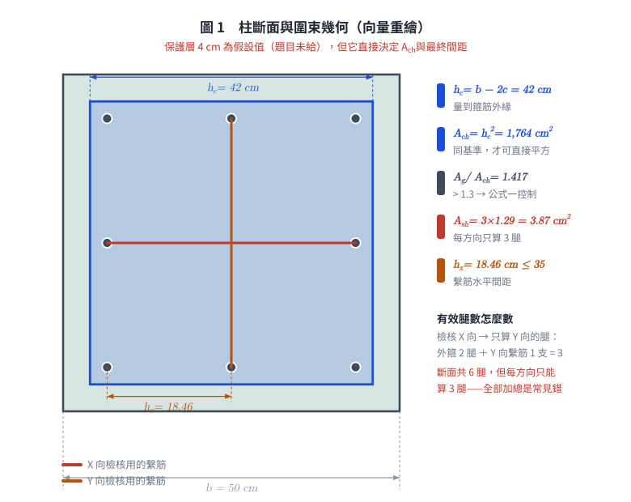
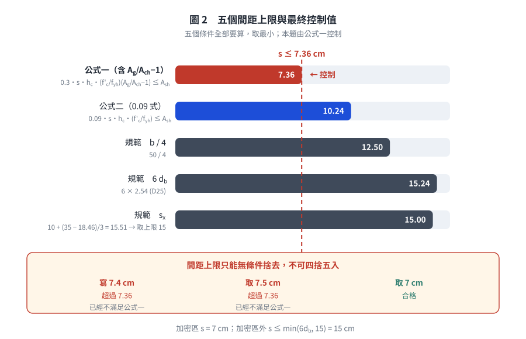

# 考題編號：RC-2004-3

**主分類：** `RC-U3-3` 韌性要求與耐震設計
**副分類：** `RC-U1-2` RC 柱強度分析與設計
**設計法：** USD 強度設計法
**標籤：** `耐震柱` `Ash公式` `圍束箍筋` `繫筋` `密箍區間距` `特殊矩形框架柱` `D13箍筋` `8-D25`

---

## 1. 原始題目重述 (Problem Restatement)

柱之橫向鋼筋若為矩形閉合箍筋，需滿足耐震特別規定：

$$A_{sh} = 0.3\!\left(s \cdot h_c \cdot \frac{f'_c}{f_{yh}}\right)\!\left(\frac{A_g}{A_{ch}} - 1\right)$$

$$A_{sh} = 0.09\!\left(s \cdot h_c \cdot \frac{f'_c}{f_{yh}}\right)$$

試問如圖所示之柱斷面橫向鋼筋之**間距**該如何才能滿足規範要求。（15 分）

*圖說：柱斷面 50 cm × 50 cm，主筋 8-D25（$f_y = 4200\ \text{kgf/cm}^2$）配置於 4 角及各面中點。箍筋及繫筋均為 D13（$f_{yh} = 2800\ \text{kgf/cm}^2$）。外側矩形閉合箍筋 1 組 + 繫筋 2 支（每方向各 1 支）。$f'_c = 280\ \text{kgf/cm}^2$。*

| 參數 | 數值 |
|------|------|
| 柱斷面 | $50 \times 50\ \text{cm}$ |
| 主筋 | 8-D25（$a_b = 5.10\ \text{cm}^2$，$d_b = 2.54\ \text{cm}$）|
| 箍筋 / 繫筋 | D13（$a_b = 1.29\ \text{cm}^2$，$d_{tie} = 1.27\ \text{cm}$，$f_{yh} = 2800\ \text{kgf/cm}^2$）|
| $f'_c$ | $280\ \text{kgf/cm}^2$ |

---

*圖 1　柱斷面與圍束幾何。$h_c$ 與 $A_{ch}$ 都量到箍筋**外緣**（同一基準才可寫 $A_{ch} = h_c^2$）；圖上把兩支繫筋分色，可攔下「把斷面全部 6 腿算給同一方向」這個常見錯。*

## 2. 考題核心精神與出題者意圖

**核心觀念：** ACI 耐震柱圍束箍筋（Ash）公式控制間距——從「提供的 $A_{sh}$」反推「最大允許間距 $s$」。

**測驗重點：**
1. 正確識別 $A_{sh,\text{provided}}$：外閉合箍筋 + 繫筋共同構成 Ash（需清楚繫筋貢獻方向）
2. 正確計算 $A_g$、$A_{ch}$、$h_c$（注意覆蓋層推算）
3. 兩公式均需滿足，取較嚴者；再與規範最大間距比較

---

## 3. 解題戰略地圖與陷阱分析

**作戰計畫：**
1. 計算斷面幾何：$A_g$、$h_c$、$A_{ch}$
2. 確定 $A_{sh,\text{provided}}$（每方向的 D13 腿數）
3. 由兩條 $A_{sh}$ 公式各反推最大 $s$，**取小者**
4. 算規範的三項間距上限（含 $s_x$），與上一步一起取**最小值**
5. 最終答案**無條件捨去**取實務整數

**關鍵陷阱（5 個）：**
- ⚠ **$h_c$ 與 $A_{ch}$ 的量法必須一致**：本解採現行規範，兩者都量到**箍筋外緣**，$h_c = b - 2c = 50 - 8 = 42$ cm、$A_{ch} = h_c^2 = 1764$ cm²。（舊版 ACI 318-99 的 $h_c$ 是箍筋**中心距** $= 42 - d_{tie} = 40.73$ cm，但 $A_{ch}$ 仍量到外緣——若採舊版，$A_{ch} \ne h_c^2$，不可混寫。）
- ⚠ **保護層 4 cm 是假設**：題目沒給，依規範非受候柱之淨保護層採 4 cm，須在卷面上寫明。
- ⚠ **$A_{sh}$ 只計算「對該方向有貢獻」的腿**：檢核 X 方向時只算 Y 方向的腿（外箍 2 腿 + Y 向繫筋 1 支）= 3 根 D13
- ⚠ **公式一不是永遠較嚴**：門檻是 $A_g/A_{ch} > 1.3$。本題 50 cm 方柱為 1.417 → 公式一控制；邊長超過約 65 cm 就換公式二控制（見 §5①）。
- ⚠ **間距上限只能捨去不能進位**：$7.36 \to 7.4$ 是錯的，$7.4 > 7.36$ 已經違規。

---

## 3.5 變數層次分析 (Variable Hierarchy Analysis)

### 最終目標
求滿足兩個 $A_{sh}$ 公式及規範間距要求的最大箍筋間距 $s$（cm）。

### 本題關鍵公式（依計算順序）

$$\text{Step 1: } h_c = b - 2\,c_{\text{cover}} = 50 - 8 = 42\ \text{cm}\quad(\text{量到箍筋外緣})$$

$$\text{Step 2: } A_{ch} = h_c^2 = 42^2 = 1764\ \text{cm}^2\quad(\text{同一基準，故可直接平方})$$

$$\text{Step 3: } A_{sh,\text{provided}} = n_{legs} \times a_b = 3 \times 1.29 = 3.87\ \text{cm}^2$$

$$\text{Step 4 (公式一): } s \le \frac{A_{sh}}{0.3 \cdot h_c \cdot \dfrac{f'_c}{f_{yh}} \cdot \left(\dfrac{A_g}{A_{ch}}-1\right)}$$

$$\text{Step 5 (公式二): } s \le \frac{A_{sh}}{0.09 \cdot h_c \cdot \dfrac{f'_c}{f_{yh}}}$$

$$\text{Step 6 (規範上限): } s \le \min\!\left(\frac{b}{4},\ 6d_b,\ s_x\right),\quad s_x = 10 + \frac{35 - h_x}{3}\ \text{(cm)},\ 10 \le s_x \le 15$$

$$\text{Step 7 (取值): } s = \left\lfloor \min(\text{Step 4},\ \text{Step 5},\ \text{Step 6}) \right\rfloor \quad(\text{無條件捨去})$$

### L1：題目直接給定

| 符號 | 數值 | 說明 |
|------|------|------|
| $b = h$ | $50\ \text{cm}$ | 正方形柱邊長 |
| D13（箍筋 + 繫筋）| $a_b = 1.29\ \text{cm}^2$，$d_{tie} = 1.27\ \text{cm}$ | |
| D25（主筋）| $d_b = 2.54\ \text{cm}$ | |
| $f'_c$ | $280\ \text{kgf/cm}^2$ | |
| $f_{yh}$ | $2800\ \text{kgf/cm}^2$ | 箍筋 / 繫筋 |

### L2：需知識點推導

| 符號 | 公式／來源 | 卡關? |
|------|------|------|
| $h_c$ | $50 - 2 \times 4 = 42\ \text{cm}$ | |
| $A_g$ | $50^2 = 2500\ \text{cm}^2$ | |
| $A_{ch}$ | $42^2 = 1764\ \text{cm}^2$ | |
| $A_{sh,\text{prov}}$ | $3 \times 1.29 = 3.87\ \text{cm}^2$（外箍 2 腿 + 繫筋 1 條）| |
| $s_{\max,F1}$ | 公式一反推 = **7.36 cm**（控制；只能捨去，不可寫 7.4） | |
| $s_{\max,F2}$ | 公式二反推 = 10.2 cm | |
| $s_{\max,\text{code}}$ | $\min(12.5, 15.2, 15)= 12.5\ \text{cm}$ | |

### L3：深層知識（不懂就卡住）

| 知識點 | 說明 | 卡關? |
|--------|------|------|
| $A_{sh}$ 僅計「垂直於 $h_c$ 方向」的腱腿 | 檢核 X 方向（$h_c = 42\ \text{cm}$）時，只算 Y 方向的腱腿；外箍有 2 條 Y 腿，再加 Y 向繫筋 1 條 = 3 條 | |
| 公式一通常比公式二嚴（本題） | $0.3 \times (A_g/A_{ch}-1) = 0.3 \times 0.417 = 0.125 > 0.09$，故公式一較嚴 | |
| 規範最大間距三條件 | $s \le \min(b/4,\ 6d_b,\ s_x)$，$s_x = 10+\frac{35-h_x}{3}$；本題 $h_x = 18.46 \to s_x = 15.51 \to 15$，以 $b/4 = 12.5\ \text{cm}$ 控制 | |

---

## 4. 步驟化詳細計算過程

### ① 斷面幾何參數

$$A_g = 50 \times 50 = 2500\ \text{cm}^2$$

**保護層：題目未給定。** 依規範，非受候環境之柱淨保護層取 $c_{\text{cover}} = 4$ cm（量至 D13 箍筋外緣）——這是假設，作答時必須寫出來。

$$h_c = 50 - 2 \times 4 = 42\ \text{cm}\quad(\text{箍筋外緣至外緣})$$

> **量法說明：** 本解採現行規範慣例，$h_c$ 與 $A_{ch}$ **同樣量到箍筋外緣**，所以 $A_{ch} = h_c^2$ 成立。
> 舊版 ACI 318-99 把 $h_c$ 定義為箍筋**中心至中心**（$= 42 - 1.27 = 40.73$ cm），而 $A_{ch}$ 仍量到外緣；
> 那套定義下 $A_{ch} \ne h_c^2$，且 $s$ 會放寬到 7.59 cm。**兩套不可混用**——本庫統一採外緣。

$$A_{ch} = 42 \times 42 = 1764\ \text{cm}^2$$

$$\frac{A_g}{A_{ch}} - 1 = \frac{2500}{1764} - 1 = 1.417 - 1 = 0.417$$

---

### ② 每方向提供之 $A_{sh}$

本柱配置：外矩形閉合箍筋（D13）+ 繫筋（D13）各 1 支／方向

**檢核 X 方向（$h_c = 42\ \text{cm}$）：**
計算「Y 方向」之腱腿截面積（對 X 方向圍束有效）：

| 組件 | Y 方向腿數 | 貢獻 $A_{sh}$（cm²）|
|------|:---:|:---:|
| 外矩形閉合箍筋 | 2（左腿 + 右腿）| $2 \times 1.29 = 2.58$ |
| Y 方向繫筋（1 支）| 1 | $1 \times 1.29 = 1.29$ |
| **合計** | **3** | **$3.87\ \text{cm}^2$** |

由對稱性，Y 方向同理：$A_{sh,\text{prov}} = 3.87\ \text{cm}^2$

---

### ③ 公式一求最大間距

$$A_{sh} = 0.3\,s \cdot h_c \cdot \frac{f'_c}{f_{yh}} \cdot \left(\frac{A_g}{A_{ch}} - 1\right) \le A_{sh,\text{prov}}$$

$$3.87 \ge 0.3 \times s \times 42 \times \frac{280}{2800} \times 0.417 = s \times 0.526$$

$$s \le \frac{3.87}{0.526} = \boxed{7.36\ \text{cm}}$$

---

### ④ 公式二求最大間距

$$A_{sh} = 0.09\,s \cdot h_c \cdot \frac{f'_c}{f_{yh}} \le A_{sh,\text{prov}}$$

$$3.87 \ge 0.09 \times s \times 42 \times \frac{280}{2800} = 0.378s$$

$$s \le \frac{3.87}{0.378} = \boxed{10.24\ \text{cm}}$$

---

### ⑤ 規範最大間距（耐震特別規定的間距條款）

三項條件取最小，其中第三項 $s_x$ 要由繫筋水平間距 $h_x$ 算出，不是固定 15 cm：

**(i) 柱最小邊長的 1/4：** $\dfrac{50}{4} = 12.5$ cm

**(ii) 主筋直徑的 6 倍：** $6 \times 2.54 = 15.24$ cm

**(iii) $s_x$（依繫筋密度放寬／收緊）：**

先求 $h_x$ ＝ 受繫筋或箍筋轉角支承的主筋**水平中心間距**。角筋中心到角筋中心：

$$50 - 2\left(c_{\text{cover}} + d_{tie} + \frac{d_b}{2}\right) = 50 - 2(4 + 1.27 + 1.27) = 36.92\ \text{cm}$$

每面 3 根主筋（兩角 + 中點各 1），故相鄰支承點間距：

$$h_x = \frac{36.92}{2} = 18.46\ \text{cm} \;<\; 35\ \text{cm}\quad\checkmark\ (\text{規範要求 } h_x \le 35\ \text{cm})$$

$$s_x = 10 + \frac{35 - h_x}{3} = 10 + \frac{35 - 18.46}{3} = 10 + 5.51 = 15.51\ \text{cm} \;\Rightarrow\; \text{取上限 } 15\ \text{cm}$$

**合計：**

$$s_{\max,\text{code}} = \min(12.5,\ 15.24,\ 15) = \boxed{12.5\ \text{cm}}$$

> 本題 $s_x$ 算出來超過上限，所以結果與「直接寫 15 cm」相同——但那是巧合。
> 若換成每面只有 2 根主筋的斷面（$h_x = 25$ cm），$s_x = 13.3$ cm，直接寫 15 cm 就**不保守**了。

---

### ⑥ 控制間距

| 條件 | 最大間距 |
|------|:---:|
| 公式一（含 $A_g/A_{ch}-1$ 項）| **7.36 cm ← 控制** |
| 公式二（$0.09$ 式）| 10.24 cm |
| 規範間距上限 $\min(b/4,\ 6d_b,\ s_x)$ | 12.5 cm |

$$\boxed{s \le 7.36\ \text{cm}}$$

**實際採用：$s = 7$ cm。**

> ⚠ 間距上限**只能無條件捨去**。寫成「$s \le 7.4$ cm」是把 7.36 進位，而 $7.4 > 7.36$ 本身就違規；
> 取 $s = 7.5$ cm 更是直接不滿足公式一。實務整數只能取 **7 cm**。
> （若採舊版 ACI 318-99 的 $h_c = 40.73$ cm，上限為 7.59 cm，7.5 cm 才合法——但本庫已統一採外緣定義。）

**加密區以外的間距：** 題目問「間距該如何」，完整答案要含非加密區：

$$s \le \min(6d_b,\ 15\ \text{cm}) = \min(15.24,\ 15) = 15\ \text{cm}$$

---

*圖 2　五個間距上限與最終控制值。$s_x$ 那一列提醒它不是固定 15 cm 而要由 $h_x$ 算；下方三格把「寫 7.4」「取 7.5」「取 7」並排，可攔下把 7.36 進位後仍自認合格的錯誤。*

## 5. 關鍵爭議點與進階探討

**① 公式一 vs 公式二的控制條件**

公式一含 $(A_g/A_{ch} - 1)$ 項，物理意義是：**蓋層佔比越大，剝落後損失越多，就要越多圍束箍筋來補**。
兩式的分界很單純——公式一控制的條件是

$$0.3\left(\frac{A_g}{A_{ch}} - 1\right) > 0.09 \quad\Longleftrightarrow\quad \frac{A_g}{A_{ch}} > 1.3$$

本題 $A_g/A_{ch} = 1.417 > 1.3$，$0.3\times0.417 = 0.125 > 0.09$ → 公式一控制。

**但這不是「永遠」。** 保護層固定 4 cm 時，$A_g/A_{ch}$ 隨柱變大而變小：

| 柱邊長 $b$ | $A_g/A_{ch}$ | $0.3(A_g/A_{ch}-1)$ | 控制式 |
|---:|---:|---:|:---|
| 50 cm（本題） | 1.417 | 0.1252 | 公式一 |
| 65 cm | 1.300 | 0.0901 | 公式一（臨界） |
| 70 cm | 1.275 | 0.0824 | **公式二** |
| 100 cm | 1.181 | 0.0544 | **公式二** |

**邊長超過約 65 cm 的方柱就改由公式二控制**——這是實務上很常見的尺寸。
背「公式一永遠較嚴」會在大斷面柱直接失分；正確的記法是先比 $A_g/A_{ch}$ 有沒有超過 1.3。

**② 繫筋貢獻方向的正確計算**

一根 Y 方向繫筋只對**檢核 X 方向**的 $A_{sh}$ 有貢獻（相反亦然）。本斷面一共有 6 腿 D13（外箍 4 腿 + 繫筋 2 支），但**每個方向只能算 3 腿**。

兩種常見誤算：
- 把兩支繫筋都算給同一方向 → 4 腿 $= 5.16$ cm²，$s$ 高估到 9.8 cm
- 把全斷面 6 腿全部加總 → $7.74$ cm²，$s$ 高估到 14.7 cm（比規範上限還鬆）

都會低估所需圍束、高估可用間距。

**③ 若無繫筋（僅外箍）**

若只有外閉合箍筋（$A_{sh} = 2 \times 1.29 = 2.58\ \text{cm}^2$）：
$$s \le \frac{2.58}{0.526} = 4.9\ \text{cm}$$
外箍加繫筋後放寬到 7.36 cm（＋50%），說明繫筋對施工可行性有實質幫助——4.9 cm 的箍筋間距，混凝土幾乎灌不下去。

**④ 密箍區長度（附加知識）**

除間距外，耐震規範要求密箍區長度 $l_o$：
$$l_o \ge \max\!\left(\frac{l_n}{6},\ \text{柱最大邊長},\ 450\ \text{mm}\right) = \max\!\left(\frac{l_n}{6},\ 50\ \text{cm},\ 45\ \text{cm}\right) = \max\!\left(\frac{l_n}{6},\ 50\right)\ \text{cm}$$
本題未提供柱淨高，故不計算，但考場應能說明此要求。

*圖解補繪：2026-08-21（向量圖 2 張，腳本 `figs/gen_RC-2004-3.py`，可重跑；腳本檔尾對 §4 公佈值做 assert）*
