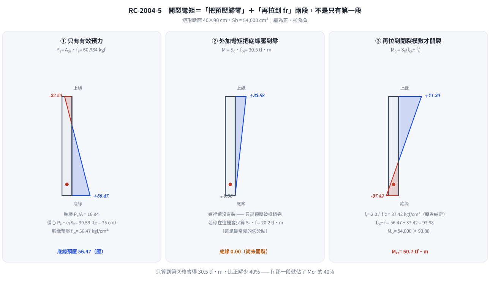
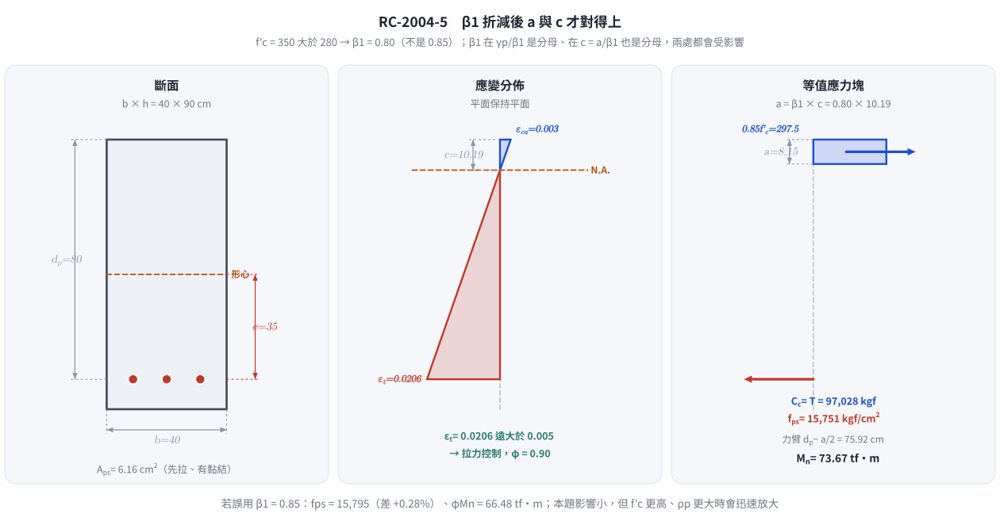
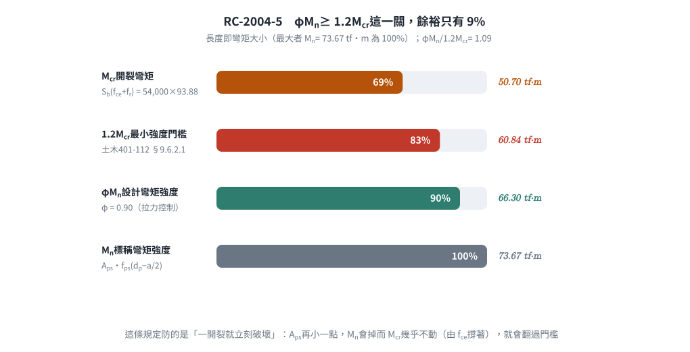

# 考題編號：RC-2004-5

**主分類：** `RC-U4-1` 預力梁斷面應力分析
**副分類：** `RC-U4-3` 預力損失
**設計法：** 混合（WSD 應力分析 + USD 強度設計）
**標籤：** `先拉法` `有黏結腱` `開裂彎矩Mcr` `fps公式` `Whitney應力塊` `β₁折減` `矩形斷面` `有效預力` `ωp延性驗核`

---

## 1. 原始題目重述 (Problem Restatement)

先拉預力梁，矩形斷面與鋼腱配置如圖所示：

*圖說：矩形斷面寬 b = 40 cm，高 h = 90 cm。預力鋼腱位於距底部 10 cm 處，有效深度 $d_p = 90 - 10 = 80\ \text{cm}$。*

| 參數 | 數值 |
|------|------|
| $b \times h$ | $40 \times 90\ \text{cm}$ |
| $d_p$ | $90 - 10 = 80\ \text{cm}$ |
| $A_{ps}$ | $6.16\ \text{cm}^2$ |
| $f_{pu}$ | $16{,}500\ \text{kgf/cm}^2$ |
| $f_{py}$ | $0.85\,f_{pu} = 14{,}025\ \text{kgf/cm}^2$ |
| $f_e$（有效預力）| $0.6\,f_{pu} = 9{,}900\ \text{kgf/cm}^2$ |
| $f'_c$ | $350\ \text{kgf/cm}^2$ |
| $\gamma_p$ | $0.4$（給定）|
| $f_r$（裂縫模數）| $2.0\sqrt{f'_c}$（給定）|

**求：（1）開裂彎矩 $M_{cr}$；（2）彎矩設計強度 $\phi M_n$**

> **原卷原文（93 年第五題）核對：** 「先拉預力梁之矩形斷面與鋼腱配置如圖所示，預力鋼腱之抗拉強度 $f_{pu}=16500$ kgf/cm²，
> 降伏強度 $f_{py}=0.85f_{pu}$，有效預力 $f_e=0.6f_{pu}$，預力鋼腱之斷面積 $A_{ps}=6.16$ cm²，$f'_c=350$ kgf/cm²，
> 試求此斷面之開裂彎矩與彎矩設計強度。（20 分）」
> 提示欄印出 $f_{ps}=f_{pu}\left(1-\rho_p\frac{\gamma_p f_{pu}}{\beta_1 f'_c}\right)$（$\gamma_p=0.4$）與 $\omega_p = \dfrac{A_{ps}f_{ps}}{bd_pf'_c}$；
> 卷首資料欄印出 $E_c=15000\sqrt{f'_c}$、$f_r=2.0\sqrt{f'_c}$。**原卷未指定規範版本**（93 年當時為土木 401-86／ACI 318-99 世代）。

---

## 2. 考題核心精神與出題者意圖

**核心觀念：** 先拉預力梁的**兩個強度指標**：

| 指標 | 分析方法 | 物理意義 |
|------|----------|---------|
| $M_{cr}$（開裂彎矩）| WSD 彈性法 + 斷裂模數 | 有效預力 + $f_r$ 的組合抵抗力 |
| $\phi M_n$（設計強度）| USD 強度設計 + ACI $f_{ps}$ 公式 | 鋼腱拉力 × 力臂 |

**測驗重點：**
1. $\beta_1$ 需依 $f'_c = 350\ \text{kgf/cm}^2$ 折減（$\ne 0.85$）
2. 偏心距 $e = d_p - h/2 = 35\ \text{cm}$（鋼腱距中性軸距離）
3. $f_{ps}$ 公式正確帶入並確認結果合理（$f_{pe} < f_{ps} < f_{pu}$）
4. $M_{cr}$ 用底纖維壓應力 + $f_r$ 判斷開裂時刻

---

## 3. 解題戰略地圖與陷阱分析

**作戰計畫：**
1. 計算 $\beta_1$、斷面幾何（$A$、$I$、$S_b$、$e$）
2. 計算有效預力力 $P_e$，求底纖維壓應力 $f_{ce}$
3. $M_{cr} = S_b \times (f_{ce} + f_r)$
4. 計算 $\rho_p$，代入 $f_{ps}$ 公式
5. 驗核延性（$\omega_p \le 0.36\beta_1$），求 $a$，計算 $M_n$、$\phi M_n$

**關鍵陷阱（3 個）：**
- ⚠ **$\beta_1 \ne 0.85$**：$f'_c = 350 > 280\ \text{kgf/cm}^2$，需折減：$\beta_1 = 0.85 - 0.05 \times (350-280)/70 = 0.80$
- ⚠ **偏心距 $e$ 的計算**：$e = d_p - h/2 = 80 - 45 = 35\ \text{cm}$（鋼腱中心至斷面形心的距離，非 $d_p$）
- ⚠ **底纖維壓應力包含軸壓與偏心兩項**：$f_{ce} = P_e/A + P_e \cdot e / S_b$（兩項均為壓縮，同向）

---

## 3.5 變數層次分析 (Variable Hierarchy Analysis)

### 最終目標
求 $M_{cr}$（開裂彎矩，tf·m）與 $\phi M_n$（設計彎矩強度，tf·m）。

### 本題關鍵公式（依計算順序）

$$\text{Step 1: } \beta_1 = 0.85 - 0.05 \times \frac{f'_c - 280}{70}$$

$$\text{Step 2: } f_{ce} = \frac{P_e}{A} + \frac{P_e \cdot e}{S_b},\quad M_{cr} = S_b \times \left(\boxed{f_{ce}} + f_r\right)$$

$$\text{Step 3: } \rho_p = \frac{A_{ps}}{b \cdot d_p},\quad f_{ps} = f_{pu}\!\left(1 - \frac{\gamma_p}{\boxed{\beta_1}} \cdot \rho_p \cdot \frac{f_{pu}}{f'_c}\right)$$

$$\text{Step 4: } a = \frac{A_{ps}\,\boxed{f_{ps}}}{0.85\,f'_c\,b},\quad M_n = A_{ps}\,\boxed{f_{ps}}\!\left(d_p - \frac{\boxed{a}}{2}\right)$$

$$\text{Step 5: } \omega_p = \frac{A_{ps}\,\boxed{f_{ps}}}{b\,d_p\,f'_c} \le 0.36\beta_1 \text{（延性驗核）}$$

### L1：題目直接給定

| 符號 | 數值 | 說明 |
|------|------|------|
| $b, h, d_p$ | $40, 90, 80\ \text{cm}$ | |
| $A_{ps}$ | $6.16\ \text{cm}^2$ | |
| $f_{pu}$ | $16{,}500\ \text{kgf/cm}^2$ | |
| $f_e$ | $9{,}900\ \text{kgf/cm}^2$（$= 0.6f_{pu}$）| 有效預力 |
| $\gamma_p$ | $0.4$ | |
| $f'_c$ | $350\ \text{kgf/cm}^2$ | |

### L2：需知識點推導

| 符號 | 公式／來源 | 卡關? |
|------|------|------|
| $\beta_1$ | $0.85 - 0.05(350-280)/70 = 0.80$ | |
| $A, I, S_b, e$ | 幾何計算 | |
| $P_e, f_{ce}$ | 有效預力 × 面積/模數 | |
| $f_r$ | $2\sqrt{350} = 37.42\ \text{kgf/cm}^2$ | |
| $M_{cr}$ | $S_b(f_{ce}+f_r)$ | |
| $\rho_p$ | $6.16/(40\times80)$ | |
| $f_{ps}$ | ACI 公式代入 | |
| $\phi M_n$ | $0.9 \times M_n$ | |

---

## 4. 步驟化詳細計算過程

### ① 材料與幾何參數

$$\beta_1 = 0.85 - 0.05 \times \frac{350 - 280}{70} = 0.85 - 0.05 \times 1.0 = 0.80$$

$$f_r = 2.0\sqrt{f'_c} = 2.0\sqrt{350} = 2.0 \times 18.708 = 37.42\ \text{kgf/cm}^2$$

**斷面幾何：**
$$A = 40 \times 90 = 3{,}600\ \text{cm}^2$$
$$I = \frac{40 \times 90^3}{12} = \frac{40 \times 729{,}000}{12} = 2{,}430{,}000\ \text{cm}^4$$
$$y_t = \frac{h}{2} = 45\ \text{cm},\quad S_b = \frac{I}{y_t} = \frac{2{,}430{,}000}{45} = 54{,}000\ \text{cm}^3$$

**偏心距（鋼腱中心至形心）：**
$$e = d_p - \frac{h}{2} = 80 - 45 = 35\ \text{cm}$$

---

### ② 開裂彎矩 $M_{cr}$

**有效預力作用力：**
$$P_e = A_{ps} \times f_e = 6.16 \times 9{,}900 = 60{,}984\ \text{kgf}$$

**底纖維預壓應力（軸壓 + 偏心壓縮）：**
$$f_{ce} = \frac{P_e}{A} + \frac{P_e \cdot e}{S_b} = \frac{60{,}984}{3{,}600} + \frac{60{,}984 \times 35}{54{,}000}$$

$$= 16.94 + \frac{2{,}134{,}440}{54{,}000} = 16.94 + 39.53 = 56.47\ \text{kgf/cm}^2 \text{（壓縮）}$$

**開裂彎矩（底纖維合應力 = 0 時為去壓，再加 $f_r$ 才開裂）：**
$$M_{cr} = S_b \times (f_{ce} + f_r) = 54{,}000 \times (56.47 + 37.42) = 54{,}000 \times 93.89$$

$$= 5{,}070{,}060\ \text{kgf·cm} = \boxed{M_{cr} = 50.7\ \text{tf·m}}$$

*圖 1　開裂彎矩要走完兩段，不是一段。第一段把 $f_{ce} = 56.47$ 去壓到零，第二段再拉到 $f_r = 37.42$ 才出現裂縫——這張圖攔的是「$M_{cr} = S_b f_{ce}$」這個少算 40% 的常見寫法：$f_r$ 那一段就佔了 $M_{cr}$ 的四成。*

---

### ③ 極限鋼腱應力 $f_{ps}$（ACI 公式）

$$\rho_p = \frac{A_{ps}}{b \cdot d_p} = \frac{6.16}{40 \times 80} = \frac{6.16}{3{,}200} = 0.001925$$

$$f_{ps} = f_{pu}\!\left(1 - \frac{\gamma_p}{\beta_1} \cdot \rho_p \cdot \frac{f_{pu}}{f'_c}\right)$$

$$= 16{,}500 \times \left(1 - \frac{0.4}{0.80} \times 0.001925 \times \frac{16{,}500}{350}\right)$$

$$= 16{,}500 \times \left(1 - 0.5 \times 0.001925 \times 47.14\right)$$

$$= 16{,}500 \times (1 - 0.04538) = 16{,}500 \times 0.9546$$

$$\boxed{f_{ps} = 15{,}751\ \text{kgf/cm}^2}$$

**驗核：** $f_e = 9{,}900 \le f_{ps} = 15{,}751 \le f_{pu} = 16{,}500$ ✓（在有效預力至極限強度之間）

**使用此近似式的前提（規範明訂，必須先寫）：** $f_{se} \ge 0.5f_{pu}$。
本題 $f_e = 0.6f_{pu} > 0.5f_{pu}$ ✓ 成立。（若不成立則不得用此式，須改做應變相容分析。）

---

### ④ 延性驗核（$\omega_p$ 指標）

$$\omega_p = \frac{A_{ps} \cdot f_{ps}}{b \cdot d_p \cdot f'_c} = \frac{6.16 \times 15{,}751}{40 \times 80 \times 350} = \frac{97{,}026}{1{,}120{,}000} = 0.0866$$

$$0.36\beta_1 = 0.36 \times 0.80 = 0.288$$

$$\omega_p = 0.0866 \le 0.288 \quad \checkmark \quad \text{（足夠延性）}$$

> **這條是 ACI 318-99／土木 401-86 的舊制**（$\omega_p \le 0.36\beta_1$ 相當於限制 $c/d_p \le 0.42$）。
> 現行土木 401-110／112 與 ACI 318-19 **已刪除** $\omega_p$ 判準，改用**淨拉應變 $\varepsilon_t$** 決定 $\phi$。
> 兩制在本題同結論（見下方 §4-⑤ 的 $\varepsilon_t$ 驗算與 §6），作答時建議兩者並寫。

---

### ⑤ 彎矩設計強度 $\phi M_n$

**Whitney 等值應力塊深度：**
$$a = \frac{A_{ps} \cdot f_{ps}}{0.85 \cdot f'_c \cdot b} = \frac{6.16 \times 15{,}751}{0.85 \times 350 \times 40} = \frac{97{,}026}{11{,}900} = 8.15\ \text{cm}$$

**標稱彎矩：**
$$M_n = A_{ps} \cdot f_{ps} \cdot \left(d_p - \frac{a}{2}\right) = 97{,}026 \times \left(80 - \frac{8.15}{2}\right)$$

$$= 97{,}026 \times 75.92 = 7{,}366{,}682\ \text{kgf·cm} = 73.67\ \text{tf·m}$$

**$\phi$ 的判定（現行規範：淨拉應變法）：**

$$c = \frac{a}{\beta_1} = \frac{8.154}{0.80} = 10.19\ \text{cm},\qquad
\varepsilon_t = 0.003\times\frac{d_t - c}{c} = 0.003\times\frac{80 - 10.19}{10.19} = \mathbf{0.0206}$$

預力構材之拉力控制界限為 $\varepsilon_t \ge 0.005$（土木 401-112 表 4.3.1／ACI 318-19 Table 21.2.2）：
$0.0206 \gg 0.005$ → **拉力控制**，$\phi = 0.90$ ✓（與舊制 $\omega_p$ 判準同結論）。

$$\phi M_n = 0.9 \times 73.67 = \boxed{66.3\ \text{tf·m}}$$

*圖 2　斷面、應變、等值應力塊三格共用同一垂直尺度。$c = a/\beta_1$ 用的是折減後的 $\beta_1 = 0.80$，所以 $c$ 必然比 $a$ 深——圖上若兩者顛倒就是 $\beta_1$ 沒折減；同時 $\varepsilon_t = 0.0206 \gg 0.005$ 一眼可見，$\phi = 0.9$ 不必再猶豫。*

---

### ⑥ 最小彎矩強度驗核（土木 401-112 §9.6.2.1／ACI 318-19 §9.6.2.1；舊編號 ACI 318-99 §18.8.2）

$$1.2\,M_{cr} = 1.2 \times 50.70 = 60.84\ \text{tf·m}$$

$$\phi M_n = 66.30 \ge 60.84 \quad \checkmark \quad (\text{餘裕僅 } 9\%)$$

*圖 3　$\phi M_n \ge 1.2M_{cr}$ 這一關的餘裕只有 9%。預力量高、腱量低的斷面很容易在這裡卡住——這張圖攔的是「算完 $\phi M_n$ 就交卷」：少了這一條驗核，梁可能一開裂就直接破壞（少筋型脆性破壞）。*

---

**最終答案：**

| 項目 | 結果 |
|------|:---:|
| 開裂彎矩 $M_{cr}$ | $\boxed{50.7\ \text{tf·m}}$ |
| 彎矩設計強度 $\phi M_n$ | $\boxed{66.3\ \text{tf·m}}$（$M_n = 73.67$，$\varepsilon_t = 0.0206$ → $\phi = 0.90$）|
| 最小強度驗核 | $\phi M_n = 66.30 \ge 1.2M_{cr} = 60.84$ ✓ |

---

## 5. 關鍵爭議點與進階探討

**① 為何 $f_{ps}$ 可超過 $f_{py}$？**

ACI $f_{ps}$ 公式給出 $f_{ps} = 15{,}751 > f_{py} = 14{,}025$。這在物理上合理：先拉有黏結腱在極限狀態下，混凝土極限應變使鋼腱應變遠超過降伏應變，進入**應變硬化**區，應力可從 $f_{py}$ 繼續升高至 $f_{pu}$（16,500 kgf/cm²）。ACI 公式用近似法得出極限狀態下的鋼腱應力，結果在 $f_{py}$ 與 $f_{pu}$ 之間是合理的。

**② $\beta_1$ 的折減效應（2026-08-22 勘誤）**

若誤用 $\beta_1 = 0.85$（不折減）：
$$f_{ps} = 16{,}500 \times \left(1 - \frac{0.4}{0.85} \times 0.001925 \times 47.14\right) = 16{,}500 \times (1 - 0.04271) = \mathbf{15{,}795}\ \text{kgf/cm}^2$$

> ⚠ **舊版把這個值寫成 16,793 kgf/cm²**（$16{,}500\times0.9573$ 顯然不可能大於 $f_{pu}=16{,}500$，是打字時把 15,795 的數字順序打亂）。
> 正確值 15,795，比 $\beta_1=0.80$ 的 15,751 大 **0.28%**（舊版寫的「約 0.3%」這句敘述反而是對的）。

$\phi M_n$ 隨之由 66.30 變成 66.48 tf·m（+0.3%）。**本題 $\beta_1$ 折減與否對答案影響很小**，
但 $\beta_1$ 在 $\gamma_p/\beta_1$ 是分母、又在 $c = a/\beta_1$ 是分母，$f'_c$ 更高、$\rho_p$ 更大時影響會迅速放大，
仍應正確折減。

**③ 開裂彎矩的工程意義**

$M_{cr} = 50.7\ \text{tf·m}$ 是梁從全截面受壓（無裂縫）轉為開裂的臨界值。在 $M_{cr}$ 以下，截面保持不開裂（Uncracked），預力梁具有良好防腐蝕和耐久性。$\phi M_n/M_{cr} = 66.30/50.70 = 1.31 > 1.2$，滿足最小強度要求，確保有一定的強度儲備。

**④ 為何 $M_{cr}$ 的餘裕這麼薄？**

$\phi M_n / (1.2M_{cr}) = 66.30/60.84 = 1.09$——只有 **9% 餘裕**。
這是預力量偏高、鋼腱量偏低（$\rho_p = 0.0019$）的典型組合：$M_{cr}$ 被 $f_{ce}=56.5$ 撐得很高，
而 $M_n$ 因 $A_{ps}$ 小而上不去。若 $A_{ps}$ 再小一點就會觸發 $\phi M_n < 1.2M_{cr}$ 的**脆性破壞**警戒
（一開裂就立刻破壞、無預警），規範設這條就是為了防這件事。
考場上若算出 $\phi M_n < 1.2M_{cr}$，正解是**加鋼腱或加非預力鋼筋**，不是改材料。

---

## 6. 依最新規範對照（土木 401-112／ACI 318-19）

**結論：兩個主線答案不變（$M_{cr} = 50.7$ tf·m、$\phi M_n = 66.3$ tf·m），但兩處依據要換。**

| 項目 | 原卷（93 年）／舊制 | 土木 401-112／ACI 318-19 | 影響 |
|---|---|---|---|
| $\beta_1$（$f'_c=350$） | $0.85-0.05(f'_c-280)/70 = 0.80$ | kgf 制同式；SI 制 $0.85-0.05(34.3-28)/7 = 0.805$ | 差 0.6%，**答案不變** |
| $f_r$ | $2.0\sqrt{f'_c}$（原卷給定） | $0.62\lambda\sqrt{f'_c}$ MPa ＝ $2.0\sqrt{f'_c}$ kgf/cm²（§19.2.3.1） | **無** |
| $M_{cr} = S_b(f_{ce}+f_r)$ | 同 | 同（§24.5.2 及 §9.6.2.1 解說） | **無** |
| 有黏結腱 $f_{ps}$ 近似式 | 原卷印出（$\gamma_p = 0.4$） | ACI 318-19 §20.3.2.3.1 **保留同式**（完整式含 $\frac{d}{d_p}(\omega-\omega')$ 項，本題無非預力筋故為零） | **無** |
| 使用近似式之前提 | 原卷未提 | $f_{se} \ge 0.5f_{pu}$（§20.3.2.3.1）；本題 $0.6f_{pu}$ ✓ | 須補寫 |
| $f_{ps}$ 是否設上限 | — | **有黏結腱無 $f_{py}$ 上限**（上限只加在無黏結腱 §20.3.2.4.1），故 $f_{ps}=15{,}751 > f_{py}=14{,}025$ 合法 | 佐證 §5① |
| 延性／$\phi$ 判定 | $\omega_p \le 0.36\beta_1$（318-99 舊制） | **改用 $\varepsilon_t$**：預力構材壓力控制界限 0.002、拉力控制界限 0.005（Table 21.2.2）；本題 $\varepsilon_t = 0.0206$ → $\phi = 0.90$ | **依據換、數值同** |
| 最小撓曲強度 | ACI 318-99 §18.8.2 | §9.6.2.1：$\phi M_n \ge 1.2M_{cr}$（$66.30 \ge 60.84$ ✓） | 僅編號 |
| 混凝土極限應變 | 0.003 | 0.003（§22.2.2.1 未改） | **無** |

**唯一實質差異：** 舊制用 $\omega_p \le 0.36\beta_1$ 這個「配筋指標」判延性，
新制改用「斷面在極限狀態的實際應變」$\varepsilon_t$。本題 $\omega_p = 0.087$ 遠低於 0.288、
$\varepsilon_t = 0.0206$ 遠高於 0.005，兩制都是安全側很大的拉力控制斷面，故結論一致。
**寫答案時建議兩條都寫**（舊制是原卷 93 年當時的規範，新制是現行規範），這在近年考卷已成標準答法。

---

*圖解補繪：2026-08-31（向量圖 3 張，腳本 `figs/gen_RC-2004-5.py`，可重跑；腳本檔尾對 §4／§5 公佈值做 assert）*
