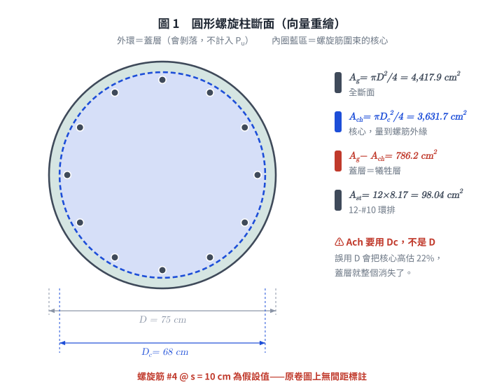
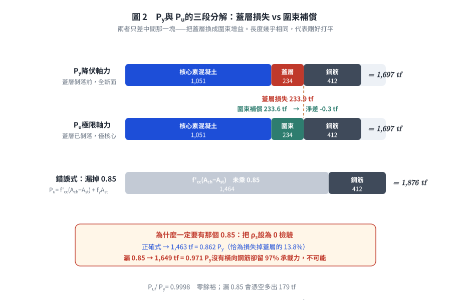
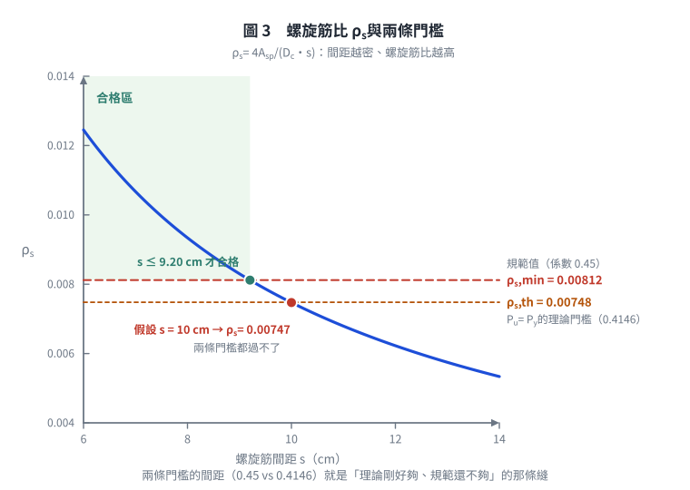

# 考題編號：RC-2010-1

**主分類：** `RC-U1-2` RC 柱強度分析與設計  
**副分類：** 無  
**設計法：** USD 強度設計法  
**標籤：** `圓形螺旋柱` `降伏軸力` `極限軸力` `螺旋筋圍束` `圍束混凝土強度` `ρs最小值` `f'cc` `fL側向圍束壓力` `Pu≥Py檢核` `12根主筋`

---

## 1. 原始題目重述 (Problem Restatement)

檢核圓形 RC 螺旋柱（`RC-2010-1-fig-1.png`）所能承受之**降伏軸力 $P_y$** 與**極限軸力 $P_u$**：

*圖說：圓形柱全斷面外徑 $D = 75$ cm；螺旋筋外徑（外緣至外緣）$D_c = 68$ cm；主筋 12-#10 環排；橫向螺旋筋 #4。*

> ⚠ **螺距 $s$ 是假設，不是題目給的。** 原卷第一題圖上只標了「主筋 12-#10」「#4 螺筋」「68 cm」「75 cm」四項，**沒有間距標註**（同卷第二題有標「D13 @ 10 cm」，可見要給時是會給的；而且本圖是橫斷面，螺距是縱向尺寸，本來就畫不出來）。考卷首頁允許「合理假設」，本解**假設 $s = 10$ cm**，並在 Step 3 反過來檢驗這個假設站不站得住。
>
> 另一種不依賴假設的作法：直接令 $\rho_s = \rho_{s,\min}$ 反推 $f'_{cc}$，見 §5⑤。

**材料：** $f'_c = 350$ kgf/cm²，$f_y = 4200$ kgf/cm²  
**鋼筋面積：** #4（螺筋）$A_{sp} = 1.27$ cm²；#10（主筋）$A_s = 8.17$ cm²（40 分）

---

*圖 1　圓形螺旋柱斷面（向量重繪）。$A_{ch}$ 用的是螺旋筋外緣直徑 $D_c = 68$ cm 而非全斷面 $D = 75$ cm——誤用 $D$ 會把核心高估 22%、蓋層直接消失，$P_u$ 與 $P_y$ 的比較就整個失去意義。*

## 2. 考題核心精神與出題者意圖 (Core Concepts & Examiner's Intent)

**核心觀念：** 螺旋柱的延性機制：
- **$P_y$（降伏/蓋層破壞）**：外圍蓋層混凝土達到極限應變後開始剝落，以全斷面計算
- **$P_u$（圍束極限）**：蓋層脫落後，螺旋筋提供側向圍束壓力 $f_L$，使核心混凝土強度提升至 $f'_{cc}$
- 設計要求：$P_u \ge P_y$（螺旋筋補償蓋層損失），等效 $\rho_s \ge \rho_{s,\min}$

**出題者意圖：**
1. 測驗兩個不同強度（蓋層 vs. 圍束核心）的物理意義
2. 測驗螺旋筋體積比 $\rho_s$ 的計算及最小值檢核
3. 測驗圍束強度 $f'_{cc}$ 的計算

---

## 3. 解題戰略地圖與陷阱分析 (Strategic Roadmap & Trap Analysis)

**作戰計畫：**
1. 計算各斷面幾何（$A_g$、$A_{ch}$、$A_{st}$）
2. 計算 $P_y$（全斷面，用 $0.85f'_c$）
3. 計算 $\rho_s$（體積比），與 $\rho_{s,\min}$ 比較
4. 計算 $f_L$、$f'_{cc}$、$P_u$（核心斷面，**同樣要乘 $0.85$**）
5. 比較 $P_u$ vs $P_y$，作出結論——注意這兩項應**一致**：$\rho_s$ 不足則 $P_u < P_y$，不可能一個 ❌ 一個 ✅

**關鍵陷阱：**

| 陷阱 | 說明 | 應對 |
|------|------|------|
| ❶ $\rho_s$ 的分母是**核心**，一律量到螺筋**外緣**（$D_c$） | 與 $A_{ch}$ 同一個基準，才能和 $\rho_{s,\min} = 0.45(A_g/A_{ch}-1)\cdots$ 對接，也才保得住 $f_L = \rho_s f_{yt}/2$ 這個恆等式 | $\rho_s = \dfrac{4A_{sp}}{D_c\,s} = \dfrac{4\times1.27}{68\times10}$ |
| ❷ 不可把分母換成螺筋中心距 $D_c - d_b$ | $4A_{sp}/[(D_c-d_b)s] = 0.00761$，比正解大 1.9%，且與量到外緣的 $A_{ch}$ **混用兩套基準**——偏不保守。本題 $P_u$ 與 $P_y$ 只差 0.02%，用錯定義直接翻盤 | 核心一律量到外緣 |
| ❸ $P_y$ 用 $0.85f'_c$ 的理由**不是** Whitney 應力塊 | $0.85$ 是「圓柱試體強度 → 構材內實際強度」的折減（尺寸效應、澆置方向、慢速加載），與撓曲的等值應力塊只是數值巧合相同 | 純軸壓也要乘，且**核心混凝土同樣要乘** |
| ❹ **$P_u$ 不可漏掉 $0.85$** | 若寫成 $P_u = f'_{cc}(A_{ch}-A_{st}) + f_yA_{st}$，代入 $\rho_s = 0$（完全不配螺旋筋）會得 $0.97P_y$——沒有橫向鋼筋的柱在蓋層剝落後還保有 97% 承載力，物理上不可能 | 見 Step 4 的 MacGregor 式 |
| ❺ 螺距 $s$ 本題沒給 | 圖上無間距標註，需自行假設並說明 | 假設 $s = 10$ cm，或以 $\rho_s = \rho_{s,\min}$ 反推 |

---

## 3.5 變數層次分析 (Variable Hierarchy Analysis)

### 最終目標

計算 $P_y$（蓋層破壞軸力）與 $P_u$（圍束核心軸力），並驗證 $P_u \ge P_y$。

### 本題關鍵公式（依計算順序）

$$\text{Step 1：} A_g = \pi(D/2)^2,\quad A_{ch} = \pi(D_c/2)^2,\quad A_{st} = n \cdot A_{\#10}$$

$$\text{Step 2：} P_y = 0.85f'_c(\boxed{A_g} - \boxed{A_{st}}) + f_y \boxed{A_{st}}$$

$$\text{Step 3：} \rho_s = \frac{4A_{sp}}{D_c\cdot s},\quad \rho_{s,\min} = 0.45\!\left(\frac{\boxed{A_g}}{\boxed{A_{ch}}} - 1\right)\!\frac{f'_c}{f_{yt}}$$

$$\text{Step 4：} f_L = \frac{\rho_s \cdot f_{yt}}{2},\quad f'_{cc} = f'_c + 4.1\boxed{f_L}$$

$$\text{Step 5：} P_u = \underbrace{0.85f'_c(\boxed{A_{ch}} - \boxed{A_{st}})}_{\text{核心素混凝土}} + \underbrace{4.1\boxed{f_L}\,\boxed{A_{ch}}}_{\text{圍束增益}} + f_y \boxed{A_{st}}$$

### L1：題目直接給定

| 符號 | 數值 | 說明 |
|------|------|------|
| $D$ | 75 cm | 圓柱全斷面外徑 |
| $D_c$ | 68 cm | 螺旋筋外緣直徑（外到外） |
| $f'_c$ | 350 kgf/cm² | |
| $f_y = f_{yt}$ | 4200 kgf/cm² | |
| $A_{sp}$（#4） | 1.27 cm² | 螺旋筋單根面積 |
| $A_{\#10}$ | 8.17 cm² | 主筋單根面積 |
| $n$（主筋根數） | 12 | |
| $s$（螺旋間距） | 10 cm | ⚠ **題目未給，本解假設**（見 §1 註） |

### L2：需知識點推導

**▌ 斷面幾何**

| 符號 | 公式／計算 | 卡關? |
|------|-----------|-------|
| $A_g$ | $\pi(75/2)^2 = \pi\times37.5^2 = 4418$ cm² | |
| $D_{c,cc}$ | $68-1.27 = 66.73$ cm（螺筋中心線直徑；**本解不用它**，列出以辨識常見誤用） | |
| $A_{ch}$ | $\pi(68/2)^2 = \pi\times34^2 = 3632$ cm²（核心，量到螺筋**外緣**） | |
| $A_{st}$ | $12\times8.17 = 98.04$ cm² | |
| $A_g - A_{ch}$ | $786.2$ cm²（蓋層＝犧牲層） | |

**▌ 螺旋筋比 $\rho_s$**

| 符號 | 公式 | 卡關? |
|------|------|-------|
| $\rho_s$（提供） | $4A_{sp}/(D_c s) = 5.08/680 = 0.00747$ | |
| $\rho_{s,\min}$（規範） | $0.45(A_g/A_{ch}-1)(f'_c/f_{yt}) = 0.45\times0.2165\times0.08333 = 0.00812$ | |
| $\rho_{s,\text{th}}$（$P_u = P_y$ 的理論門檻） | $0.4146\times0.2165\times0.08333 = 0.00748$ | |

**▌ 圍束強度 $f'_{cc}$ 與 $P_u$**

| 符號 | 公式 | 卡關? |
|------|------|-------|
| $f_L$ | $\rho_s\cdot f_{yt}/2 = 0.00747\times4200/2 = 15.69$ kgf/cm² | |
| $f'_{cc}$ | $f'_c + 4.1f_L = 350+64.3 = 414.3$ kgf/cm² | |
| 蓋層損失 | $0.85f'_c(A_g - A_{ch}) = 297.5\times786.2 = 233.9$ tf | |
| 圍束增益 | $4.1f_L A_{ch} = 64.33\times3631.7 = 233.6$ tf | |
| $P_u$ | 增益 $233.6 \approx$ 損失 $233.9$ → $P_u \approx P_y$，**零餘裕** | ⚠ |

### L3：深層知識（不懂就卡住）

| 知識點 | 說明 | 卡關? |
|--------|------|-------|
| $f_L = \rho_s f_{yt}/2$ 的物理意義 | 螺旋筋提供的側向圍束壓力，由薄圓環平衡方程推導 | |
| 螺旋柱 $P_u \ge P_y$ 的設計邏輯 | 蓋層脫落後，圍束使核心強度提升，維持承載力不驟降 | |
| $A_{ch}$ 量到螺旋筋**外緣**，$D_{c,cc}$ 量到螺旋筋**中心** | 用途不同：$A_{ch}$ 是核心**體積**的底面積（$\rho_s$ 的分母）；$D_{c,cc}$ 只用來算螺筋一圈的**長度**（$\rho_s$ 的分子）。兩者各司其職，不可互換 | |
| $\rho_{s,\min}$ 與 $P_u \ge P_y$ 是同一件事的兩種說法 | 理論門檻係數 0.4146，規範取 0.45（多 8.6% 裕度）。所以 $\rho_s$ 落在 0.4146~0.45 對應區間時，會出現「$P_u \ge P_y$ 成立但規範不過」；低於 0.4146 對應值則兩者同時不過 | |
| 最小螺旋比 $\rho_{s,\min} = 0.45(A_g/A_{ch}-1)(f'_c/f_{yt})$ 的推導 | 由 $P_u \ge P_y$ 條件推導得，ACI 加入安全裕度（0.45 > 理論值 0.41）| |

---

## 4. 步驟化詳細計算過程 (Step-by-Step Detailed Calculation)

### Step 1：斷面幾何

$$A_g = \pi\left(\frac{75}{2}\right)^2 = \pi\times37.5^2 = \boxed{4417.9 \text{ cm}^2}$$

$$A_{ch} = \pi\left(\frac{68}{2}\right)^2 = \pi\times34^2 = \boxed{3631.7 \text{ cm}^2}$$

$$A_{st} = 12\times8.17 = \boxed{98.04 \text{ cm}^2}$$

$$D_{c,cc} = D_c - d_{b,sp} = 68 - 1.27 = 66.73 \text{ cm}$$

蓋層面積：$A_g - A_{ch} = 4417.9 - 3631.7 = 786.2$ cm²

---

### Step 2：降伏軸力 $P_y$（全斷面）

**定義：** 蓋層混凝土達到其有效抗壓強度 $0.85f'_c$、開始剝落的那一刻，以**全斷面**計算：

> $0.85$ 的來源是「$\phi150\times300$ 圓柱試體強度 → 構材內實際強度」的折減（尺寸效應、澆置方向、慢速持續加載），**與撓曲的 Whitney 等值應力塊無關**，只是係數數值巧合相同。記住這一點，Step 4 的核心混凝土才不會漏乘。

$$P_y = 0.85f'_c(A_g - A_{st}) + f_y A_{st}$$

$$= 0.85\times350\times(4417.9-98.04) + 4200\times98.04$$

$$= 297.5\times4319.86 + 411{,}768$$

$$= 1{,}285{,}158 + 411{,}768 = 1{,}696{,}926 \text{ kgf}$$

$$\boxed{P_y = 1{,}697 \text{ tf}}$$

---

### Step 3：螺旋筋比 $\rho_s$ 及最小值驗核

**提供的螺旋筋比（體積比）：**

$\rho_s$ 是「一個螺距內螺旋筋的體積 ÷ 同一段核心的體積」。核心與 $A_{ch}$ 同一基準，量到螺筋**外緣**：

$$\rho_s = \frac{4A_{sp}}{D_c\cdot s} = \frac{4\times1.27}{68\times10} = \frac{5.08}{680} = \boxed{0.00747}$$

> ⚠ 不要把分母換成螺筋中心距：$4A_{sp}/[(D_c-d_b)s] = 5.08/667.3 = 0.00761$，大了 1.9%，
> 而且與量到外緣的 $A_{ch}$ **混用兩套基準**——偏不保守。
> 下面 $P_u$ 與 $P_y$ 只差 0.02%，**用錯定義直接翻盤**。
>
> （若要嚴格的體積比，一圈長度應取中心線周長：$\rho_s = 4A_{sp}(D_c-d_b)/(D_c^2 s) = 0.00733$，
> 比上式小 1.9%。但那樣 $f_L = \rho_s f_{yt}/2$ 這個恆等式就不再成立，教科書與規範一律用上式。）

**ACI 最小螺旋筋比：**

$$\rho_{s,\min} = 0.45\!\left(\frac{A_g}{A_{ch}} - 1\right)\!\frac{f'_c}{f_{yt}} = 0.45\times\!\left(\frac{4417.9}{3631.7}-1\right)\!\times\frac{350}{4200}$$

$$= 0.45\times0.2165\times0.08333 = \boxed{0.00812}$$

**比較：**

$$\rho_s = 0.00747 < \rho_{s,\min} = 0.00812 \quad \Rightarrow \quad \text{❌ 不符最小螺旋筋比要求}$$

$\rho_s/\rho_{s,\min} = 0.920$，短少 8%。

**需要的最大螺旋間距：**

由 $\rho_s = \dfrac{4A_{sp}}{D_c s} \ge \rho_{s,\min}$ 反解：

$$s \le \frac{4A_{sp}}{\rho_{s,\min}\,D_c} = \frac{5.08}{0.00812\times68} = \frac{5.08}{0.5522} = \boxed{9.20 \text{ cm}}$$

→ 假設的 $s = 10$ cm **偏大**，應改為 $s \le 9.2$ cm。

---

### Step 4：圍束混凝土強度 $f'_{cc}$ 與極限軸力 $P_u$

**側向圍束壓力 $f_L$：**

$$f_L = \frac{\rho_s\cdot f_{yt}}{2} = \frac{0.00747\times4200}{2} = \frac{31.38}{2} = \boxed{15.69 \text{ kgf/cm}^2}$$

**圍束混凝土強度（Richart 公式）：**

$$f'_{cc} = f'_c + 4.1\cdot f_L = 350 + 4.1\times15.69 = 350 + 64.3 = \boxed{414.3 \text{ kgf/cm}^2}$$

**極限軸力 $P_u$（蓋層已剝落，僅核心承載）：**

核心混凝土同樣要乘 $0.85$（理由見 Step 2）。把圍束增益拆出來寫，才看得出這題在比什麼：

$$P_u = \underbrace{0.85f'_c(A_{ch} - A_{st})}_{\text{核心素混凝土}} + \underbrace{4.1f_L\,A_{ch}}_{\text{圍束增益}} + f_y A_{st}$$

$$= 297.5\times3533.66 \;+\; 64.33\times3631.7 \;+\; 411{,}768$$

$$= 1{,}051{,}258 + 233{,}589 + 411{,}768 = 1{,}696{,}615 \text{ kgf}$$

$$\boxed{P_u = 1{,}697 \text{ tf}}$$

> **為什麼一定要有那個 $0.85$：** 把 $\rho_s$ 設為 0（完全不配螺旋筋）代進來檢驗。
> 漏掉 $0.85$ 的寫法給出 $P_u = 350\times3533.66 + 411{,}768 = 1{,}649$ tf $= 0.97P_y$——
> 一根**沒有任何橫向鋼筋**的柱，蓋層剝落後居然還留 97% 的軸壓能力，不可能。
> 本式在 $\rho_s = 0$ 時給 $1{,}463$ tf $= 0.862P_y$，正好等於損失掉蓋層那 13.8%，才合理。

---

### Step 5：強度檢核彙整

把 $P_u$ 拆成「損失」與「補償」兩項，一眼就看得出這題卡在哪：

把 $P_u$ 拆成「損失」與「補償」兩項，一眼就看得出這題卡在哪：

| 項目 | 數值 |
|------|------|
| 蓋層剝落**損失** $0.85f'_c(A_g - A_{ch})$ | $297.5\times786.2 = \mathbf{233.9}$ tf |
| 螺旋圍束**補償** $4.1f_L A_{ch}$ | $64.33\times3631.7 = \mathbf{233.6}$ tf |
| 淨差 | $233.6 - 233.9 = \mathbf{-0.3}$ tf |

補償幾乎**剛好打平**損失，一點餘裕都沒有：

| 項目 | 數值 | 判定 |
|------|------|------|
| 降伏軸力 $P_y$（蓋層臨界） | **1,697 tf** | — |
| 極限軸力 $P_u$（圍束核心） | **1,697 tf** | — |
| $P_u \ge P_y$ ？ | $1{,}696{,}615$ vs $1{,}696{,}926$，差 **0.02%** | ⚠ **實質打平，零餘裕** |
| $\rho_s \ge \rho_{s,\min}$ ？ | $0.00747 < 0.00812$，短少 **8%** | **❌ 不符規範** |

這兩列不是互相矛盾，而是同一件事的兩種尺度：$\rho_{s,\min}$ 的係數 0.45 就是為了在理論門檻 0.4146 之上再加一層 8.6% 的裕度。本題 $\rho_s$ 恰好落在「理論剛好夠、規範不夠」的那條縫裡——這正是 $\rho_{s,\min}$ 存在的理由：**不要讓設計停在打平的位置上。**

$$\boxed{P_y = 1{,}697 \text{ tf},\quad P_u = 1{,}697 \text{ tf（零餘裕）},\quad \rho_s < \rho_{s,\min} \text{ ❌ 不符規範}}$$

**設計建議：** 把螺距由假設的 $s = 10$ cm 縮小至 $\boxed{s \le 9.2 \text{ cm}}$。取 $s = 9$ cm 驗證：

$$\rho_s = \frac{5.08}{68\times9} = 0.00830 > \rho_{s,\min} = 0.00812 \ \checkmark$$
$$f_L = 17.43,\quad P_u = 1{,}051{,}258 + 4.1\times17.43\times3631.7 + 411{,}768 = 1{,}723 \text{ tf} > P_y \ \checkmark$$

兩個條件同時滿足，且有 1.5% 的餘裕。

---

### 附：ACI 設計容量（φ 折減後）

螺旋柱 $\phi = 0.75$、上限係數 $0.85$：

$$\phi P_{n,\max} = 0.85\times0.75\times P_y = 0.85\times0.75\times1{,}697 = \boxed{1{,}082 \text{ tf}}$$

> ⚠ **前提：** $\phi = 0.75$ 與 $0.85$ 上限是「符合規定的螺旋柱」才享有的優待。
> 本題 $\rho_s < \rho_{s,\min}$，嚴格說不具資格；若視同橫箍柱則
> $\phi P_{n,\max} = 0.80\times0.65\times1{,}697 = 882$ tf。
> 這正是「螺旋筋不足」的實際代價：設計容量少掉 200 tf。改用 $s = 9$ cm 後才回到 1,082 tf。

---

*圖 2　$P_y$ 與 $P_u$ 的三段分解。兩者只差中間那一塊——把蓋層換成圍束增益。長度幾乎相同（233.9 vs 233.6 tf），這就是「剛好打平、零餘裕」的視覺版；第三條顯示漏掉 $0.85$ 會憑空多出 179 tf，且過不了 $\rho_s = 0$ 的檢驗。*

*圖 3　$\rho_s$ 與兩條門檻。假設的 $s = 10$ cm 落在兩條線之下，需縮到 $s \le 9.20$ cm；兩條門檻之間那道縫（0.45 vs 0.4146）就是「理論剛好夠、規範還不夠」的來源，可攔下把 $\rho_s$ 不足與 $P_u > P_y$ 同時寫出而不覺矛盾。*

## 5. 關鍵爭議點與進階探討 (Critical Issues & Advanced Discussion)

**① $P_y$ vs. $P_u$：螺旋柱延性機制**

螺旋柱設計的核心概念：
1. 蓋層混凝土（$A_g - A_{ch}$）是"犧牲層"，在地震或過載時先行剝落
2. 剝落後，螺旋筋提供側向圍束，使核心強度從 $f'_c$ 提升至 $f'_{cc}$
3. 設計目標：$P_u \ge P_y$，確保強度**不驟降**（非脆性破壞）

本題 $P_u/P_y = 0.9998$——**剛好打平**。這是一道刀鋒上的臨界題，也正因為如此，$\rho_s$ 的定義寫法（0.00733 嚴格體積比 / 0.00747 標準式 / 0.00761 混用基準）會直接決定結論落在哪一邊，不能含糊。真正的判準是 $\rho_s \ge \rho_{s,\min}$：規範用 0.45 而非理論的 0.4146，就是為了讓設計者不必去比這種 0.02% 的差距。

**② $4.1f_L$ 圍束強度公式的來源**

Richart (1929) 的三軸實驗：
$$f'_{cc} = f'_c + 4.1f_L$$
其中 $4.1$ 為實驗係數，代表側向圍束壓力對縱向強度提升的效率。
側向圍束壓力 $f_L$ 從螺旋筋環的均衡方程推導：
$$f_L = \frac{2A_{sp}f_{yt}}{D_c\cdot s} = \frac{\rho_s\cdot f_{yt}}{2}$$

（切開半圓：螺筋跨過直徑面提供 $2A_{sp}f_{yt}$，抵抗 $f_L$ 作用在 $D_c \times s$ 的投影面積上。
分母用 $D_c$ 而非 $D_c - d_b$，才與 $\rho_s = 4A_{sp}/(D_c s)$ 對得起來，恆等式 $f_L = \rho_s f_{yt}/2$ 才成立。）

**③ 矩形箍筋柱（tied column）vs. 螺旋柱（spiral column）**

| 比較項 | 矩形箍筋柱 | 螺旋柱 |
|--------|-----------|--------|
| $\phi$ | 0.65 | 0.75 |
| $\phi P_{n,\max}$ 係數 | 0.80 | 0.85 |
| 蓋層剝落後 | 承載力驟降 | 圍束補償，平緩 |
| 適用情境 | 一般使用 | 高地震區重要柱 |

**④ 考場速解提示**

螺旋柱 40 分題必須含：
- $P_y$（$0.85f'_c + f_y$ 公式）
- $\rho_s$ 計算 + $\rho_{s,\min}$ 比較
- $f_L \to f'_{cc} \to P_u$ 計算（**核心混凝土的 $0.85$ 不可漏**）
- $P_u$ vs $P_y$ 結論，並與 $\rho_s$ 判定**互相對照**是否自洽
- 若題目沒給螺距，明寫「假設 $s = \cdots$」，不要當成題給條件

**⑤ 不依賴假設的另一種作法：反推 $f'_{cc}$**

本題螺距是自行假設的。若不想讓答案掛在一個假設上，可以直接令螺旋筋**恰好滿足規範**
（$\rho_s = \rho_{s,\min} = 0.00812$，對應 $s = 9.20$ cm）往下算：

$$f_L = \frac{0.00812\times4200}{2} = 17.05,\quad f'_{cc} = 350 + 4.1\times17.05 = 419.9 \text{ kgf/cm}^2$$
$$P_u = 1{,}051{,}258 + 4.1\times17.05\times3631.7 + 411{,}768 = 1{,}717 \text{ tf} > P_y = 1{,}697 \text{ tf} \ \checkmark$$

這樣答案只依賴題目給的幾何與材料，並且直接示範了 $\rho_{s,\min}$ 的設計意圖：
**照規範配，$P_u$ 一定壓得過 $P_y$，而且有約 1.2% 的餘裕。**

*圖解補繪：2026-08-21（向量圖 3 張，腳本 `figs/gen_RC-2010-1.py`，可重跑；腳本檔尾對 §4 公佈值做 assert）*
