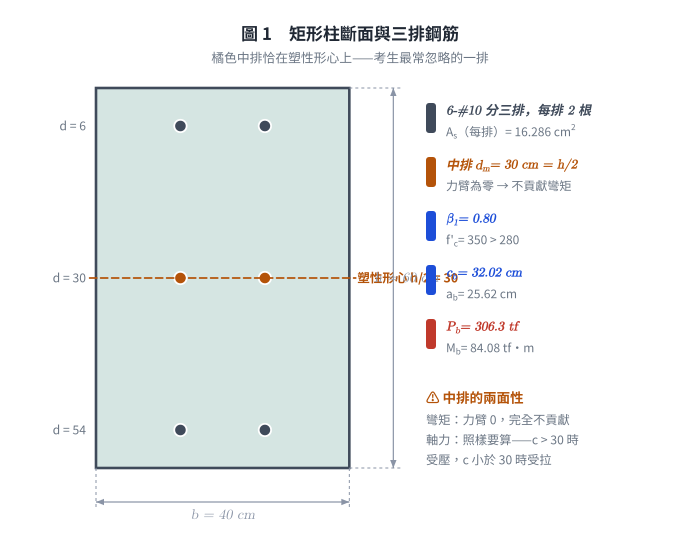
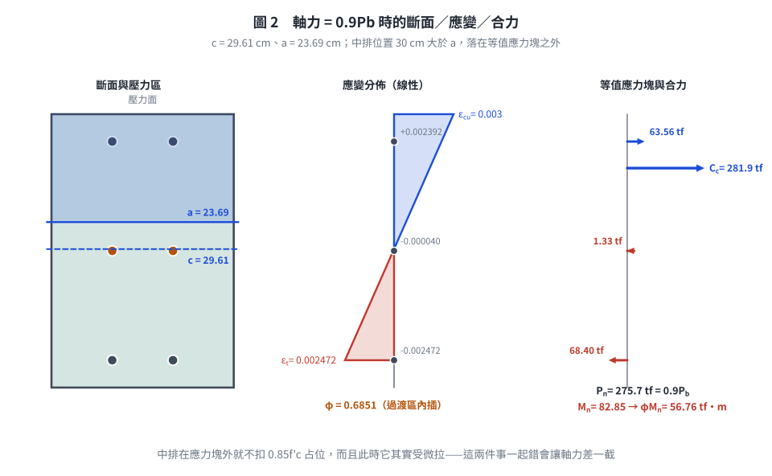
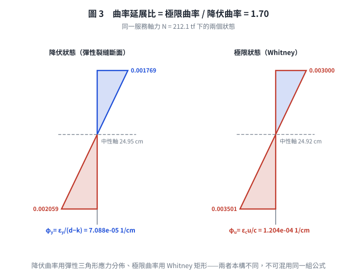

# 考題編號：RC-2011-3

**主分類：** `RC-U1-2` RC 柱強度分析與設計  
**副分類：** 無  
**設計法：** USD 強度設計法  
**標籤：** `矩形柱` `P-M互制` `平衡點` `三排配筋` `中排鋼筋` `過渡區φ值` `斷面韌性容量` `柱曲率延展比` `彈性中性軸` `載重係數γ`

---

## 1. 原始題目重述 (Problem Restatement)

針對圖 2 所示矩形 RC 柱斷面（`RC-2011-3-fig-1.png`）：

*圖說：矩形柱 $b=40$ cm，$h=60$ cm。6-#10 鋼筋分三排（每排 2 根）：第一排（壓力面）$d_1=d'=6$ cm；第二排（中排）$d_2 = d' + d'' = 6+24 = 30$ cm（= $h/2$，斷面形心）；第三排（張力面）$d_3 = d = 54$ cm。各排面積 $A_1 = A_m = A_s = 2\times8.143 = 16.286$ cm²；總配筋 $A_{st} = 48.858$ cm²。#3 箍筋。*

**材料：** $f'_c = 350$ kgf/cm²，$f_y = 4200$ kgf/cm²，$E_s = 2.04\times10^6$ kgf/cm²

**(一)** 已知 $P_u = 0.9P_b$，求此柱斷面之設計彎矩強度 $\phi M_n$。（15 分）  
**(二)** 求斷面韌性容量 $\mu_\phi = \phi_u/\phi_y$（假設載重係數 $\gamma = 1.3$）。（10 分）

---

*圖 1　矩形柱斷面與三排鋼筋。橘色中排恰在塑性形心（$d_m = h/2 = 30$ cm）：對彎矩力臂為零完全不貢獻，但軸力照樣要算——這一排的兩面性是本題最常被忽略的地方。*

## 2. 考題核心精神與出題者意圖 (Core Concepts & Examiner's Intent)

**核心觀念：**
- **(一)**：柱斷面三排鋼筋 P-M 互制；$P_u = 0.9P_b < P_b$ → 偏心增大 → 過渡區 → 需插值 $\phi$。
- **(二)**：用 $\gamma=1.3$ 換算服務載重，彈性中性軸求 $\phi_y$，Whitney 中性軸求 $\phi_u$。

**出題者意圖：**
1. 測驗三排鋼筋（含中排）的 P-M 計算，中排力臂為零（不貢獻彎矩）
2. 測驗 $\phi$ 過渡區插值
3. 測驗柱斷面韌性的彈性 vs 塑性中性軸雙重計算

---

## 3. 解題戰略地圖與陷阱分析 (Strategic Roadmap & Trap Analysis)

**作戰計畫：**
1. 材料常數（$\beta_1$、$\varepsilon_y$、$E_c$）
2. 求平衡點 $P_b$（$c_b=6120/(6120+f_y)\times d$）
3. 建立 $P_n = f(c)$ 方程式，解 $c$ 使 $P_n = 0.9P_b$
4. 計算 $M_n$（對形心取矩）及 $\phi$ 值
5. **(二)** 服務載重 $N = P_u/\gamma$；解彈性 NA（$k_y d$）求 $\phi_y$；解塑性 NA（$c_u$）求 $\phi_u$

**關鍵陷阱：**

| 陷阱 | 說明 | 應對 |
|------|------|------|
| ❶ 中排鋼筋在形心 | 中排力臂 = $d_m - h/2 = 0$，**不貢獻彎矩** | $M_n$ 計算時中排項 = 0 |
| ❷ 中排應力符號 | $c < d_m = 30$ → 中排在張力區；$c > 30$ → 壓力區 | 計算前先判斷 $c$ 與 30 的大小 |
| ❸ 壓力鋼筋在 Whitney block 內要扣除 $0.85f'_c$ | 若 $d_1 = 6 < a$，$C_1 = A_1(f'_1 - 0.85f'_c)$ | 中排若在 block 外，不扣 |
| ❹ $\phi_y$ 用彈性三角形，$\phi_u$ 用 Whitney 矩形 | 兩者中性軸位置不同 | 分開計算，用 $\gamma$ 算服務載重 |

---

## 3.5 變數層次分析 (Variable Hierarchy Analysis)

### 最終目標

**(一)** $\phi M_n$（給定 $P_u = 0.9P_b$ 條件下）；**(二)** $\mu_\phi = \phi_u/\phi_y$（$\gamma = 1.3$）

### 本題關鍵公式（依計算順序）

$$\text{Step 1：} c_b = \frac{6120}{6120+f_y}\cdot d,\quad a_b = \beta_1 c_b,\quad P_b = C_c^b + C_1^b + S_m^b - T^b$$

$$\text{Step 2：} 9520c + 94807 - \frac{2{,}990{,}130}{c} = 0.9\boxed{P_b} \quad \Rightarrow \quad c_u$$

$$\text{Step 3：} M_n = C_c(30 - a/2) + C_1(24) + 0 + T(24) \quad \text{（中排臂 = 0）}$$

$$\text{Step 4：} \phi = 0.65 + 0.25\frac{\varepsilon_t - \varepsilon_y}{0.005-\varepsilon_y},\quad \phi M_n$$

$$\text{Step 5（}\phi_y\text{）：} 11{,}556k^2 + 417{,}303k - 17{,}609{,}490 = 0 \quad \Rightarrow \quad k_y d \quad \Rightarrow \quad \phi_y = \frac{\varepsilon_y}{d - \boxed{k_y d}}$$

$$\text{Step 6（}\phi_u\text{）：} 9520c^2 - 117{,}293c - 2{,}990{,}130 = 0 \quad \Rightarrow \quad c_u^* \quad \Rightarrow \quad \phi_u = \frac{\varepsilon_{cu}}{\boxed{c_u^*}}$$

### L1：題目直接給定

| 符號 | 數值 | 說明 |
|------|------|------|
| $f'_c$ | 350 kgf/cm² | |
| $f_y$ | 4200 kgf/cm² | |
| $b$ | 40 cm | 柱寬 |
| $h$ | 60 cm | 柱高 |
| $d_1 = d'$ | 6 cm | 壓力鋼筋位置 |
| $d_m$ | 30 cm（= $d' + d'' = 6+24$） | 中排位置 |
| $d = d_3$ | 54 cm | 拉力鋼筋位置 |
| 各排面積 | 16.286 cm² | $2\times8.143$ |
| $\gamma$ | 1.3 | 載重係數（Part (二) 用） |

### L2：需知識點推導

**▌ 材料常數**

| 符號 | 公式 | 卡關? |
|------|------|-------|
| $\beta_1$ | $0.85 - 0.05(350-280)/70 = 0.80$ | |
| $\varepsilon_y$ | $4200/2{,}040{,}000 = 0.002059$ | |
| $E_c$ | $15000\sqrt{350} = 280{,}624$ kgf/cm² | |

**▌ 平衡點 $P_b$**

| 符號 | 公式 | 卡關? |
|------|------|-------|
| $c_b$ | $6120/10320\times54 = 32.02$ cm | |
| $a_b$ | $0.80\times32.02 = 25.62$ cm | |
| $C_c^b$ | $0.85\times350\times25.62\times40 = 304{,}878$ kgf | |
| $\varepsilon_1^b$ | $0.003(32.02-6)/32.02 = 0.002438 > \varepsilon_y$ → 降伏 | |
| $C_1^b$ | $16.286(4200-297.5) = 63{,}537$ kgf | |
| $\varepsilon_m^b$ | $0.003(32.02-30)/32.02 = 0.000189 > 0$（壓），$< \varepsilon_y$ | |
| $S_m^b$ | $16.286\times2{,}040{,}000\times0.000189 = 6{,}285$ kgf（在 block 外，不扣 $0.85f'_c$） | |
| $T^b$ | $16.286\times4200 = 68{,}401$ kgf | |
| $P_b$ | $304{,}878+63{,}537+6{,}285-68{,}401 = 306{,}299$ kgf = 306.3 tf | |

**▌ Part (一)：$P_n = 0.9P_b$ 時的中性軸**

| 符號 | 公式 | 卡關? |
|------|------|-------|
| $P_n$ | $0.9\times306.3 = 275.7$ tf = 275,700 kgf | |
| $c_u$ | 解二次方程 $9520c^2 - 180{,}893c - 2{,}990{,}130 = 0$ → 29.60 cm | |
| $a$ | $0.80\times29.60 = 23.68$ cm | |
| $\varepsilon_t$ | $0.003\times(54-29.60)/29.60 = 0.002475$ | |
| $\phi$ | 過渡區插值 = 0.685 | |
| $M_n$ | $82.84$ tf·m（見詳算） | |
| $\phi M_n$ | $0.685\times82.84 = 56.75$ tf·m | |

**▌ Part (二)：服務載重下韌性**

| 符號 | 公式 | 卡關? |
|------|------|-------|
| $N$ | $P_u/\gamma = 275.7/1.3 = 212.1$ tf | |
| $k_y d$（彈性） | 解 $k^2+36.11k-1524=0$ → 24.96 cm | |
| $\phi_y$ | $0.002059/(54-24.96) = 7.09\times10^{-5}$ rad/cm | |
| $c_u^*$（Whitney，$N=212.1$ tf） | 解 $c^2-12.321c-314.09=0$ → 24.92 cm | |
| $\phi_u$ | $0.003/24.92 = 1.204\times10^{-4}$ rad/cm | |
| $\mu_\phi$ | $1.204/0.709 = 1.70$ | |

### L3：深層知識（不懂就卡住）

| 知識點 | 說明 | 卡關? |
|--------|------|-------|
| 中排在形心處力臂為零 | 彎矩對形心取矩：$d_m = h/2 = 30$ cm → arm = 0，**中排不貢獻彎矩** | |
| $P_b$ 是標稱值（無 $\phi$），$P_u$ 是設計值（有 $\phi$） | 原題寫 $P_u = 0.9P_b$，而 $P_b$ 被明定為**標稱**軸壓強度——兩個層次混寫。本解採「$0.9P_b$ 即為標稱軸力 $P_n$」之解讀，詳見 §5「題意歧義」 | ⚠ |
| 載重係數 $\gamma$ 的作用 | $\gamma$ 將設計（因數化）荷重轉回服務（工作）荷重：$N = P_u/\gamma$ | |
| Whitney vs 彈性中性軸 | $\phi_y$：彈性三角形（線彈性假設）；$\phi_u$：Whitney 矩形（極限狀態） | |

---

## 4. 步驟化詳細計算過程 (Step-by-Step Detailed Calculation)

### Part (一)：設計彎矩強度 $\phi M_n$

#### Step 1：材料常數

$$\beta_1 = 0.80,\quad \varepsilon_y = 0.002059,\quad E_c = 280{,}624 \text{ kgf/cm}^2$$

---

#### Step 2：求平衡標稱軸壓強度 $P_b$

$$c_b = \frac{6120}{6120+4200}\times54 = 32.02 \text{ cm},\quad a_b = 0.80\times32.02 = 25.62 \text{ cm}$$

**各力（壓力正）：**

$$C_c^b = 0.85\times350\times25.62\times40 = 304{,}878 \text{ kgf}$$

壓力鋼筋（$d_1=6$ cm，在 block 內）：
$$\varepsilon_1^b = 0.003\times\frac{32.02-6}{32.02} = 0.002438 > \varepsilon_y \Rightarrow f_1 = f_y$$
$$C_1^b = 16.286\times(4200-297.5) = 63{,}537 \text{ kgf}$$

中排鋼筋（$d_m=30$ cm，在 block 外，壓力區）：
$$\varepsilon_m^b = 0.003\times\frac{32.02-30}{32.02} = 1.893\times10^{-4} \quad (< \varepsilon_y,\ \text{壓縮未降伏})$$
$$S_m^b = 16.286\times2{,}040{,}000\times1.893\times10^{-4} = 6{,}286 \text{ kgf}$$

拉力鋼筋（$d=54$ cm，平衡時降伏）：
$$T^b = 16.286\times4200 = 68{,}401 \text{ kgf}$$

$$\boxed{P_b = 304{,}878 + 63{,}537 + 6{,}286 - 68{,}401 = 306{,}300 \text{ kgf} = 306.3 \text{ tf}}$$

---

#### Step 3：求 $c_u$ 使 $P_n = 0.9P_b = 275.7$ tf

設 $c < 30$ cm（中排在張力區，待驗證）。Whitney block 力平衡：

$$P_n = \underbrace{9520c}_{C_c} + \underbrace{63{,}537}_{C_1,\text{ 降伏}} + \underbrace{16.286\times\frac{6120(c-30)}{c}}_{S_m < 0} - \underbrace{68{,}401}_{T}$$

整理（令 $P_n = 275{,}700$）：

$$9520c + 94{,}807 - \frac{2{,}990{,}130}{c} = 275{,}700$$

$$9520c^2 - 180{,}893c - 2{,}990{,}130 = 0$$

$$\boxed{c_u = \frac{180{,}893 + \sqrt{180{,}893^2 + 4\times9520\times2{,}990{,}130}}{2\times9520} = 29.60 \text{ cm}} \quad (< 30 \checkmark)$$

$$a = 0.80\times29.60 = 23.68 \text{ cm}$$

**驗算：**
$C_c = 9520\times29.60 = 281{,}792$ kgf；$S_m = 16.286\times6120\times(-0.40)/29.60 = -1{,}347$ kgf

$P_n = 281{,}792 + 63{,}537 - 1{,}347 - 68{,}401 = 275{,}581 \approx 275{,}700$ kgf ✅

---

#### Step 4：$\varepsilon_t$ 及 $\phi$ 值

$$\varepsilon_t = 0.003\times\frac{54-29.60}{29.60} = 0.003\times0.8243 = 0.002473$$

$\varepsilon_y = 0.002059 < \varepsilon_t = 0.002473 < 0.005$ → **過渡區**

$$\phi = 0.65 + 0.25\times\frac{0.002473 - 0.002059}{0.005 - 0.002059} = 0.65 + 0.25\times\frac{4.14\times10^{-4}}{2.941\times10^{-3}} = 0.65 + 0.0352 = \boxed{0.685}$$

---

#### Step 5：計算 $M_n$（對形心 $h/2 = 30$ cm 取矩）

| 力 | 大小（kgf） | 位置（cm from top） | 力臂（cm） | 力矩（kgf·cm） |
|----|------------|---------------------|------------|----------------|
| $C_c$ | 281,792 | $a/2 = 11.84$ | $30-11.84 = 18.16$ | 5,117,363 |
| $C_1$ | 63,537 | 6 | $30-6 = 24$ | 1,524,888 |
| $S_m$ | −1,347 | 30 | **0** | **0** |
| $T$ | 68,401 | 54 | $54-30 = 24$ | 1,641,624 |

$$M_n = 5{,}117{,}363 + 1{,}524{,}888 + 0 + 1{,}641{,}624 = 8{,}283{,}875 \text{ kgf·cm} = 82.84 \text{ tf·m}$$

$$\boxed{\phi M_n = 0.685\times82.84 = 56.75 \text{ tf·m}}$$

> 驗算偏心距：$e = M_n/P_n = 82.84/275.7 = 30.05$ cm $> e_b = 84.09/306.3 = 27.46$ cm ✅（偏心大於平衡，符合 $P_n < P_b$）

---

### Part (二)：斷面韌性容量 $\mu_\phi = \phi_u/\phi_y$（$\gamma = 1.3$）

---

#### Step 6：服務載重

$$N = \frac{0.9P_b}{\gamma} = \frac{275{,}700}{1.3} = 212{,}077 \approx 212{,}100 \text{ kgf} = 212.1 \text{ tf}$$

（分子即 Step 3 的 $0.9P_b = 275.7$ tf。原稿寫成 $P_u/\gamma$，但 Step 3 又把同一個數字當成 $P_n$——這個符號矛盾與題意歧義同源，見 §5「題意歧義」。）

---

#### Step 7：降伏曲率 $\phi_y$（彈性裂縫斷面）

在 $N = 212{,}100$ kgf 且 $\varepsilon_t = \varepsilon_y$，設彈性 NA 深度 $k$（$< 30$）：

各力均以 $\phi_y = \varepsilon_y/(d-k)$ 表示，力平衡 $N + T = C_c^e + C_1^e + S_m^e$：

$$\underbrace{0.5E_c\varepsilon_y bk^2/(54-k)}_{C_c^e} + \underbrace{A_1 f_y(k-6)/(54-k)}_{C_1^e} + \underbrace{A_m f_y(k-30)/(54-k)}_{S_m^e} = N + T = 280{,}501$$

整理（乘以 $(54-k)$）：

$$0.5\times280{,}624\times0.002059\times40\cdot k^2 + 68{,}401(k-6) + 68{,}401(k-30) = 280{,}501(54-k)$$

$$11{,}556k^2 + 136{,}802k - 2{,}462{,}436 = 15{,}147{,}054 - 280{,}501k$$

$$11{,}556k^2 + 417{,}303k - 17{,}609{,}490 = 0$$

$$k^2 + 36.11k - 1524.0 = 0$$

$$k_y d = \frac{-36.11 + \sqrt{36.11^2 + 4\times1524.0}}{2} = \frac{-36.11 + \sqrt{7400}}{2} = \frac{-36.11 + 86.03}{2} = \boxed{24.96 \text{ cm}}$$

$$\phi_y = \frac{\varepsilon_y}{d - k_y d} = \frac{0.002059}{54 - 24.96} = \frac{0.002059}{29.04} = 7.09\times10^{-5} \text{ rad/cm}$$

---

#### Step 8：極限曲率 $\phi_u$（Whitney block，$N = 212.1$ tf）

同前設 $c < 30$：

$$9520c + 94{,}807 - \frac{2{,}990{,}130}{c} = 212{,}100$$

$$9520c^2 - 117{,}293c - 2{,}990{,}130 = 0$$

$$c_u^* = \frac{12.321 + \sqrt{12.321^2 + 4\times314.09}}{2} = \frac{12.321 + 37.527}{2} = \boxed{24.92 \text{ cm}}$$

$$\phi_u = \frac{\varepsilon_{cu}}{c_u^*} = \frac{0.003}{24.92} = 1.204\times10^{-4} \text{ rad/cm}$$

---

#### Step 9：韌性容量

$$\boxed{\mu_\phi = \frac{\phi_u}{\phi_y} = \frac{1.204\times10^{-4}}{7.09\times10^{-5}} = 1.70}$$

---

*圖 2　$P_n = 0.9P_b$ 的斷面／應變／合力。三格垂直比例共用，$a = 23.69 < d_m = 30$ 的相對關係是真的——中排落在等值應力塊**之外**就不扣 $0.85f'_c$ 占位，而且此時它其實受微拉，兩件事一起錯會讓軸力差一截。*

*圖 3　曲率延展比的兩個狀態。左圖用彈性三角形應力分佈求 $\phi_y$、右圖用 Whitney 矩形求 $\phi_u$，兩者本構不同不可混用；兩個中性軸幾乎重合（24.95 vs 24.92 cm）正是 $\mu_\phi$ 只有 1.70 的原因。*

## 5. 關鍵爭議點與進階探討 (Critical Issues & Advanced Discussion)

### ⚠ 題意歧義：$P_u = 0.9P_b$ 該當成標稱還是設計軸力？（待人工定案）

原卷用字（RC-2011 第三題）：「$A_{st}$＝6-#10，$P_u$＝$0.9P_b$，試求此柱斷面之**設計彎矩強度**，其中 $P_b$ 為此柱斷面平衡偏心破壞時之**標稱**軸壓強度」。同一份考卷第一題又自行定義「$P_u$ 及 $M_u$ 分別為柱斷面之**設計**軸力強度及設計彎矩強度」——出題者把兩個層次混寫了。

| 解讀 | 式子 | $c$ (cm) | $\varepsilon_t$ | $\varphi$ | $M_n$ (tf·m) | $\varphi M_n$ (tf·m) | $\mu_\phi$ |
|------|------|---------:|-----------------:|----------:|-------------:|---------------------:|-----------:|
| **A（本解採用）** | $P_n = 0.9P_b$ | 29.61 | 0.002472 | 0.685 | 82.85 | **56.75** | **1.70** |
| B（照字面） | $\varphi P_n = 0.9P_b$ | 39.63 | 0.001087 | 0.650 | 77.30 | **50.25** | **2.21** |

兩者都自洽，差距不小。解讀 B 的字面依據較強（$P_u$ 依第一題定義即設計值，且出題者特別註明 $P_b$ 是標稱值，正是要考生換算）；解讀 A 則是坊間解答的通行做法。**本頁暫採 A 並保留 B 的完整數字，待人工比對標準答案後擇一定案。**

注意兩點：

1. 解讀 B 落在**壓力控制區**（$\varepsilon_t = 0.001087 < \varepsilon_{ty} = 0.002059$），$\varphi$ 直接取 0.65，不作內插；解讀 A 則落在過渡區才需要內插。
2. Part (二) 的服務載重一律是 $N = 275{,}700 / 1.3 = 212.1$ tf。這個算式（把 $0.9P_b$ 直接除以 $\gamma$）**只有在解讀 B 下才嚴格成立**——$\gamma$ 的定義是把因數化載重轉回服務載重，被除的必須是設計值。解讀 A 若要嚴謹，應為 $N = \varphi P_n/\gamma = 0.685\times275.7/1.3 = 145.3$ tf，$\mu_\phi$ 也會跟著變。本頁沿用通行解法的 212.1 tf，這是解讀 A 的一個內部不一致，**一併待定案**。

---

**① 中排鋼筋在形心處的特殊性**

由於 $d_m = 30$ cm $= h/2$，中排鋼筋恰好在塑性形心，對彎矩強度貢獻為零。但它參與軸力平衡（在 $c_b = 32.02 > 30$ 時為壓力鋼筋，在 $c < 30$ 時為張力鋼筋）。考生常忽略此點而多算彎矩。

**② 為何本柱的 $\mu_\phi$ 只有 1.70？**

本柱在 $N = 212.1$ tf 下，彈性 NA（24.96 cm）與 Whitney NA（24.92 cm）極為接近，因為：
$$\mu_\phi = \frac{\phi_u}{\phi_y} = \frac{\varepsilon_{cu}/c_u^*}{\varepsilon_y/(d-k_y d)} = \frac{\varepsilon_{cu}}{\varepsilon_y}\cdot\frac{d-k_y d}{c_u^*}$$

本題 $\varepsilon_{cu}/\varepsilon_y = 0.003/0.002059 = 1.457$，$(d-k_y d)/c_u^* = 29.04/24.92 = 1.165$，故 $\mu_\phi \approx 1.70$。

**③ $\gamma = 1.3$ 的使用時機**

$\gamma = 1.3$ 僅用於求服務載重（$N = P_u/\gamma$），用於韌性計算。**不能**將 $\phi M_n$ 再除以 $\gamma$。

**④ 考場速解提示（Part (二) 佔 10 分，是計算題不是概念題）**

> 若考場時間不足，可先計算 $\phi_u$（較直接），再記 $\phi_y \approx \phi_u \times c_u/(d-k_y d)$ 的比值，快速估算 $\mu_\phi$。

*圖解補繪：2026-08-21（向量圖 3 張，腳本 `figs/gen_RC-2011-3.py`，可重跑；腳本檔尾對 §4 公佈值做 assert）*
