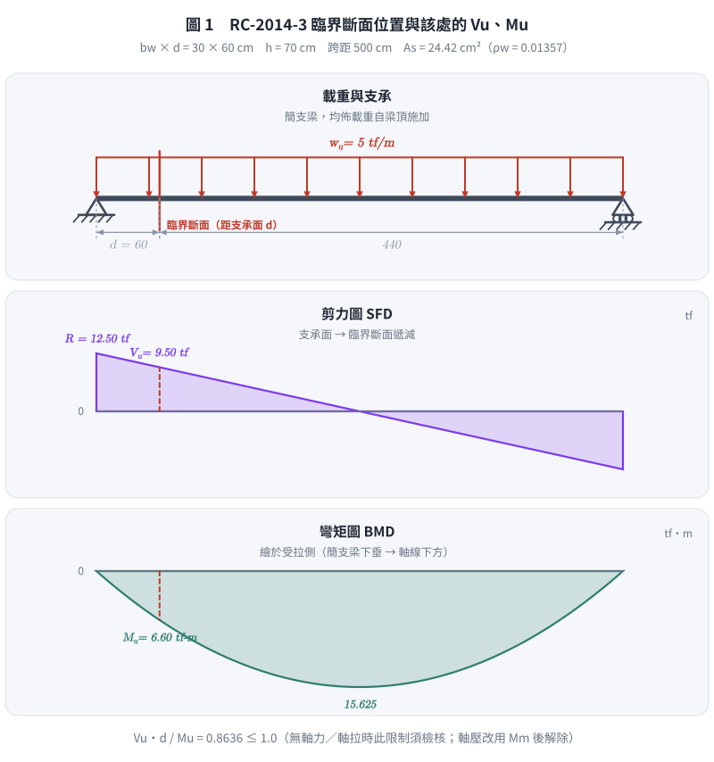
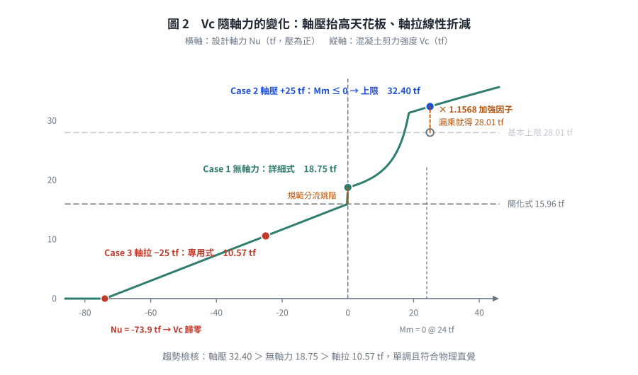
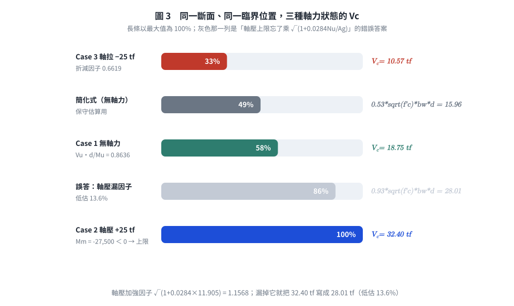

# 考題編號：RC-2014-3

**主分類：** `RC-U2-1` RC 剪力強度分析與設計
**副分類：** （無）
**設計法：** USD 強度設計法
**標籤：** `臨界斷面` `Vc最大混凝土剪力強度` `軸力影響` `等效彎矩Mm` `詳細公式` `軸壓梁` `軸拉梁` `軸壓Vc上限加強` `軸拉專用式` `規範分流`

---

## 1. 原始題目重述 (Problem Restatement)

**作答規範（原卷明訂）：** 中國土木水利工程學會「混凝土工程設計規範」（土木 401-100），未依規範作答不予計分。

**原卷所附「可能使用之公式，但不限於」：**

$$\phi = 0.65+(\varepsilon_t-0.002)(0.25/0.003),\quad E_s = 2.04\times10^6,\quad E_c = 15000\sqrt{f'_c}$$

$$V_c = 0.53\sqrt{f'_c}\,b_w d,\qquad V_c = \left(0.50\sqrt{f'_c} + 175\rho_w\frac{V_u d}{M_u}\right)b_w d \le 0.93\sqrt{f'_c}\,b_w d$$

$$M_m = M_u - N_u\!\left(\frac{4h-d}{8}\right),\qquad \beta_1 = 0.85-0.05\frac{f'_c-280}{70},\ \ 0.65\le\beta_1\le0.85$$

有一**簡支矩形梁**，跨距 $L = 5\ \text{m}$，斷面尺寸：

$$b = 30\ \text{cm},\quad d = 60\ \text{cm},\quad h = 70\ \text{cm}$$

材料與載重：
- $f'_c = 280\ \text{kgf/cm}^2$
- 均布設計載重 $w_u = 5\ \text{tf/m}$（原卷印為「均佈設計載重 5 tf」，依「均佈」二字判為 5 tf/m；不計梁自重）
- 受拉鋼筋：$A_s = 3\text{-D32} = 24.42\ \text{cm}^2$

在下列三種軸力條件下，求**臨界斷面**（距支承面距離 $d$ 處）之**最大混凝土剪力計算強度 $V_c$**：（25 分）

| 案例 | 軸力條件 |
|------|---------|
| Case 1 | 無軸力（$N_u = 0$） |
| Case 2 | 設計軸壓力 $N_u = 25\ \text{tf}$（壓力） |
| Case 3 | 設計軸拉力 $N_u = 25\ \text{tf}$（拉力） |

---



*圖 1　臨界斷面位置與該處的 $V_u$、$M_u$。臨界斷面自**支承面**起算 $d$（不是支承中心），$V_u \cdot d / M_u = 0.8636 \le 1.0$ 這道檢核在無軸力與軸拉時都要做——軸壓改用 $M_m$ 後才解除。*

## 2. 考題核心精神與出題者意圖 (Core Concepts & Examiner's Intent)

**核心精神：**
本題考的不是一條公式，而是**規範對三種軸力狀態各有一條獨立路徑**——考生必須先分流、再代值：

| 軸力狀態 | 規範路徑 | 特徵 |
|---------|---------|------|
| 無軸力 | 詳細式 $\left(0.50\sqrt{f'_c}+175\rho_w\dfrac{V_ud}{M_u}\right)b_wd$，且 $\dfrac{V_ud}{M_u}\le1.0$、$V_c\le0.93\sqrt{f'_c}b_wd$ | 標準式 |
| **軸壓** | 同上但以 $M_m$ 代 $M_u$，$\dfrac{V_ud}{M_m}$ **不受 1.0 限制**；**上限改為** $0.93\sqrt{f'_c}b_wd\sqrt{1+0.0284\dfrac{N_u}{A_g}}$。且**當 $M_m<0$ 時，$V_c$ 直接取該上限** | 上限被軸壓「加強」 |
| **軸拉** | **另有專用式** $V_c = 0.53\!\left(1+0.0284\dfrac{N_u}{A_g}\right)\!\sqrt{f'_c}\,b_wd$（$N_u$ 取負） | 不走 $M_m$ 路徑 |

**關鍵物理直覺：**
- **軸壓**使斷面受壓增加、抑制斜裂縫張開 → $V_c$ **提升**（而且上限本身也被放大）
- **軸拉**促進開裂、有效壓力區縮小 → $V_c$ **降低**（線性折減，可折到 0）

**出題者意圖：**
- 測試考生知不知道「軸壓的 $V_c$ 上限不是 $0.93\sqrt{f'_c}b_wd$」——這是 25 分裡最容易失分的一格
- 測試 $M_m$ 的物理意義與 $N_u$ 符號規定，以及 $M_m \le 0$ 的邊界處理
- 測試考生會不會把軸拉也硬套 $M_m$（規範的 $M_m$ 條文明寫「承受軸壓力之構材」）

---

## 3. 解題戰略地圖與陷阱分析 (Strategic Roadmap & Trap Analysis)

**作戰計畫：**

```
共用前置（全三案例相同）：
  → 計算 ρw、√f'c、Ag、臨界斷面 Vu、Mu、Vu·d/Mu

Case 1（無軸力）：Mm = Mu
  → 詳細式 → 與上限 0.93√f'c·bw·d 比較

Case 2（軸壓）：Mm = Mu − Nu(4h−d)/8
  → 先算軸壓加強後的上限 0.93√f'c·bw·d·√(1+0.0284Nu/Ag)
  → 若 Mm ≤ 0 → 直接取該上限（本題即此情形）
  → 若 Mm > 0 → 代詳細式（Vu·d/Mm 不受 1.0 限制），再與該上限比較

Case 3（軸拉）：改走軸拉專用式
  → Vc = 0.53(1 + 0.0284Nu/Ag)√f'c·bw·d，Nu 取負值
```

**關鍵陷阱：**

| # | 陷阱 | 應對策略 |
|---|------|---------|
| 1 | **軸壓時上限忘了乘 $\sqrt{1+0.0284N_u/A_g}$**：直接寫 $0.93\sqrt{f'_c}b_wd = 28.01$ tf | 軸壓上限為 $0.93\sqrt{f'_c}b_wd\sqrt{1+0.0284N_u/A_g}$；本題 = **32.40 tf**，低估 13.5% |
| 2 | **$N_u$ 符號搞混** | 土木 401-100：**壓力 $N_u > 0$，拉力 $N_u < 0$**（$N_u/A_g$ 以 kgf/cm² 代入） |
| 3 | **$M_m \le 0$ 時繼續套詳細式**：得 $V_ud/M_m < 0$，$V_c$ 反而變小 | $M_m \le 0$ → 規範規定直接取軸壓加強上限 |
| 4 | **軸拉硬套 $M_m$**：$M_m$ 條文限「承受軸壓力之構材」 | 軸拉走專用式；原卷只印 $M_m$ 是「不限於」清單的省略，不代表軸拉也用它 |
| 5 | **忘記 $V_ud/M_u \le 1.0$ 的限制** | 無軸力／軸拉時要檢核；**軸壓（用 $M_m$）時此限制解除** |
| 6 | **臨界斷面位置錯誤**：取支承中心起算 | 臨界斷面自**支承面**起算 $d$（本題三條件均成立，可 $d$ 偏移） |

---

## 3.5 變數層次分析 (Variable Hierarchy Analysis)

> 複習提示：第一次解題後，在每個卡住的知識點旁標記 `⚠`；第二次複習時只看有 `⚠` 的項目。

### 最終目標
`三種軸力條件下，臨界斷面之最大混凝土剪力計算強度 Vc`

### 本題關鍵公式（依計算順序）

> $\boxed{\cdot}$ = 需由前步驟推導，非題目直接給定的變數

$$\text{Step 1:}\quad \rho_w = \frac{A_s}{b_w d},\quad V_u = w_u\!\left(\frac{L}{2} - d\right),\quad M_u = \frac{w_u d (L-d)}{2},\quad A_g = bh$$

$$\text{Step 2（軸壓）:}\quad M_m = M_u - N_u\frac{4h-d}{8}$$

$$\text{Step 3a（無軸力）:}\quad V_c = \!\left(0.50\sqrt{f'_c} + 175\rho_w\frac{\boxed{V_u}\,d}{\boxed{M_u}}\right)\!b_w d \ \le\ 0.93\sqrt{f'_c}\,b_w d$$

$$\text{Step 3b（軸壓）:}\quad V_{c,\max} = 0.93\sqrt{f'_c}\,b_w d\sqrt{1+0.0284\frac{N_u}{A_g}};\quad \boxed{M_m}\le 0 \Rightarrow V_c = V_{c,\max}$$

$$\text{Step 3c（軸拉）:}\quad V_c = 0.53\!\left(1 + 0.0284\frac{N_u}{A_g}\right)\!\sqrt{f'_c}\,b_w d \quad (N_u<0)$$

### L1：題目直接給定

| 符號 | 數值 | 說明 |
|------|------|------|
| $b$ | 30 cm | 梁寬 |
| $d$ | 60 cm | 有效深度 |
| $h$ | 70 cm | 梁高 |
| $f'_c$ | 280 kgf/cm² | 混凝土強度 |
| $A_s$ | 24.42 cm² | 拉力鋼筋量（3-D32） |
| $L$ | 500 cm | 跨距 |
| $w_u$ | 5 tf/m = 50 kgf/cm | 均布設計載重 |
| $N_{u,2}$ | +25,000 kgf | Case 2 軸壓力（正） |
| $N_{u,3}$ | −25,000 kgf | Case 3 軸拉力（負） |

### L2：需知識點推導

**共用前置：**

| 符號 | 公式／來源 | 卡關? |
|------|----------|:-----:|
| $\rho_w$ | $24.42/(30\times60) = 0.01357$ | |
| $\sqrt{f'_c}$ | $\sqrt{280} = 16.733$ | |
| $b_w d$ | $30\times60 = 1800\ \text{cm}^2$ | |
| $A_g$ | $30\times70 = 2100\ \text{cm}^2$ | |
| $V_u$ | $w_u(L/2-d) = 50\times(250-60) = 9{,}500\ \text{kgf}$ | |
| $M_u$ | $w_u d(L-d)/2 = 50\times60\times440/2 = 660{,}000\ \text{kgf·cm}$ | |
| $V_u d/M_u$ | $9{,}500\times60/660{,}000 = 0.8636 \le 1.0$ ✓ | |
| $(4h-d)/8$ | $(4\times70-60)/8 = 27.5\ \text{cm}$ | |
| $N_u/A_g$（Case 2） | $25{,}000/2100 = 11.905\ \text{kgf/cm}^2$ | |

**Case 1（無軸力）：**

| 符號 | 公式／來源 | 卡關? |
|------|----------|:-----:|
| $V_c$ | $(8.366 + 175\times0.01357\times0.8636)\times1800 = 18{,}751\ \text{kgf}$ | |
| 上限 | $0.93\times16.733\times1800 = 28{,}011\ \text{kgf}$ ✓ 未超過 | |

**Case 2（軸壓）：**

| 符號 | 公式／來源 | 卡關? |
|------|----------|:-----:|
| $M_m$ | $660{,}000 - 25{,}000\times27.5 = -27{,}500\ \text{kgf·cm} < 0$ | |
| 上限修正因子 | $\sqrt{1+0.0284\times11.905} = \sqrt{1.3381} = 1.1568$ | |
| $V_c$ | $M_m\le0 \Rightarrow 28{,}011\times1.1568 = 32{,}402\ \text{kgf}$ | |

**Case 3（軸拉）：**

| 符號 | 公式／來源 | 卡關? |
|------|----------|:-----:|
| 折減因子 | $1 + 0.0284\times(-11.905) = 0.6619$ | |
| $V_c$ | $0.53\times0.6619\times16.733\times1800 = 10{,}566\ \text{kgf}$ | |

### L3：深層知識（不懂就卡住）

| 知識點 | 說明 | 卡關? |
|--------|------|:-----:|
| **$M_m$ 的物理意義** | 軸壓對斷面產生的「反向彎矩效應」$-N_u(4h-d)/8$，等效上抵銷外加彎矩；$M_m$ 變小 → $V_ud/M_m$ 變大 → $V_c$ 變大。$M_m<0$ 表示抵銷量已超過外加彎矩，斷面實質受壓，$V_c$ 取上限 | |
| **軸壓的上限也會被放大** | 這是本題最關鍵、也最常被漏掉的一條：$V_{c,\max} = 0.93\sqrt{f'_c}b_wd\sqrt{1+0.0284N_u/A_g}$。ACI 318（英制）原式為 $3.5\sqrt{f'_c}b_wd\sqrt{1+0.002N_u/A_g}$（$N_u/A_g$ 以 psi 代），$0.002\times14.223 = 0.0284$ 即公制係數 | |
| **軸拉走另一條路** | 規範的 $M_m$ 條文明寫「承受軸壓力之構材」。軸拉另有 $V_c = 0.53(1+0.0284N_u/A_g)\sqrt{f'_c}b_wd$（英制 $2(1+N_u/500A_g)\sqrt{f'_c}b_wd$），且允許保守取 $V_c=0$ 而由腹筋承擔全部剪力 | |
| **$V_c$ 何時歸零** | 軸拉折減因子 $1+0.0284N_u/A_g = 0$ 時，即 $N_u/A_g = -35.2\ \text{kgf/cm}^2$；本斷面 $A_g=2100$ → $N_u = -73.9\ \text{tf}$。超過此拉力，混凝土完全不提供抗剪貢獻 | |
| **詳細式比簡化式高的原因** | $175\rho_w V_ud/M_m$ 項為正，簡化式相當於把它併入 $0.53$ 的常數中保守處理 | |

---

## 4. 步驟化詳細計算過程 (Step-by-Step Detailed Calculation)

### 前置計算（三案例共用）

**斷面參數：**

$$\rho_w = \frac{A_s}{b_w d} = \frac{24.42}{30\times60} = \boxed{0.01357}$$

$$\sqrt{f'_c} = \sqrt{280} = \boxed{16.733}\ \text{kgf}^{1/2}/\text{cm}$$

$$b_w d = 1800\ \text{cm}^2,\qquad A_g = b\times h = 30\times70 = 2100\ \text{cm}^2$$

**臨界斷面（距支承面 $d = 60$ cm 處）之 $V_u$、$M_u$：**

（$d$ 偏移三條件均成立：簡支支承提供壓力、均佈載重自梁頂施加、區間內無集中載重。）

$$R = \frac{w_u L}{2} = \frac{50\times500}{2} = 12{,}500\ \text{kgf}$$

$$V_u = R - w_u d = 12{,}500 - 50\times60 = \boxed{9{,}500\ \text{kgf}}$$

$$M_u = R\,d - \frac{w_u d^2}{2} = 750{,}000 - 90{,}000 = \boxed{660{,}000\ \text{kgf·cm}}$$

$$\frac{V_u d}{M_u} = \frac{570{,}000}{660{,}000} = \boxed{0.8636} \le 1.0\ ✓$$

**等效彎矩參數：**

$$\frac{4h-d}{8} = \frac{4\times70 - 60}{8} = \frac{220}{8} = \boxed{27.5\ \text{cm}}$$

**基本上限（無軸力時）：**

$$V_{c,\max}^{(0)} = 0.93\sqrt{f'_c}\,b_w d = 0.93\times16.733\times1800 = \boxed{28{,}011\ \text{kgf} = 28.01\ \text{tf}}$$

**參考：簡化公式（無軸力）**

$$V_{c,\text{simple}} = 0.53\sqrt{f'_c}\,b_w d = 0.53\times16.733\times1800 = 15{,}963\ \text{kgf} = 15.96\ \text{tf}$$

---

### Case 1：無軸力（$N_u = 0$）

$M_m = M_u = 660{,}000\ \text{kgf·cm}$

$$V_c = \!\left(0.50\sqrt{f'_c} + 175\,\rho_w\,\frac{V_u d}{M_u}\right)\!b_w d
= \!\left(8.366 + 175\times0.01357\times0.8636\right)\!\times1800$$

$$= \left(8.366 + 2.375\times0.8636\right)\times1800 = \left(8.366 + 2.051\right)\times1800 = 10.417\times1800$$

$$= \boxed{V_c = 18{,}751\ \text{kgf} = 18.75\ \text{tf}}$$

上限驗算：$18{,}751 < 28{,}011\ ✓$（詳細式值有效）

---

### Case 2：設計軸壓力 $N_u = +25\ \text{tf}$（壓力，$N_u > 0$）

**Step 2-1：等效彎矩 $M_m$**

$$M_m = M_u - N_u\,\frac{4h-d}{8} = 660{,}000 - 25{,}000\times27.5 = 660{,}000 - 687{,}500 = \boxed{-27{,}500\ \text{kgf·cm}} < 0$$

**Step 2-2：軸壓加強後的上限**

$$\frac{N_u}{A_g} = \frac{25{,}000}{2{,}100} = 11.905\ \text{kgf/cm}^2$$

$$V_{c,\max} = 0.93\sqrt{f'_c}\,b_w d\,\sqrt{1 + 0.0284\frac{N_u}{A_g}}
= 28{,}011\times\sqrt{1 + 0.0284\times11.905}$$

$$= 28{,}011\times\sqrt{1.3381} = 28{,}011\times1.1568 = \boxed{32{,}402\ \text{kgf} = 32.40\ \text{tf}}$$

**Step 2-3：$M_m \le 0$ 之處理**

規範規定：**當 $M_m$ 計算為負值時，$V_c$ 應直接以上式（軸壓加強上限）計算。**（若仍代入詳細式，$V_ud/M_m = -20.7 < 0$，會荒謬地把 $V_c$ 算成 $-38$ tf。）

$$\boxed{V_c = 32{,}402\ \text{kgf} = 32.40\ \text{tf}}$$

> ⚠ **常見錯誤：** 寫成 $V_c = 0.93\sqrt{f'_c}b_wd = 28.01$ tf，漏掉 $\sqrt{1+0.0284N_u/A_g} = 1.157$
> 這個因子，**低估 13.5%**。規範的上限式本身就含軸壓項——軸壓不只讓詳細式的分子變大，
> 連天花板都一起抬高。

**物理意義：** 軸壓 25 tf 的等效附加彎矩（687,500 kgf·cm）已超過外力彎矩（660,000 kgf·cm），臨界斷面實質處於「壓彎加強」狀態，混凝土剪力強度達規範所允許的上限，且該上限因軸壓而提高 15.7%。

---

### Case 3：設計軸拉力 $N_u = -25\ \text{tf}$（拉力，$N_u < 0$）

軸拉不走 $M_m$ 路徑，改用規範之軸拉專用式：

$$V_c = 0.53\!\left(1 + 0.0284\frac{N_u}{A_g}\right)\!\sqrt{f'_c}\,b_w d$$

$$\frac{N_u}{A_g} = \frac{-25{,}000}{2{,}100} = -11.905\ \text{kgf/cm}^2$$

$$1 + 0.0284\times(-11.905) = 1 - 0.3381 = \boxed{0.6619}$$

$$V_c = 0.53\times0.6619\times16.733\times1800 = 0.3508\times16.733\times1800 = 5.870\times1800$$

$$= \boxed{V_c = 10{,}566\ \text{kgf} = 10.57\ \text{tf}}$$

即軸拉 25 tf 使 $V_c$ 相對無軸拉的簡化值（15.96 tf）**折減 33.8%**。

> **另一讀法（留檔）：** 原卷「可能使用之公式」只印了 $M_m$，沒印軸拉專用式，
> 因此坊間有解答把軸拉當成 $N_u<0$ 代入 $M_m$ 路徑：
> $M_m = 660{,}000 + 687{,}500 = 1{,}347{,}500$，$V_ud/M_m = 0.4230$，
> $V_c = (8.366 + 2.375\times0.4230)\times1800 = 16{,}868\ \text{kgf} = 16.87$ tf。
> 這個讀法**與規範條文不符**（$M_m$ 條文限「承受軸壓力之構材」），而且結論反直覺——
> 它算出軸拉 25 tf 的 $V_c$（16.87）竟比無軸拉的簡化式（15.96）**還高**，物理上站不住腳。
> 本解以規範分流為主線（10.57 tf），並保留 16.87 tf 供對照。

---

### 彙總比較表

| 案例 | $N_u$ (kgf) | 規範路徑 | 關鍵中間值 | $V_c$ (kgf) | $V_c$ (tf) |
|------|:-----------:|---------|-----------|:-----------:|:----------:|
| Case 1 無軸力 | 0 | 詳細式 | $V_ud/M_u = 0.864$ | **18,751** | **18.75** |
| Case 2 軸壓 | +25,000 | $M_m<0$ → 軸壓加強上限 | $M_m = -27{,}500$；因子 1.1568 | **32,402** | **32.40** |
| Case 3 軸拉 | −25,000 | 軸拉專用式 | 折減因子 0.6619 | **10,566** | **10.57** |

（參考：簡化式 $V_{c,\text{simple}} = 15{,}963\ \text{kgf} = 15.96\ \text{tf}$；無軸力上限 $28.01$ tf）

**趨勢檢核：** 軸壓（32.40）> 無軸力（18.75）> 軸拉（10.57）✓ 單調且符合物理直覺。

---



*圖 2　$V_c$ 隨軸力的變化。軸壓不只讓詳細式的分子變大，**連天花板都一起抬高**（$\times\sqrt{1+0.0284N_u/A_g} = 1.1568$）；軸拉則是線性折減、到 $N_u = -73.9$ tf 就歸零。$N_u$ 符號寫反的話整條曲線會左右翻轉，一眼可辨。*



*圖 3　三種軸力狀態的 $V_c$ 與一個標準錯誤答案並排。灰色那一列就是把 $0.93\sqrt{f'_c}b_wd = 28.01$ tf 當成軸壓時的上限——低估 13.6%，是這 25 分裡最容易掉的一格。*

## 5. 關鍵爭議點與進階探討 (Critical Issues & Advanced Discussion)

**① 為何軸壓 Case 2 的 $V_c$ 達到（且超過）基本上限**

軸壓 $N_u$ 在梁的任一斷面產生一個抵銷外加彎矩的效應（$-N_u(4h-d)/8$）。當抵銷量超過外加彎矩（$M_m<0$），即表示斷面實質受壓，斜裂縫被壓閉，$V_c$ 達上限。而規範同時把上限本身乘上 $\sqrt{1+0.0284N_u/A_g}$，因為壓應力越高、可達到的抗剪應力也越高。本題兩者疊加後 $V_c = 32.40$ tf，是無軸力值的 1.73 倍。

**② 軸拉力的工程意義與歸零點**

軸拉使斷面開裂、有效壓力區縮小。折減是**線性**的：$V_c \propto (1+0.0284N_u/A_g)$。歸零點在 $N_u/A_g = -35.2$ kgf/cm²，即本斷面 $N_u = -73.9$ tf。實務上（如受溫度／收縮束制的連續梁腹、拉桿式構材）規範也允許保守取 $V_c = 0$，由腹筋承擔全部剪力。

**③ 「最大混凝土剪力計算強度」該怎麼讀**

題目說「**最大**混凝土剪力計算強度」，意思是：在規範允許的各條路徑中，取算得最大者（而非隨手用簡化式）。三案例的規範解讀分別是：

| 案例 | 可用路徑 | 取值 |
|------|---------|------|
| 無軸力 | 簡化式 15.96 / 詳細式 18.75（上限 28.01） | 取 **18.75** |
| 軸壓 | 詳細式（$M_m$ 路徑）／上限式 | $M_m<0$ → 取上限 **32.40** |
| 軸拉 | 軸拉專用式（或保守取 0） | 取 **10.57** |

**④ 詳細式 vs 簡化式的取捨**

| 公式 | Case 1 $V_c$ | 適用情境 |
|------|:-----------:|---------|
| 簡化：$0.53\sqrt{f'_c}b_wd$ | 15.96 tf | 快速估算、保守設計 |
| 詳細：含 $175\rho_w V_ud/M_m$ 項 | 18.75 tf | 最大化 $V_c$ 以減少腹筋 |

詳細式需計算 $V_ud/M_m$，可省約 15% 腹筋。考場判準：題目寫「**最大**混凝土剪力計算強度」→ 走詳細式與上限式；只寫「計算 $V_c$」或時間緊迫 → 簡化式即可。

**⑤ 依最新規範（土木 401-112／ACI 318-19）重算對照**

ACI 318-19 把 $V_c$ 全面改寫（Table 22.5.5.1），**$M_m$ 等效彎矩法與軸拉專用式一併廢除**，改以單一線性軸力項 $N_u/(6A_g)$ 統一處理壓與拉：

$$A_v \ge A_{v,\min}:\quad V_c = \max\!\left\{\left[0.53\lambda\sqrt{f'_c} + \frac{N_u}{6A_g}\right]b_wd,\ \ \left[2.12\lambda\,\rho_w^{1/3}\sqrt{f'_c} + \frac{N_u}{6A_g}\right]b_wd\right\}$$

$$\text{限制：}\ \frac{N_u}{6A_g}\le 0.05f'_c,\qquad V_c \le 1.325\lambda\sqrt{f'_c}\,b_wd$$

（$N_u$：壓為正、拉為負；括號內係數為 kgf/cm² 制，對應 SI 制的 $0.17$／$0.66$／$0.42$。）

代入本題（$\rho_w^{1/3} = 0.2385$，故式(a) $0.53 > $ 式(b) $2.12\times0.2385 = 0.5056$，由式(a) 控制；$N_u/(6A_g) = \pm1.984 \le 0.05f'_c = 14$ ✓；上限 $1.325\times16.733\times1800 = 39.9$ tf 未觸及）：

| 案例 | **土木 401-100（原卷指定，本解主線）** | **土木 401-112／ACI 318-19** | 差異 |
|------|:---:|:---:|:---:|
| Case 1 無軸力 | 18.75 tf（詳細式） | **15.96 tf** | −14.9% |
| Case 2 軸壓 +25 tf | 32.40 tf（$M_m<0$ → 加強上限） | **19.53 tf** | −39.7% |
| Case 3 軸拉 −25 tf | 10.57 tf（軸拉專用式） | **12.39 tf** | +17.2% |

**觀念差異（比數字更重要）：**
1. 318-19 取消了「$\rho_w$ 與 $V_ud/M_u$ 交互作用」的詳細式，改用 $\rho_w^{1/3}$，**且不再需要斷面的 $M_u$**——同一斷面不再因位置不同而有不同 $V_c$。
2. 軸力效應由「非線性的 $M_m$ ＋ 開根號上限」改成**線性的 $N_u/(6A_g)$**，壓與拉共用一條式子，符號自動處理。因此 318-19 下軸壓的加成溫和許多（+22% 而非 +73%），軸拉的折減也溫和許多（−22% 而非 −34%）。
3. 318-19 另新增尺寸效應係數 $\lambda_s$（僅在 $A_v < A_{v,\min}$ 時適用），$d$ 越大折減越多；本題假設配有充足腹筋故不觸發。

> **考場提醒：** 本題原卷已明訂土木 401-100 並附上 $M_m$ 公式，因此**主線必須用 401-100**。
> 上表僅供理解規範演進；若未來考題指定 401-112，$M_m$ 一律不再使用。

*圖解補繪：2026-09-02（向量圖 3 張，腳本 `figs/gen_RC-2014-3.py`，可重跑；腳本檔尾對 §4 公佈值做 assert）*
