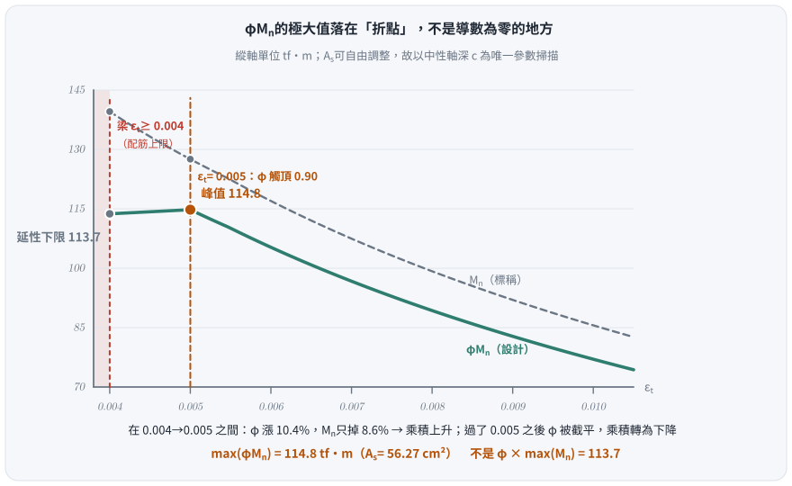
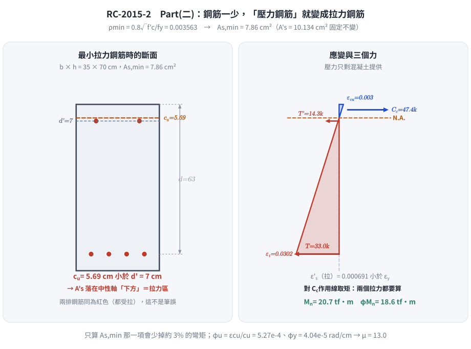
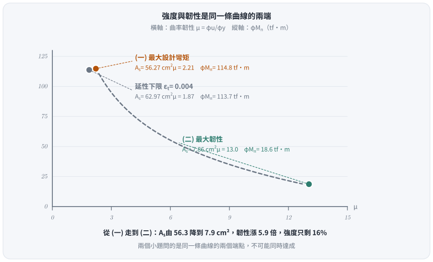

# 考題編號：RC-2015-2

**主分類：** `RC-U1-1` RC 梁彎矩強度分析與設計  
**副分類：** （無）  
**設計法：** USD強度設計法  
**標籤：** `雙筋梁` `最大設計彎矩` `拉力控制界限` `折點極大值` `曲率韌性` `εt=0.004限制` `最小配筋率` `φu/φy` `轉換斷面法` `壓力鋼筋落入拉力區`

---

## 1. 原始題目重述（Problem Restatement）

RC 雙筋矩形梁斷面，已知條件：

| 項目 | 數值 |
|------|------|
| 斷面寬 $b$ | 35 cm |
| 斷面總深 $h$ | 70 cm |
| 拉力鋼筋有效深度 $d$ | 63 cm |
| 壓力鋼筋有效深度 $d'$ | 7 cm |
| 混凝土強度 $f'_c$ | 350 kgf/cm² |
| 鋼筋降伏強度 $f_y$ | 4200 kgf/cm² |
| 彈性模數比 $n$ | 7 |
| 壓力鋼筋 $A'_s$ | $2\text{-\#8} = 2 \times 5.067 = 10.134$ cm² |

**試求（在適當設置拉力鋼筋後）：**  
（一）此梁斷面可具有之最大設計彎矩強度。（20 分）  
（二）此梁斷面可具有之最大韌性容量 $\mu$，其中 $\mu = \varphi_u / \varphi_y$。（20 分）

---

## 2. 考題核心精神與出題者意圖（Core Concepts & Examiner's Intent）

**核心觀念：**
- **(一)** 最大設計彎矩強度：題目寫「在**適當設置**拉力鋼筋後」，代表 $A_s$ 是**可自由調整**的變數，所求為 $\max_c\bigl[\varphi(\varepsilon_t)\cdot M_n(c)\bigr]$，必須**掃描求極大**而非直接套「最大鋼筋量」。峰值落在**拉力控制界限 $\varepsilon_t = 0.005$**，不是延性下限 $\varepsilon_t = 0.004$。
- **(二)** 最大韌性容量：最大曲率韌性 $\mu$ 在**最少拉力鋼筋**時出現。極限曲率 $\varphi_u = \varepsilon_{cu}/c_u$，降伏曲率 $\varphi_y = \varepsilon_y/(d-k_y d)$（彈性轉換斷面）。

**出題者意圖：** 讓考生看清「最大彎矩」與「最大韌性」是兩個相互**抵換**（trade-off）的設計目標——拉力鋼筋越多，彎矩越大但韌性越低；鋼筋越少，韌性越高但強度越小。

> **同卷第一題用了完全相同的句型**（RC-2015-1：「在適當調整軸壓載重後，可承受之最大極限彎矩載重」）。
> 兩題考的是同一件事：**設計強度的極大值出現在 $\varphi$ 觸頂處，不在標稱強度的極大值處。**

---

## 3. 解題戰略地圖與陷阱分析（Strategic Roadmap & Trap Analysis）

**Part (一) 作戰：**
```
(1) 確認 β₁ = 0.80（f'c = 350 kgf/cm²）
(2) 認清 As 可自由調整 → φMn 是 c 的函數，要掃描不是代一個點
(3) 算延性下限端點：εt = 0.004 → c = 3d/7 = 27 cm → φ = 0.815 → φMn = 113.7
(4) 算拉力控制界限：εt = 0.005 → c = 0.375d = 23.625 cm → φ = 0.90 → φMn = 114.8 ← 峰值
(5) εt > 0.005 後 φ 被截平在 0.90、Mn 續降 → φMn 單調遞減，確認單峰
(6) 每一點都要重驗 A's 是否降伏（ε's 隨 c 變小而下降）
```

**Part (二) 作戰：**
```
(1) 最大韌性 → 最少拉力鋼筋 As,min = ρmin × b × d
(2) 極限分析：找 cu（注意 A's 可能落在中性軸下方 = 拉力）
(3) 彈性轉換斷面法：找 ky（n=7），求 φy
(4) μ = φu/φy = (εcu/cu) / (εy / (d - kyd))
```

**關鍵陷阱（四個）：**

| # | 陷阱 | 正確做法 |
|---|------|---------|
| ① | **把「最大設計彎矩」當成「最大鋼筋量」** | $\max(\varphi M_n) \neq \varphi\cdot\max(M_n)$。$A_s$ 可調時峰值在 $\varepsilon_t = 0.005$（114.8），不在 $\varepsilon_t = 0.004$（113.7）。必須掃描並附表證明單峰 |
| ①' | 若題目鎖死在 $\varepsilon_t = 0.004$，φ 誤用 0.90 | 該點在過渡區，$\varphi = 0.815$（現行式）／0.817（舊式），不是 0.90 |
| ② | Cs 未扣除混凝土占位 | $C'_s = A'_s(f'_s - 0.85f'_c)$ |
| ③ | Part(二) 極限時 A's 落於中性軸以下（拉力區） | cu < d' = 7 cm → A's 為拉力鋼筋，需重新列平衡 |
| ④ | φy 直接用 εy/d（忽略轉換斷面中性軸） | 必須用彈性轉換斷面求 ky，φy = εy/(d(1-ky)) |

---

## 3.5 變數層次分析（Variable Hierarchy Analysis）

> 複習提示：第一次解題後，在每個卡住的知識點旁標記 `⚠`；第二次複習時只看有 `⚠` 的項目。

### 最終目標

（一）最大 φMn（$A_s$ 可調，掃描 $c$ 求 $\max\varphi M_n$）；（二）最大 μ = φu/φy（最小 As 限制）

### 本題關鍵公式（依計算順序）

$$\text{Part(一)-Step1:}\quad c(\varepsilon_t) = \frac{\varepsilon_{cu}}{\varepsilon_{cu}+\varepsilon_t}\,d \quad
\begin{cases}\varepsilon_t = 0.004 &\Rightarrow c = \tfrac{3}{7}d = 27.00 \text{ cm（延性下限）}\\[2pt]
\varepsilon_t = 0.005 &\Rightarrow c = 0.375d = 23.625 \text{ cm（拉力控制界限）}\end{cases}$$

$$\text{Part(一)-Step2:}\quad \varepsilon'_s = 0.003\,\frac{\boxed{c}-d'}{\boxed{c}} \quad \Rightarrow f'_s \quad(\text{每一個 } c \text{ 都要重驗})$$

$$\text{Part(一)-Step3:}\quad A_s(c) = \frac{C_c + C'_s}{f_y},\quad M_n(c) = C_c\!\left(d-\tfrac{a}{2}\right)+C'_s(d-d')$$

$$\text{Part(一)-Step4:}\quad \boxed{\varphi M_n = \max_c\bigl[\varphi(\varepsilon_t)\cdot M_n(c)\bigr]} \quad \text{（折點極大值，不可微分求，需分段判斷）}$$

$$\text{Part(二)-Step1:}\quad A_{s,\min} = \rho_{\min} \cdot b \cdot d,\quad \rho_{\min} = \frac{0.8\sqrt{f'_c}}{f_y}$$

$$\text{Part(二)-Step2:}\quad 0.85 f'_c \beta_1 c_u b = A'_s\,f'_{s,\text{tension}} + A_s\,f_y \quad (c_u < d')$$

$$\text{Part(二)-Step3:}\quad \frac{b(k_y d)^2}{2} + (n-1)A'_s(k_y d - d') = n A_s(d - k_y d)$$

$$\text{Part(二)-Step4:}\quad \mu = \frac{\varphi_u}{\varphi_y} = \frac{\varepsilon_{cu}/\boxed{c_u}}{\varepsilon_y/(d - \boxed{k_y}\,d)}$$

### L1：題目直接給定

| 符號 | 數值 | 說明 |
|------|------|------|
| $b, h, d, d'$ | 35, 70, 63, 7 cm | 斷面幾何 |
| $f'_c, f_y$ | 350, 4200 kgf/cm² | 材料強度 |
| $n$ | 7 | 彈性模數比（用於降伏曲率分析） |
| $A'_s$ | 10.134 cm² | 2-\#8，固定壓力鋼筋 |

### L2：需知識點推導

**▎Part (一)：最大設計彎矩**

| 符號 | 公式／來源 | 卡關? |
|------|-----------|-------|
| $\beta_1$ | $0.85 - 0.05(350-280)/70 = 0.80$ | |
| $c$（拉力控制界限）| $0.375d = 23.625$ cm（$\varepsilon_t = 0.005$）**← 控制** | |
| $a$ | $\beta_1 c = 18.90$ cm | |
| $\varepsilon'_s$ | $0.003(23.625-7)/23.625 = 0.002111 > \varepsilon_y = 0.002059$ → A's **勉強**降伏 | |
| $C_c$ | $0.85 \times 350 \times 18.90 \times 35 = 196{,}796$ kgf | |
| $C'_s$ | $A'_s(f_y - 0.85f'_c) = 39{,}548$ kgf | |
| $A_s$ | $(C_c + C'_s)/f_y = 56.27$ cm² | |
| $M_n$ | $C_c(d-a/2) + C'_s(d-d') = 127.53$ tf·m | |
| $\varphi$ | $\varepsilon_t = 0.005$ → 拉力控制 → $\varphi = 0.90$（不必內插） | |
| 對照：$c_{\max}$ | $3d/7 = 27$ cm（$\varepsilon_t = 0.004$，延性下限）→ $\varphi M_n = 113.7$ **不是峰值** | |

**▎Part (二)：最大韌性**

| 符號 | 公式／來源 | 卡關? |
|------|-----------|-------|
| $\rho_{\min}$ | $0.8\sqrt{350}/4200 = 0.003564$ | |
| $A_{s,\min}$ | $\rho_{\min} \times 35 \times 63 = 7.86$ cm² | |
| $c_u$ | 由力平衡求解（含 cu < d' 之特殊條件） | |
| $k_y$ | 由彈性轉換斷面二次方程求解 | |
| $\varphi_u$ | $\varepsilon_{cu}/c_u = 0.003/c_u$ | |
| $\varphi_y$ | $\varepsilon_y/(d-k_y d)$ | |
| $\mu$ | $\varphi_u/\varphi_y$ | |

### L3：深層知識（不懂就卡住）

| 知識點 | 說明 | 卡關? |
|--------|------|-------|
| **$\max(\varphi M_n) \neq \varphi\cdot\max(M_n)$** | 過渡區內 $\varphi$ 相對自身漲 10.4%（0.815→0.90）、$M_n$ 只掉 8.6%，乘積一路上升到 $\varphi$ 觸頂被**截平**為止 → 折點極大值，不是導數為零的平滑極值 | |
| εt = 0.004 為梁最大鋼筋限制 | ACI／土木401 規定梁（非柱）εt ≥ 0.004，對應 c/d ≤ 3/7。這是**配筋上限**，不是**設計彎矩上限** | |
| 最大韌性在最小鋼筋 | As ↓ → cu ↓ → φu ↑；ky 幾乎不變 → φy 幾乎不變 → μ ↑ | |
| cu < d' 時 A's 成為拉力鋼筋 | 當中性軸比 d'（壓力鋼筋位置）還高時，A's 落在拉力區，平衡方程式改變 | |
| 彈性轉換斷面求 ky（用於 φy） | 截面一開始仍是彈性，用 n 倍化鋼筋面積，對中性軸取面積矩 = 0 | |
| 韌性 vs 強度的本質抵換 | 多鋼筋 → c↑ → φu↓ → μ↓；少鋼筋 → c↓ → φu↑ → μ↑ | |

---

## 4. 步驟化詳細計算過程（Step-by-Step Detailed Calculation）

### 共用基本參數

$$\beta_1 = 0.85 - 0.05 \times \frac{350-280}{70} = 0.85 - 0.05 = \boxed{0.80}$$

$$\varepsilon_y = \frac{f_y}{E_s} = \frac{4200}{2{,}040{,}000} = 0.00206$$

$$A'_s = 2 \times 5.067 = 10.134 \text{ cm}^2$$

---

### Part（一）：最大設計彎矩強度

#### Step 1：認清 $A_s$ 是設計變數 → $\varphi M_n$ 是 $c$ 的函數

題目寫「在**適當設置**拉力鋼筋後」，$A_s$ 不是給定值，是**可自由調整的設計變數**。
以中性軸深度 $c$ 為唯一參數，整個斷面完全確定：

$$\varepsilon_t = 0.003\,\frac{d-c}{c},\qquad a = \beta_1 c = 0.80c,\qquad
\varepsilon'_s = 0.003\,\frac{c-d'}{c},\qquad f'_s = \min(E_s\varepsilon'_s,\ f_y)$$

$$C_c = 0.85f'_c\,ab,\qquad C'_s = A'_s\bigl(f'_s - 0.85f'_c\bigr),\qquad
A_s(c) = \frac{C_c + C'_s}{f_y}$$

$$M_n(c) = C_c\!\left(d - \frac{a}{2}\right) + C'_s\,(d-d')$$

**兩個效應方向相反：** $c\downarrow$ → $A_s\downarrow$ → $M_n\downarrow$，但同時 $\varepsilon_t\uparrow$ → $\varphi\uparrow$。
所以 $\varphi M_n$ 必須**掃描求極大**，不能代單一點。

**可行區間下限：** 規範規定梁 $\varepsilon_t \geq 0.004$，即 $c \leq \dfrac{3}{7}d = 27$ cm。

---

#### Step 2：端點 A —— 延性下限 $\varepsilon_t = 0.004$（最大鋼筋量）

$$c = \frac{0.003}{0.003+0.004}\times 63 = \frac{3}{7}\times 63 = 27.00 \text{ cm},\qquad a = 0.80\times27 = 21.60 \text{ cm}$$

**驗算壓力鋼筋：**

$$\varepsilon'_s = 0.003 \times \frac{27 - 7}{27} = 0.002222 > \varepsilon_y = 0.002059 \;\Rightarrow\; f'_s = f_y = 4{,}200 \text{ kgf/cm}^2\ ✓$$

**三力與斷面：**

$$C_c = 0.85 \times 350 \times 21.60 \times 35 = 224{,}910 \text{ kgf}$$

$$C'_s = A'_s(f_y - 0.85f'_c) = 10.134 \times (4{,}200 - 297.5) = 39{,}548 \text{ kgf}$$

$$A_s = \frac{224{,}910 + 39{,}548}{4{,}200} = \frac{264{,}458}{4{,}200} = 62.97 \text{ cm}^2 \quad(= A_{s,\max}\text{，配筋上限})$$

$$M_n = 224{,}910 \times (63 - 10.80) + 39{,}548 \times (63-7) = 11{,}740{,}302 + 2{,}214{,}688 = 13{,}954{,}990 \text{ kgf·cm} = 139.55 \text{ tf·m}$$

**φ（過渡區，用現行式）：**

$$\varphi = 0.65 + 0.25\,\frac{\varepsilon_t - \varepsilon_{ty}}{0.005 - \varepsilon_{ty}}
= 0.65 + 0.25\times\frac{0.004 - 0.002059}{0.005 - 0.002059} = 0.65 + 0.165 = 0.815$$

$$\varphi M_n = 0.815 \times 139.55 = 113.7 \text{ tf·m}$$

> 舊式 $\varphi = 0.65+\frac{0.004-0.002}{0.003}\times0.25 = 0.817$ 得 114.0 tf·m，差 0.3%，**不影響下面的結論**。

---

#### Step 3：端點 B —— 拉力控制界限 $\varepsilon_t = 0.005$

$$c = \frac{0.003}{0.003+0.005}\times 63 = 0.375 \times 63 = 23.625 \text{ cm},\qquad a = 0.80 \times 23.625 = 18.90 \text{ cm}$$

**重驗壓力鋼筋（$c$ 變小，$\varepsilon'_s$ 會跟著掉，不可沿用 Step 2 的結論）：**

$$\varepsilon'_s = 0.003 \times \frac{23.625 - 7}{23.625} = 0.003 \times 0.7037 = 0.002111 > \varepsilon_y = 0.002059$$

$$\Rightarrow f'_s = f_y = 4{,}200 \text{ kgf/cm}^2\ ✓\quad(\text{只餘 } 2.5\%\text{，若 } c \text{ 再小一點就不降伏了})$$

**三力與斷面：**

$$C_c = 0.85 \times 350 \times 18.90 \times 35 = 196{,}796 \text{ kgf},\qquad C'_s = 39{,}548 \text{ kgf（同上）}$$

$$A_s = \frac{196{,}796 + 39{,}548}{4{,}200} = \frac{236{,}344}{4{,}200} = 56.27 \text{ cm}^2$$

$$M_n = 196{,}796 \times (63 - 9.45) + 39{,}548 \times 56 = 10{,}538{,}426 + 2{,}214{,}688 = 12{,}753{,}114 \text{ kgf·cm} = 127.53 \text{ tf·m}$$

**φ：** $\varepsilon_t = 0.005$ → **拉力控制斷面**，$\varphi = 0.90$（不必內插）

$$\boxed{\varphi M_n = 0.90 \times 127.53 = \mathbf{114.8 \text{ tf·m}}}$$

---

#### Step 4：掃描 $\varphi M_n$，證明峰值在 $\varepsilon_t = 0.005$

| $\varepsilon_t$ | $c$ (cm) | $a$ (cm) | $\varepsilon'_s$ | $f'_s$ | $A_s$ (cm²) | $M_n$ (tf·m) | $\varphi$ | $\varphi M_n$ (tf·m) |
|---:|---:|---:|---:|---:|---:|---:|---:|---:|
| 0.0040 | 27.00 | 21.60 | 0.002222 | 4,200 | 62.97 | 139.55 | 0.815 | 113.7 |
| 0.0045 | 25.20 | 20.16 | 0.002167 | 4,200 | 59.40 | 133.23 | 0.858 | 114.3 |
| **0.0050** | **23.63** | **18.90** | **0.002111** | **4,200** | **56.27** | **127.53** | **0.900** | **114.8 ← 峰值** |
| 0.0060 | 21.00 | 16.80 | 0.002000 | 4,080 | 50.78 | 116.98 | 0.900 | 105.3 |
| 0.0080 | 17.18 | 13.75 | 0.001778 | 3,627 | 42.11 | 99.23 | 0.900 | 89.3 |
| 0.0100 | 14.54 | 11.63 | 0.001556 | 3,173 | 35.77 | 85.57 | 0.900 | 77.0 |

**為什麼峰值恰在折點上？** 在 $[0.004,\ 0.005]$ 區間：

$$\varphi:\ 0.815 \to 0.900\ (+10.4\%\text{，法規強制的固定幅度})\qquad
M_n:\ 139.55 \to 127.53\ (-8.6\%)$$

$\varphi$ 漲得比 $M_n$ 掉得快 → 乘積**單調上升**；$\varepsilon_t > 0.005$ 後 $\varphi$ 被**截平**在 0.90、$M_n$ 繼續下降 → 乘積單調下降。
兩段夾出的極大值落在**折點**上，不是導數為零的平滑極值，**故不能用微分求，要分段判斷**。



*圖 1　折點極大值。$\varphi$ 在 $[0.004,\ 0.005]$ 漲 10.4%、$M_n$ 只掉 8.6%，乘積一路上升到 $\varphi$ 觸頂被截平為止——這張圖攔下「把最大鋼筋量當成最大設計彎矩」，也說明為何此處不能用微分求極值。*

#### Step 5：Part (一) 結論

$$\boxed{\varphi M_{n,\max} = 114.8 \text{ tf·m}\quad(A_s = 56.27 \text{ cm}^2,\ c = 23.63 \text{ cm},\ \varepsilon_t = 0.005,\ \varphi = 0.90)}$$

> **注意：** 若照「最大鋼筋量 $A_{s,\max} = 62.97$ cm²」作答會得 113.7（舊式 φ 為 114.0），
> 雖然只低 1%，但那是**配筋上限**不是**設計彎矩上限**，觀念上是錯的。

---

### Part（二）：最大韌性容量 μ = φu / φy

#### Step 1：最小拉力鋼筋量

$$\rho_{\min} = \frac{0.8\sqrt{f'_c}}{f_y} = \frac{0.8 \times \sqrt{350}}{4{,}200} = \frac{0.8 \times 18.71}{4{,}200} = \frac{14.97}{4{,}200} = 0.003564$$

$$A_{s,\min} = 0.003564 \times 35 \times 63 = \boxed{7.86 \text{ cm}^2}$$

#### Step 2：極限中性軸深度 $c_u$（特殊：A's 落在拉力區）

> **策略關鍵：** 當拉力鋼筋 As 極少時，中性軸極高（cu 很小）。若 $c_u < d' = 7$ cm，則「壓力鋼筋」A's 實際上落在**拉力區**，改為拉力鋼筋處理。

**假設 $c_u < d' = 7$ cm（A's 在拉力區，未降伏）：**

$$0.85 f'_c \cdot \beta_1 c_u \cdot b = A'_s \cdot \underbrace{E_s \cdot \frac{0.003(d'-c_u)}{c_u}}_{f'_{s,\text{tension}}} + A_{s,\min} \cdot f_y$$

$$8{,}330\,c_u = 10.134 \times \frac{6{,}120(7-c_u)}{c_u} + 7.86 \times 4{,}200$$

$$8{,}330\,c_u = \frac{62{,}020(7-c_u)}{c_u} + 33{,}012$$

整理成二次方程：

$$8{,}330\,c_u^2 + 29{,}008\,c_u - 434{,}140 = 0$$

$$c_u = \frac{-29{,}008 + \sqrt{29{,}008^2 + 4 \times 8{,}330 \times 434{,}140}}{2 \times 8{,}330} = \frac{-29{,}008 + 123{,}722}{16{,}660} = \boxed{5.69 \text{ cm}}$$

**驗證假設：** $c_u = 5.69 \text{ cm} < d' = 7 \text{ cm}$ ✓

A's 拉力應變：$\varepsilon'_{s} = 0.003(7-5.69)/5.69 = 0.000691 < \varepsilon_y$ ✓（未降伏，與計算一致）

$$\varphi_u = \frac{\varepsilon_{cu}}{c_u} = \frac{0.003}{5.69} = \boxed{5.27 \times 10^{-4} \text{ rad/cm}}$$



*圖 2　「壓力鋼筋」變成拉力鋼筋。$c_u = 5.69 < d' = 7$ cm 時平衡方程式必須改寫，對 $C_c$ 作用線取矩時兩個拉力都要算——這張圖攔下「Part (二) 沿用 Part (一) 的壓力鋼筋平衡式」。*

#### Step 3：降伏曲率 $\varphi_y$（彈性轉換斷面法，n=7）

> **注意：** φy 用**彈性分析**，此時 As 很小，ky 值小（NA 在上方），A's 在壓力區（kyd > d' = 7 cm，需驗證）。

轉換斷面中性軸（對 NA 面積矩為零）：

$$\frac{b(k_y d)^2}{2} + (n-1)A'_s(k_y d - d') = n A_{s,\min}(d - k_y d)$$

$$\frac{35(63k_y)^2}{2} + 6 \times 10.134(63k_y - 7) = 7 \times 7.86 \times 63(1-k_y)$$

$$69{,}458\,k_y^2 + 3{,}831\,k_y - 425.6 = 3{,}466 - 3{,}466\,k_y$$

$$69{,}458\,k_y^2 + 7{,}297\,k_y - 3{,}892 = 0$$

$$k_y = \frac{-7{,}297 + \sqrt{7{,}297^2 + 4 \times 69{,}458 \times 3{,}892}}{2 \times 69{,}458} = \frac{-7{,}297 + 33{,}683}{138{,}916} = \boxed{0.190}$$

$$k_y d = 0.190 \times 63 = 11.97 \text{ cm} > d' = 7 \text{ cm} \quad \checkmark \text{（A's 在壓力區，假設一致）}$$

$$\varphi_y = \frac{\varepsilon_y}{d - k_y d} = \frac{0.00206}{63 \times (1-0.190)} = \frac{0.00206}{63 \times 0.810} = \frac{0.00206}{51.03} = \boxed{4.04 \times 10^{-5} \text{ rad/cm}}$$

#### Step 4：最大韌性容量

$$\mu = \frac{\varphi_u}{\varphi_y} = \frac{5.27 \times 10^{-4}}{4.04 \times 10^{-5}} = \boxed{13.0}$$

---

### 計算結果彙整

| 子題 | 設計條件 | 核心計算值 |
|------|---------|-----------|
| **(一) 最大設計彎矩** | $A_s = 56.27$ cm²（$\varepsilon_t = 0.005$，拉力控制界限） | $\varphi M_n = \mathbf{114.8 \text{ tf·m}}$，$\varphi = 0.90$，$M_n = 127.53$ |
| （一）對照：延性下限 | $A_{s,\max} = 62.97$ cm²（$\varepsilon_t = 0.004$） | $\varphi M_n = 113.7$ tf·m，$\varphi = 0.815$，$M_n = 139.55$ ← **非峰值** |
| **(二) 最大韌性容量** | $A_{s,\min} = 7.86$ cm²（$\rho_{\min}$） | $\mu = \mathbf{13.0}$，$c_u = 5.69$ cm，$k_y = 0.190$ |

---

## 5. 關鍵爭議點與進階探討（Critical Issues & Advanced Discussion）

### 爭議一：Part (一) 的答案在 $\varepsilon_t = 0.005$ 還是 0.004？（2026-08-21 定案）

**坊間多數解答取 $\varepsilon_t = 0.004$（最大鋼筋量）得 114.0 tf·m。本解取 $\varepsilon_t = 0.005$ 得 114.8 tf·m。**

理由：原卷寫的是「請依國內設計規範規定，分析在**適當設置拉力鋼筋後**，此梁斷面**可具有之最大設計彎矩強度**」——
「適當設置」四個字明示 $A_s$ 是**可調變數**，所求為 $\max_c[\varphi M_n]$。§4 Step 4 的掃描表證明峰值在 $\varepsilon_t = 0.005$。

**旁證：** 同一份考卷第一題（RC-2015-1，柱斷面）用了一模一樣的句型「在**適當調整軸壓載重**後，
可承受之**最大極限彎矩載重**」，該題答案同樣落在拉力控制界限（104.1 tf·m）而非平衡點（88.3 tf·m）。
**同一位出題者、同一份卷、同一個觀念，兩題連考。**

**卷面寫法建議：** 兩個端點都算、附掃描表、明講「$\max(\varphi M_n) \neq \varphi\cdot\max(M_n)$」，
再指定 114.8 為答案。即使閱卷委員心中的標準答案是 114.0，這樣寫也不會失分，反而顯示觀念完整。

### 爭議二：φ 過渡區用現行式還是舊式？

本庫一律用**現行式**（依 `wiki/code-ref/ACI-318.md` §21.2.2，壓力控制界限為 $\varepsilon_{ty} = f_y/E_s$）：

$$\varphi = 0.65 + 0.25\,\frac{\varepsilon_t - \varepsilon_{ty}}{0.005 - \varepsilon_{ty}},\qquad \varepsilon_{ty} = \frac{4200}{2.04\times10^6} = 0.002059$$

舊式 $\varphi = 0.65 + \frac{\varepsilon_t-0.002}{0.003}\times0.25$ 在 $\varepsilon_t = 0.004$ 得 0.817（現行式 0.815），差 0.3%。
本題最終答案落在 $\varepsilon_t = 0.005$、$\varphi = 0.90$，**兩式在該點完全一致**，故不受此爭議影響。

### 爭議三：Part (二) 為何「壓力鋼筋」變成拉力鋼筋？

當 $A_{s,\min} = 7.86$ cm²（拉力）對上 $A'_s = 10.134$ cm²（原設計為壓力），壓力鋼筋的壓力容量遠超拉力鋼筋的拉力需求。混凝土壓力區需要同時平衡 As 的拉力和 A's 的拉力（A's 已落到拉力區），導致 $c_u$ 極小（5.69 cm）。

這揭示一個重要設計原則：**壓力鋼筋量不應過大**，否則在最小張力鋼筋條件下反而造成「兩邊都是拉力鋼筋」的矛盾截面。

### 最大彎矩 vs. 最大韌性的抵換（Trade-off）

| | 最大彎矩（一） | 延性下限對照 | 最大韌性（二） |
|-|:---:|:---:|:---:|
| $A_s$ | 56.27 cm² | 62.97 cm² | 7.86 cm² |
| $c_u$ | 23.63 cm | 27.00 cm | 5.69 cm |
| $\varphi_u = \varepsilon_{cu}/c_u$ | $1.27 \times 10^{-4}$ | $1.11 \times 10^{-4}$ | $5.28 \times 10^{-4}$ rad/cm |
| $k_y d$（彈性 NA） | 27.15 cm | 28.29 cm | 11.97 cm |
| $\varphi_y = \varepsilon_y/(d-k_yd)$ | $5.74 \times 10^{-5}$ | $5.93 \times 10^{-5}$ | $4.04 \times 10^{-5}$ rad/cm |
| $\varphi M_n$ | **114.8 tf·m** | 113.7 tf·m | **18.6 tf·m** |
| $\mu$ | 2.21 | 1.87 | **13.0** |

高強度與高韌性是相互抵換的設計目標，地震區設計應在兩者之間取得平衡。



*圖 3　兩個小題是同一條曲線的兩個端點。從 (一) 走到 (二)，韌性漲 5.9 倍、強度只剩 16%——這張圖攔下「以為兩問可以同時最佳化」。*

> **（二）的 $\varphi M_n$ 怎麼算的：** $c_u = 5.685$、$a = 4.548$ cm；此時 $A'_s$ 落在拉力區提供
> $T' = 10.134 \times 1{,}416 = 14{,}351$ kgf，$T = A_{s,\min}f_y = 33{,}001$ kgf。對 $C_c$ 作用線取矩：
> $M_n = 33{,}001(63-2.27) + 14{,}351(7-2.27) = 2{,}071{,}900$ kgf·cm $= 20.7$ tf·m；
> $\varepsilon_t = 0.0302 \Rightarrow \varphi = 0.90 \Rightarrow \varphi M_n = 18.6$ tf·m。
> **兩個拉力都要取矩**——只算 $A_{s,\min}$ 那一項會少掉 3%。

---

*圖解補繪：2026-08-31（向量圖 3 張，腳本 `figs/gen_RC-2015-2.py`，可重跑；腳本檔尾對 §4／§5 公佈值做 assert）*
