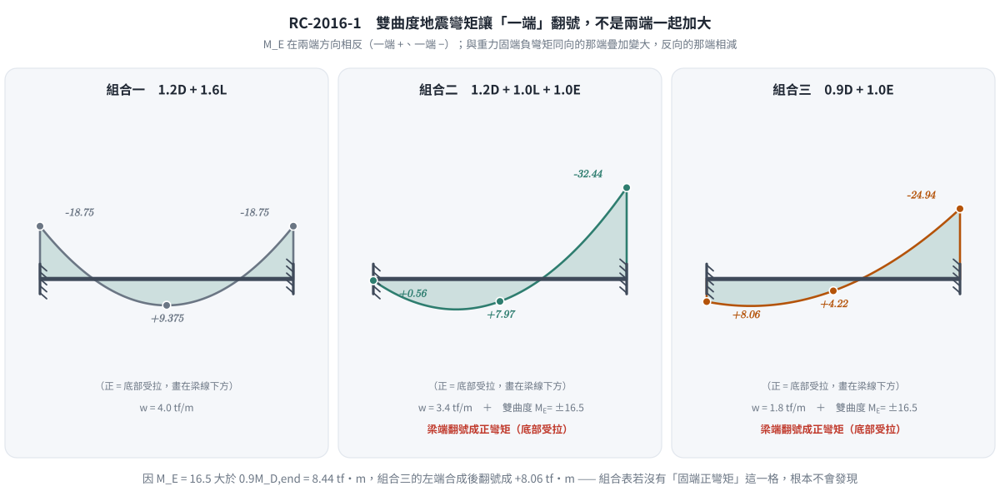
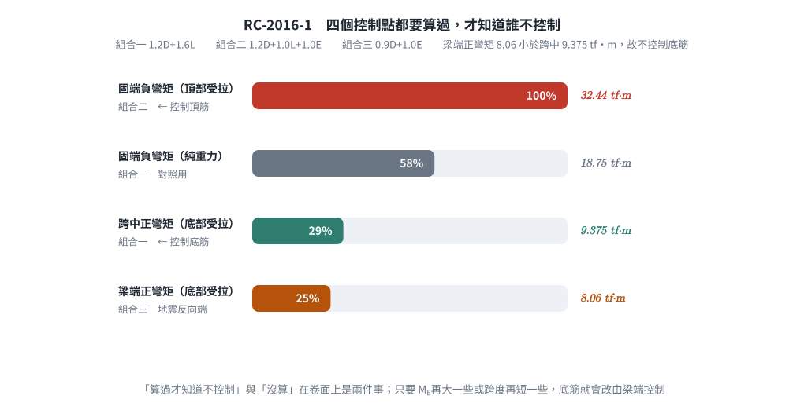
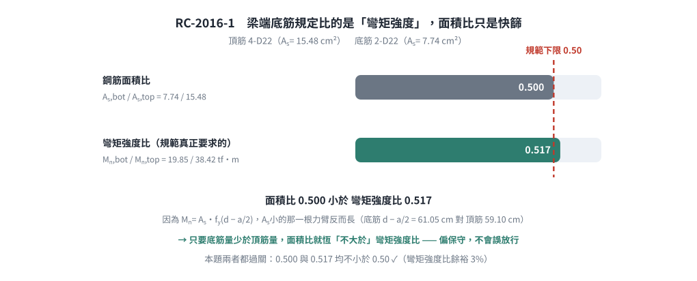

# 考題編號：RC-2016-1

**主分類：** `RC-U1-1` RC 梁彎矩強度分析與設計
**副分類：** `RC-U3-3` 韌性要求與耐震設計
**設計法：** USD強度設計法
**標籤：** `兩端固定梁` `地震彎矩組合` `雙曲度彎矩` `固端彎矩` `頂底筋設計` `單筋矩形梁` `ACI載重組合`

---

## 1. 原始題目重述（Problem Restatement）

兩端均為固定端之矩形斷面 RC 梁，斷面尺寸 35 cm（寬）× 70 cm（深），梁淨跨度 $L = 7.5$ m。

**載重條件：**
- 靜載重：$w_D = 2 \text{ tf/m}$（含梁自重）
- 活載重：$w_L = 1 \text{ tf/m}$
- 地震彎矩：$M_E = 16.5 \text{ tf-m}$（兩端均等，成雙曲度一組彎矩）

**材料：**
- $f'_c = 280 \text{ kgf/cm}^2$
- $f_y = 4200 \text{ kgf/cm}^2$
- 有效深度：$d = 63 \text{ cm}$（統一取值）

**力學假設（彈性分析）：**
- 固定端彎矩採用 $wL^2/12$（兩端）
- 跨中彎矩採用 $wL^2/24$

**目標：** 整跨頂部與底部配置相同鋼筋量，試設計之。（30 分）


*圖說：(a) 兩端固定RC梁，跨度L=7.5m，承受均佈靜載重wD=2tf/m及活載重wL=1tf/m，兩端地震彎矩ME=±16.5tf-m成雙曲度；(b) 矩形斷面b=35cm、h=70cm，有效深度d=63cm，f'c=280kgf/cm²，fy=4200kgf/cm²。*

---

## 2. 考題核心精神與出題者意圖（Core Concepts & Examiner's Intent）

**核心觀念：**
1. **地震載重組合**：除重力載重外，須加入地震作用的 ACI 載重組合（1.2D+1.0E+1.0L 或 0.9D+1.0E），考驗考生能否正確處理不同組合情境
2. **兩端固定梁的力學**：固端彎矩與跨中彎矩公式的正確應用
3. **雙曲度彎矩方向**：$M_E$ 在兩端的方向對固端彎矩的疊加方式具有決定性影響——雙曲度意味著地震彎矩在固端有不同的增強/抵消效果
4. **頂底筋相同設計**：以最大彎矩需求控制，同時滿足正負彎矩需求

**出題者意圖：**
- 測驗考生能否正確完成載重組合，特別是地震彎矩的疊加
- 確認考生理解「雙曲度」代表的物理意義（兩端彎矩方向使梁呈S型）
- 驗證單筋矩形梁的設計流程

---

## 3. 解題戰略地圖與陷阱分析（Strategic Roadmap & Trap Analysis）

### 作戰計畫

```
Step 1：計算因數化均佈載重彎矩（重力載重組合 1.2D+1.6L）
Step 2：計算因數化地震組合彎矩（1.2D+1.0E+1.0L 及 0.9D+1.0E）
Step 3：地震反向 → 檢查梁端會不會翻號成正彎矩（ME 大於重力端彎矩時就會）
Step 4：列出三個控制點（固端負、固端正、跨中正）的最大設計彎矩 Mu
Step 5：設計控制斷面的頂部與底部鋼筋量
Step 6：延性（εt ≥ 0.004）與最小鋼筋量檢核
Step 7：選配鋼筋 + 間距檢核
Step 8：耐震規定 Mn,bot ≥ Mn,top / 2（比彎矩強度，不是比面積）
```

### 關鍵陷阱

| # | 陷阱 | 說明 | 應對策略 |
|---|------|------|---------|
| ① | 地震彎矩方向 | 雙曲度：地震時梁呈S型，兩端 $M_E$ 方向**相同**（均為順時針或逆時針），但固端彎矩因位置（左/右端）與地震疊加方式不同 | 明確定義正負號：正彎矩使底部受拉，負彎矩使頂部受拉 |
| ② | 載重組合選擇 | ACI 地震組合：$1.2D+1.0E+1.0L$ 及 $0.9D+1.0E$ 兩種均需計算 | 兩組均算，取最大值 |
| ③ | 固端負彎矩 vs 跨中正彎矩 | 地震組合下，固端彎矩可能增大或減小，需分別考慮 $+M_E$ 和 $-M_E$ 的疊加 | 固端取最大絕對值，跨中取正彎矩最大值 |
| ③' | **漏算「梁端正彎矩」** | $M_E = 16.5 > 0.9M_{D,\text{end}} = 8.44$，地震反向那一端**會翻號成正彎矩** $+8.06$ tf-m | 組合表必須有「固端（正彎矩）」這一格；本題它小於跨中 9.375 故不控制，但要算過才知道 |
| ④ | 「頂底筋相同」不是說配置方式相同 | 是指整跨同位置（頂部）配置相同量、整跨同位置（底部）配置相同量，然後取兩者最大值作為統一值 | 求出 $M_{u,max}$（不論正負），以此設計鋼筋量 |

---

## 3.5 變數層次分析（Variable Hierarchy Analysis）

> 複習提示：第一次解題後，在每個卡住的知識點旁標記 `⚠`；第二次複習時只看有 `⚠` 的項目。

### 最終目標
`計算各載重組合下的設計彎矩 Mu → 設計單筋矩形梁的頂部與底部鋼筋量 As`

### 本題關鍵公式（依計算順序）

> $\boxed{\cdot}$ = 需由前步驟推導，非題目直接給定的變數

$$\text{Step 1: } M_{u,\text{gravity}} = 1.2M_D + 1.6M_L \quad \text{(重力組合固端與跨中)}$$

$$\text{Step 2: } M_{u,\text{EQ}} = 1.2M_D + 1.0M_E + 1.0M_L \quad \text{或} \quad 0.9M_D + 1.0M_E$$

$$\text{Step 3: } M_u = \max\left(\boxed{M_{u,\text{gravity}}},\ \boxed{M_{u,\text{EQ}}}\right)$$

$$\text{Step 4: } a = \frac{A_s f_y}{0.85 f'_c b}$$

$$\text{Step 5: } \phi M_n = \phi A_s f_y \!\left(d - \frac{\boxed{a}}{2}\right) \geq M_u$$

$$\text{Step 6（延性檢核）: } \rho_{\min} \leq \rho = \frac{A_s}{bd} \leq \rho_{\max}$$

### L1：題目直接給定
_看到題目就能讀出的數字，不需要任何公式。_

| 符號 | 數值 | 說明 |
|------|------|------|
| $b$ | 35 cm | 梁寬 |
| $h$ | 70 cm | 梁深 |
| $d$ | 63 cm | 有效深度（統一取值） |
| $L$ | 7.5 m = 750 cm | 梁淨跨度 |
| $w_D$ | 2 tf/m | 靜載重 |
| $w_L$ | 1 tf/m | 活載重 |
| $M_E$ | 16.5 tf-m | 地震時分析彎矩（雙曲度，兩端等值） |
| $f'_c$ | 280 kgf/cm² | 混凝土抗壓強度 |
| $f_y$ | 4200 kgf/cm² | 鋼筋降伏強度 |

### L2：需知識點推導
_需要知道公式名稱與適用條件，套入 L1 即可算出。_

**Step 1：材料與幾何基本參數**

| 符號 | 公式/來源 | 卡關? |
|------|----------|:-----:|
| $\beta_1$ | $f'_c = 280 \leq 280$ → $\beta_1 = 0.85$ | |
| $\rho_b$ | $0.85\beta_1 f'_c/f_y \cdot 6120/(6120+f_y) = 0.85\times0.85\times280/4200\times6120/10320$ | |
| $A_{s,\max}$ | $\varepsilon_t \geq 0.004$ → $c_{\max}=3d/7$ → $A_{s,\max}=0.85f'_c\beta_1c_{\max}b/f_y$（**非** $0.75\rho_b$）| |
| $\rho_{\min}$ | $\max(14/f_y,\ 0.8\sqrt{f'_c}/f_y)$ | |

**Step 2：重力載重下的彈性分析彎矩**

| 符號 | 公式/來源 | 卡關? |
|------|----------|:-----:|
| $M_{D,\text{end}}$ | $w_D L^2/12$（固端） | |
| $M_{D,\text{mid}}$ | $w_D L^2/24$（跨中） | |
| $M_{L,\text{end}}$ | $w_L L^2/12$ | |
| $M_{L,\text{mid}}$ | $w_L L^2/24$ | |

**Step 3：設計彎矩（含地震組合）**

| 符號 | 公式/來源 | 卡關? |
|------|----------|:-----:|
| $M_{u1,\text{end}}$ | $1.2M_{D,\text{end}} + 1.6M_{L,\text{end}}$（純重力，固端） | |
| $M_{u1,\text{mid}}$ | $1.2M_{D,\text{mid}} + 1.6M_{L,\text{mid}}$（純重力，跨中） | |
| $M_{u2,\text{end}}$ | $1.2M_{D,\text{end}} + 1.0M_E + 1.0M_{L,\text{end}}$（地震組合A） | |
| $M_{u3,\text{end}}$ | $0.9M_{D,\text{end}} + 1.0M_E$（地震組合B） | |
| $M_u$ | 各組合最大值 | |

**Step 4：設計鋼筋量**

| 符號 | 公式/來源 | 卡關? |
|------|----------|:-----:|
| $R_n$ | $M_u/(\phi b d^2)$（彎矩係數，用二次方程） | |
| $A_s$ | 由 $\phi A_s f_y(d-a/2) = M_u$ 解二次方程 | |

### L3：深層知識（不懂就卡住）

| 知識點 | 說明 | 卡關? |
|--------|------|:-----:|
| 雙曲度 vs 單曲度 | 雙曲度：兩端彎矩同向，梁呈S形；單曲度：兩端彎矩反向，梁呈弓形。題目說「成一組雙曲度彎矩」→ 兩端的 $M_E$ 彎矩方向一致（地震從左到右，左端產生正$M_E$，右端也產生正$M_E$，或同時為負） | |
| ACI 地震載重組合 | $U=1.2D+1.0E+1.0L$ 及 $U=0.9D+1.0E$ 兩組，前者控制梁端負彎矩，後者控制地震反向時可能減小軸壓的情境 | |
| 固端彎矩符號慣例 | 均佈載重下：固端負彎矩（使頂部受拉），跨中正彎矩（使底部受拉） | |
| 「整跨頂底筋配置一致」 | 代表頂筋全跨相同，底筋全跨相同，設計時取最大需求彎矩 | |

---

## 4. 步驟化詳細計算過程（Step-by-Step Detailed Calculation）

### Step 1：材料基本參數

**β₁ 係數：**

$$f'_c = 280 \text{ kgf/cm}^2 \leq 280 \Rightarrow \beta_1 = 0.85$$

**平衡鋼筋比：**

$$\rho_b = \frac{0.85\,\beta_1\,f'_c}{f_y} \cdot \frac{6120}{6120 + f_y} = \frac{0.85 \times 0.85 \times 280}{4200} \cdot \frac{6120}{6120 + 4200}$$

$$= \frac{202.3}{4200} \times \frac{6120}{10320} = 0.04817 \times 0.5930 = 0.02856$$

**最大鋼筋量（延性控制，土木 401-100 已改用淨拉應變）：**

規範規定非預力梁 $\varepsilon_t \geq 0.004$，對應 $c/d = 0.003/(0.003+0.004) = 3/7$：

$$c_{\max} = \frac{3}{7}\times 63 = 27.00 \text{ cm},\qquad a_{\max} = 0.85\times27.00 = 22.95 \text{ cm}$$

$$A_{s,\max} = \frac{0.85f'_c\,a_{\max}\,b}{f_y} = \frac{238 \times 22.95 \times 35}{4200} = 45.52 \text{ cm}^2
\quad\Rightarrow\quad \rho_{\max} = \frac{45.52}{2205} = 0.02064$$

> **與舊制對照：** ACI 318-99 的 $\rho_{\max} = 0.75\rho_b = 0.02142$（$A_{s,\max} = 47.24$ cm²），
> 對應 $\varepsilon_t = 0.003745$，比現行的 0.004 **略寬鬆**。本解採現行規定（與 RC-2024-1 一致）。

**最小鋼筋比：**

$$\rho_{\min} = \max\!\left(\frac{14}{f_y},\,\frac{0.8\sqrt{f'_c}}{f_y}\right) = \max\!\left(\frac{14}{4200},\,\frac{0.8\times\sqrt{280}}{4200}\right)$$

$$= \max(0.003333,\; 0.003175) = 0.003333$$

**最小鋼筋面積：**

$$A_{s,\min} = \rho_{\min} \times b \times d = 0.003333 \times 35 \times 63 = 7.35 \text{ cm}^2$$

---

### Step 2：彈性分析彎矩（服務載重）

**靜載重（固端與跨中）：**

$$M_{D,\text{end}} = \frac{w_D L^2}{12} = \frac{2 \times 7.5^2}{12} = \frac{2 \times 56.25}{12} = 9.375 \text{ tf-m（負彎矩，頂部受拉）}$$

$$M_{D,\text{mid}} = \frac{w_D L^2}{24} = \frac{2 \times 56.25}{24} = 4.688 \text{ tf-m（正彎矩，底部受拉）}$$

**活載重：**

$$M_{L,\text{end}} = \frac{w_L L^2}{12} = \frac{1 \times 56.25}{12} = 4.688 \text{ tf-m}$$

$$M_{L,\text{mid}} = \frac{w_L L^2}{24} = \frac{1 \times 56.25}{24} = 2.344 \text{ tf-m}$$

> 📌 **策略註解：** 固端彎矩為負（使頂部受拉），跨中彎矩為正（使底部受拉）。以下計算均採絕對值處理，符號僅代表頂/底受拉方向。

---

### Step 3：設計彎矩計算（載重組合）

#### 組合一：純重力載重（1.2D + 1.6L）

**固端（負彎矩）：**

$$M_{u1,\text{end}} = 1.2 \times 9.375 + 1.6 \times 4.688 = 11.25 + 7.50 = 18.75 \text{ tf-m}$$

**跨中（正彎矩）：**

$$M_{u1,\text{mid}} = 1.2 \times 4.688 + 1.6 \times 2.344 = 5.625 + 3.75 = 9.375 \text{ tf-m}$$

---

#### 組合二：地震載重組合（1.2D + 1.0E + 1.0L）

> 📌 **雙曲度說明：** 題目明確說明 $M_E = 16.5$ tf-m 在兩端形成一組雙曲度彎矩（梁呈S形）。地震時，固端彎矩與重力固端彎矩**疊加**（取方向不利者）。

地震時，對固端的最不利情況：地震彎矩與重力固端彎矩**同向（均為負彎矩，使頂部受拉）**，因此固端負彎矩增大；跨中則因雙曲度效應，地震引起的跨中彎矩較小（由固端承擔主要地震效應），通常仍以重力正彎矩控制。

**固端（地震使負彎矩增大）：**

$$M_{u2,\text{end}} = 1.2 \times M_{D,\text{end}} + 1.0 \times M_E + 1.0 \times M_{L,\text{end}}$$

$$= 1.2 \times 9.375 + 1.0 \times 16.5 + 1.0 \times 4.688 = 11.25 + 16.5 + 4.688 = 32.44 \text{ tf-m}$$

**跨中（地震對跨中影響，雙曲度下通常較小）：**

對於雙曲度彎矩，跨中彎矩採用重力控制：

$$M_{u2,\text{mid}} \approx 1.2 \times 4.688 + 1.0 \times 2.344 = 5.625 + 2.344 = 7.97 \text{ tf-m}$$

---

#### 組合三：地震載重組合（0.9D + 1.0E）

**固端（地震與重力同向，負彎矩）：**

$$M_{u3,\text{end}} = 0.9 \times 9.375 + 1.0 \times 16.5 = 8.438 + 16.5 = 24.94 \text{ tf-m（頂部受拉）}$$

---

#### 組合四（**容易漏掉**）：地震**反向**時梁端出現正彎矩

> 📌 雙曲度地震彎矩在梁的兩端方向相反（圖上一端標 $-$、一端標 $+$）。
> 在 $M_E$ 與重力固端負彎矩**反向**的那一端，兩者相減；
> 由於 $M_E = 16.5 > 0.9M_{D,\text{end}} = 8.44$，**合成後會翻號成正彎矩（梁端底部受拉）**。

$$0.9D + 1.0E:\quad -8.438 + 16.5 = \boxed{+8.06 \text{ tf-m（梁端底部受拉）}}$$

$$1.2D + 1.0L + 1.0E:\quad -(11.25 + 4.688) + 16.5 = +0.56 \text{ tf-m}$$

梁端最大正彎矩 $= 8.06$ tf-m。

---



*圖 1　雙曲度地震彎矩只讓「一端」加大。$M_E$ 在兩端方向相反，與重力固端負彎矩反向的那一端相減後翻號成正彎矩——這張圖攔下「以為兩端一起加大」而漏掉組合四那一格。*

#### 匯整最大設計彎矩

| 位置 | 組合一<br>1.2D+1.6L | 組合二<br>1.2D+1.0E+1.0L | 組合三<br>0.9D+1.0E | 組合四<br>地震反向 | **控制值 Mu** |
|------|--------|--------|--------|--------|--------------|
| 固端（負彎矩，頂部受拉） | 18.75 | **32.44** | 24.94 | — | **32.44 tf-m** |
| 固端（正彎矩，底部受拉） | — | — | — | 8.06 | 8.06 tf-m |
| 跨中（正彎矩，底部受拉） | **9.375** | 7.97 | — | — | **9.375 tf-m** |

> 📌 **設計控制：**
> - **頂筋**由固端負彎矩 $M_u = 32.44$ tf-m 控制（地震組合二）。
> - **底筋**由跨中正彎矩 $M_u = 9.375$ tf-m 控制——梁端正彎矩 8.06 < 9.375，不控制，
>   但**這一格必須算出來才知道不控制**，直接略過是失分點。

---



*圖 2　四個控制點的相對量級。梁端正彎矩 8.06 小於跨中 9.375 故不控制底筋——但「算過才知道不控制」與「沒算」在卷面上是兩件事。*

### Step 4：設計控制斷面鋼筋量（固端，$M_u = 32.44$ tf-m）

將彎矩換算為 kgf-cm 單位：

$$M_u = 32.44 \times 10^5 \text{ kgf-cm} = 3,244,000 \text{ kgf-cm}$$

**由 $\phi M_n \geq M_u$ 解鋼筋量（$\phi = 0.9$，假設拉力控制）：**

$$\phi A_s f_y \!\left(d - \frac{a}{2}\right) = M_u$$

其中 $a = \dfrac{A_s f_y}{0.85 f'_c b} = \dfrac{A_s \times 4200}{0.85 \times 280 \times 35} = \dfrac{4200\,A_s}{8330} = 0.5042\,A_s$

代入彎矩方程：

$$0.9 \times A_s \times 4200 \times \left(63 - \frac{0.5042\,A_s}{2}\right) = 3,244,000$$

$$3780\,A_s \times (63 - 0.2521\,A_s) = 3,244,000$$

$$238,140\,A_s - 953.0\,A_s^2 = 3,244,000$$

整理為二次方程：

$$953.0\,A_s^2 - 238,140\,A_s + 3,244,000 = 0$$

$$A_s^2 - 249.88\,A_s + 3404.0 = 0$$

$$A_s = \frac{249.88 \pm \sqrt{249.88^2 - 4 \times 3404.0}}{2} = \frac{249.88 \pm \sqrt{62440 - 13616}}{2}$$

$$= \frac{249.88 \pm \sqrt{48824}}{2} = \frac{249.88 \pm 220.96}{2}$$

取較小根（合理解）：

$$A_s = \frac{249.88 - 220.96}{2} = \frac{28.92}{2} = 14.46 \text{ cm}^2$$

---

### Step 5：延性與最小鋼筋量檢核

**鋼筋比：**

$$\rho = \frac{A_s}{bd} = \frac{14.46}{35 \times 63} = \frac{14.46}{2205} = 0.00656$$

**延性檢核：**

$$\rho_{\min} = 0.003333 \leq \rho = 0.00656 \leq \rho_{\max} = 0.02064 \quad \checkmark$$

**驗算 $\phi M_n$（確認拉力控制）：**

$$a = 0.5042 \times 14.46 = 7.291 \text{ cm}$$

$$c = \frac{a}{\beta_1} = \frac{7.291}{0.85} = 8.578 \text{ cm}$$

**確認拉力控制（$\varepsilon_t \geq 0.005$）：**

$$\varepsilon_t = \frac{d - c}{c} \times 0.003 = \frac{63 - 8.578}{8.578} \times 0.003 = \frac{54.42}{8.578} \times 0.003 = 0.01903 \gg 0.005 \quad \Rightarrow \phi = 0.9\ \checkmark$$

**設計彎矩強度：**

$$\phi M_n = 0.9 \times 14.46 \times 4200 \times \left(63 - \frac{7.291}{2}\right) = 0.9 \times 14.46 \times 4200 \times 59.355$$

$$= 0.9 \times 3,604,520 = 3,244,068 \text{ kgf-cm} \approx 32.44 \text{ tf-m} \geq M_u = 32.44 \text{ tf-m} \quad \checkmark$$

---

### Step 6：跨中正彎矩鋼筋量（$M_u = 9.375$ tf-m）

$$M_u = 9.375 \times 10^5 = 937,500 \text{ kgf-cm}$$

解二次方程：

$$953.0\,A_s^2 - 238,140\,A_s + 937,500 = 0$$

$$A_s^2 - 249.88\,A_s + 983.7 = 0$$

$$A_s = \frac{249.88 \pm \sqrt{249.88^2 - 4 \times 983.7}}{2} = \frac{249.88 \pm \sqrt{62440 - 3935}}{2} = \frac{249.88 \pm \sqrt{58505}}{2}$$

$$= \frac{249.88 \pm 241.88}{2}$$

取較小根：

$$A_s = \frac{249.88 - 241.88}{2} = \frac{8.00}{2} = 4.00 \text{ cm}^2$$

**但需滿足最小鋼筋量：**

$$A_{s,\min} = 7.35 \text{ cm}^2 > 4.00 \text{ cm}^2 \Rightarrow \text{取} \ A_s = 7.35 \text{ cm}^2$$

---

### Step 7：決定頂部與底部鋼筋量

**題目要求「整跨頂部與底部鋼筋均配置一致」：**

| 位置 | 控制彎矩 | 計算需求 $A_s$ | $A_{s,\min}$ | **採用** |
|------|---:|---:|---:|---:|
| 頂部（抵抗固端負彎矩） | 32.44 tf-m | 14.46 cm² ← 控制 | 7.35 cm² | **14.46 cm²** |
| 底部（抵抗跨中正彎矩） | 9.375 tf-m | 4.00 cm² | 7.35 cm² ← 控制 | **7.35 cm²** |

底筋的計算需求 $4.00\ \text{cm}^2 < A_{s,\min} = 7.35\ \text{cm}^2$，故由**最小鋼筋量**控制，取 $7.35\ \text{cm}^2$。
（梁端正彎矩需求 8.06 tf-m 亦小於跨中的 9.375 tf-m，不控制——見 Step 3 組合四。）

**鋼筋選配（依題目給定鋼筋規格）：**

可用鋼筋：D10 ($A_s = 0.71$ cm²), D22 ($A_s = 3.87$ cm²), D29 ($A_s = 6.47$ cm²)

**頂部鋼筋：$A_{s,\text{top}} \geq 14.46 \text{ cm}^2$**

| 組合 | 根數 | $A_s$（cm²） |
|------|------|------------|
| 4-D29 | 4根 | $4 \times 6.47 = 25.88$ ✓（過多） |
| 3-D29 | 3根 | $3 \times 6.47 = 19.41$ ✓（可行） |
| 4-D22 | 4根 | $4 \times 3.87 = 15.48$ ✓（接近需求） |

→ 選用 **4-D22**（$A_s = 15.48 \text{ cm}^2 \geq 14.46 \text{ cm}^2$）✓

**底部鋼筋：$A_{s,\text{bot}} \geq 7.35 \text{ cm}^2$**

| 組合 | 根數 | $A_s$（cm²） |
|------|------|------------|
| 2-D22 | 2根 | $2 \times 3.87 = 7.74$ ✓（符合） |
| 1-D29+1-D22 | 2根 | $6.47 + 3.87 = 10.34$ ✓ |

→ 選用 **2-D22**（$A_s = 7.74 \text{ cm}^2 \geq 7.35 \text{ cm}^2$）✓

**配筋幾何檢核（$b = 35$ cm，保護層 4 cm、D10 箍筋 1 cm，D22 之 $d_b = 2.22$ cm）：**

$$s_{\text{clear}} = \frac{35 - 2(4+1) - 4\times2.22}{3} = \frac{25 - 8.88}{3} = 5.37 \text{ cm} > \max(d_b,\ 2.5) = 2.5 \text{ cm}\ ✓$$

單排配置時 $d = 70 - (4 + 1 + 2.22/2) = 63.9 \approx 63$ cm ✓，與題給有效深度相符。

---

### Step 8：耐震規定檢核（梁端正彎矩強度 ≥ 負彎矩強度 × 1/2）

⚠ **規範比的是「彎矩強度」不是「鋼筋面積」**（$M_n$ 對 $A_s$ 非線性），必須實算：

$$M_{n,\text{top}}:\quad a = 0.5042\times15.48 = 7.805 \text{ cm},\qquad
M_n = 15.48\times4200\times\!\left(63-\tfrac{7.805}{2}\right) = 3{,}842{,}000 \text{ kgf-cm} = 38.42 \text{ tf-m}$$

$$M_{n,\text{bot}}:\quad a = 0.5042\times7.74 = 3.903 \text{ cm},\qquad
M_n = 7.74\times4200\times\!\left(63-\tfrac{3.903}{2}\right) = 1{,}985{,}000 \text{ kgf-cm} = 19.85 \text{ tf-m}$$

$$\frac{M_{n,\text{bot}}}{M_{n,\text{top}}} = \frac{19.85}{38.42} = 0.517 \geq 0.50 \quad \checkmark\ (\text{僅餘 } 3\%)$$

> **面積比是偏保守的快篩，不是偏樂觀（2026-08-31 訂正）：**
> 用實配量算，面積比 $= A_{s,\text{bot}}/A_{s,\text{top}} = 7.74/15.48 = 0.500$，恰好卡在下限；
> 彎矩強度比 $0.517$ 反而**比較寬鬆**。原因是 $M_n = A_sf_y\left(d-\frac{a}{2}\right)$ 中，
> $A_s$ 較小的底筋力臂較長（$d-a/2 = 61.05$ cm，對頂筋的 $59.10$ cm）：
>
> $$\frac{M_{n,\text{bot}}}{M_{n,\text{top}}}
> = \frac{A_{s,\text{bot}}}{A_{s,\text{top}}}\cdot
> \frac{d-a_{\text{bot}}/2}{d-a_{\text{top}}/2}
> \;\geq\; \frac{A_{s,\text{bot}}}{A_{s,\text{top}}}
> \qquad(\text{只要 } A_{s,\text{bot}} \leq A_{s,\text{top}})$$
>
> 所以**面積比恆不大於彎矩強度比**：面積比過關則強度比必過關，拿它當快篩只會偏嚴、不會誤放行；
> 反之若面積比不過，仍須實算強度比才能定論。
> 真正該避免的是把**需求量**與**實配量**混算（$7.74/14.46 = 0.535$）——那既不是面積比也不是強度比。

---



*圖 3　面積比與彎矩強度比的關係。$A_s$ 較小的底筋力臂較長，所以面積比恆「不大於」彎矩強度比——這張圖攔下把兩者方向記反，也攔下拿需求量 14.46 與實配量 7.74 混算成 0.535 的算法。*

### 最終答案

$$\boxed{
\begin{aligned}
&\text{頂部鋼筋（整跨）：4-D22，}A_{s,\text{top}} = 15.48 \text{ cm}^2\\
&\text{底部鋼筋（整跨）：2-D22，}A_{s,\text{bot}} = 7.74 \text{ cm}^2\\
&\text{控制設計彎矩：}M_u = 32.44 \text{ tf-m（地震組合，固端）}
\end{aligned}
}$$

---

## 5. 關鍵爭議點與進階探討（Critical Issues & Advanced Discussion）

### 爭議點一：「整跨頂底筋配置一致」的解讀

題目說「整跨梁頂部與底部鋼筋均配置一致，試設計」，最自然的解讀是：
- 頂部鋼筋：全跨等量
- 底部鋼筋：全跨等量
- 兩者可以不同（分別設計頂、底鋼筋量）

本解採此解讀。若考官意圖是「頂底筋量完全相同」，則需取 $\max(14.46, 7.35) = 14.46$ cm² 統一使用。

### 爭議點二：地震組合的活載重係數

依 ACI 318-19：
- $U = 1.2D + 1.0E + 1.0L$（若 $L \leq 0.5 \text{ kPa}$ 可取 $0.5L$）
- 本題 $w_L = 1 \text{ tf/m}$，採 $1.0L$ 較保守

### 考場建議

考場上，**地震彎矩組合計算是本題的核心得分點**。建議：
1. 先明確寫出三個載重組合
2. 固端（負彎矩）以地震組合 $1.2D + 1.0E + 1.0L$ 控制
3. 跨中（正彎矩）以純重力 $1.2D + 1.6L$ 控制
4. 二次方程解 $A_s$ 後，記得驗算最小鋼筋量

### 進階探討：耐震梁的底筋規定

依土木401-100 耐震設計規定（第二題主題），梁端底部正彎矩**強度** $\geq$ 該端負彎矩強度 × 1/2。

實算見 §4 Step 8：$M_{n,\text{bot}}/M_{n,\text{top}} = 19.85/38.42 = 0.517 \geq 0.50$ ✓

面積比只能當快篩：以實配量計，$A_{s,\text{bot}} \geq A_{s,\text{top}}/2 = 15.48/2 = 7.74$ cm²
（本解恰為 7.74，剛好通過）。$M_n = A_sf_y(d-a/2)$ 的力臂會隨 $A_s$ 減少而變長，故
**面積比恆不大於彎矩強度比**（本題 0.500 對 0.517）。方向是固定的：
面積比過關 $\Rightarrow$ 強度比必過關（偏保守）；面積比不過時才需要實算強度比。

### 進階探討：為什麼一定要算「梁端正彎矩」？

$M_E = 16.5$ tf-m 大於 $0.9M_{D,\text{end}} = 8.44$ tf-m，所以在地震彎矩與重力固端負彎矩**反向**的那一端，
合成後會**翻號**成正彎矩（梁端底部受拉）8.06 tf-m。本題它小於跨中的 9.375，不控制底筋；
但只要 $M_E$ 再大一些（或跨度再短一些），底筋就會改由**梁端**控制。
「兩端固定梁 + 雙曲度地震彎矩」這個題型，**梁端反號是核心得分點之一，不能因為結果不控制就略過不寫**。

---

*圖解補繪：2026-08-31（向量圖 3 張，腳本 `figs/gen_RC-2016-1.py`，可重跑；腳本檔尾對 §4 公佈值做 assert）*
*數值訂正：2026-08-31（$\rho_b$ 算術、舊制 $A_{s,\max}$、$M_n$ 位數、面積比與彎矩強度比的大小方向，詳見 §4 Step 8）*
