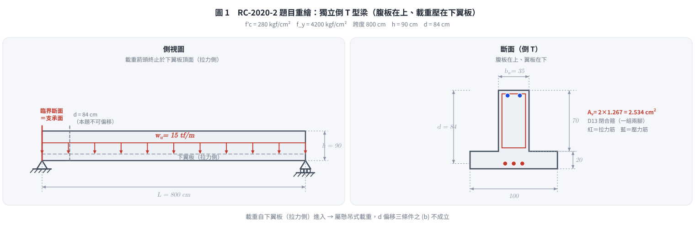
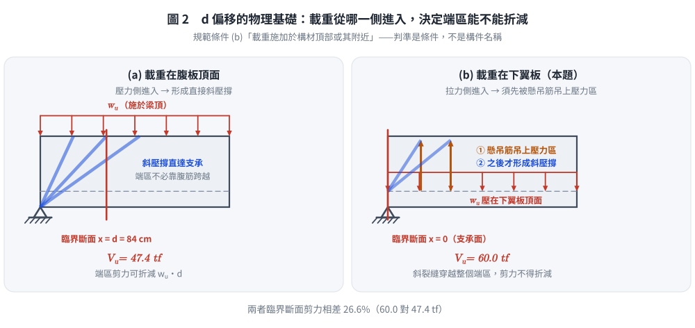
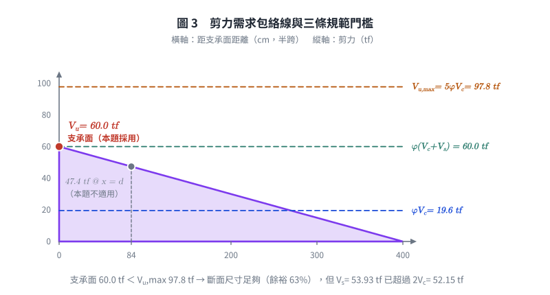
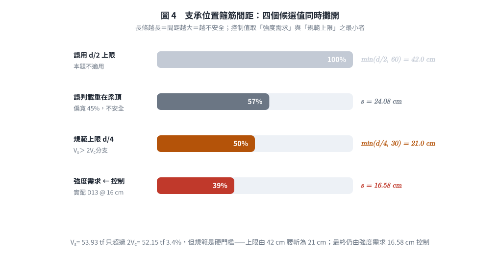

# 考題編號：RC-2020-2

**主分類：** `RC-U2-1` RC 剪力強度分析與設計
**副分類：** 無
**設計法：** USD 強度設計法
**標籤：** `倒T型梁` `臨界斷面` `d偏移規則` `懸吊式載重` `下翼板載重` `不可d偏移` `最大肋筋間距` `最大設計剪力` `Vc簡化公式` `懸吊鋼筋`

---

## 1. 原始題目重述（Problem Restatement）

**作答規範（原卷明訂）：** 內政部民國 108 年 2 月 25 日公布之「混凝土結構設計規範」，或中國土木水利工程學會「混凝土工程設計規範與解說（土木 401-100）」。

一簡支**獨立**倒 T 型梁（腹板在上、翼板在下），受均佈設計（因數化）載重 $w_u = 15 \text{ tf/m}$（含自重），跨度 800 cm。

**已知條件：**
- $f'_c = 280 \text{ kgf/cm}^2$，$f_y = 4200 \text{ kgf/cm}^2$
- 混凝土剪力強度公式（原卷給定）：$V_c = 0.53\sqrt{f'_c}\, b_w d$
- 剪力筋：D13，一支斷面積 $= 1.267 \text{ cm}^2$

**斷面幾何（由圖讀取）：**
- 腹板（上方）：寬 $b_w = 35 \text{ cm}$，高 $70 \text{ cm}$
- 翼板（下方）：寬 $100 \text{ cm}$，深 $20 \text{ cm}$
- 全深 $h = 70 + 20 = 90 \text{ cm}$
- 上、下保護層（至鋼筋重心）均為 $6 \text{ cm}$，有效深度 $d = 90 - 6 = 84 \text{ cm}$

**三小題：**
1. 請判斷支承處斷面可否按距離支承面 $d$ 處斷面之 $V_u$ 設計之，請說明原因。（5 分）
2. 計算支承位置剪力鋼筋之最大間距。（15 分）
3. 計算此梁斷面所能抵抗之最大設計剪力 $V_u$。（5 分）

*圖說：倒T型梁斷面，腹板 $b_w=35$ cm 在上，翼板 $100\times20$ cm 在下；$h=90$ cm，$d=84$ cm；梁跨度 $L=800$ cm。**側視圖中 $w_u$ 的載重箭頭並非畫在梁頂，而是自梁深 70 cm 處（即下翼板頂面）向下指、終止於翼板上緣**——載重是壓在下翼板上（拉力側），不是壓在腹板頂面。D13 閉合箍筋，$A_v=2\times1.267=2.534$ cm²；$f'_c=280$ kgf/cm²，$f_y=4200$ kgf/cm²。*

> ⚠ **附圖判讀是本題全部得分的樞紐。** 量測原圖像素：側視圖全深 90 cm 對應 502 px，
> 載重箭頭的起始線在距梁頂 380 px ≈ 68 cm 處、箭頭尖端落在 70 cm 處，
> 正好是翼板上緣。若把箭頭誤讀成「梁頂均佈載重」，小題(一)會答成「可以」，
> 小題(二)的箍筋間距會從 16.6 cm 放寬到 24.1 cm（**偏不安全 45%**），
> 而且會錯過規範間距上限由 $d/2$ 落到 $d/4$ 的分支。

---

*圖 1　倒 T 型梁題目重繪。側視圖的載重箭頭**止於下翼板頂面**而非梁頂——這一個像素高度就是本題全部 25 分的樞紐：讀成梁頂載重，小題(一)答成「可以」，小題(二)的間距會從 16.6 cm 放寬到 24.1 cm。*

## 2. 考題核心精神與出題者意圖（Core Concepts & Examiner's Intent）

**核心觀念：**
1. $d$ 偏移規則（critical section at $d$ from support）的**三項適用條件**，尤其是「載重須施加於構材頂部附近」這一條
2. 倒 T 型梁（承托梁／ledger beam）的載重自**下翼板（拉力側）**進入，屬懸吊式載重
3. 依支承面 $V_u$ 計算所需箍筋間距，並對照規範上限的雙門檻（$d/2$ vs $d/4$）
4. 斷面最大可承受剪力受 $V_{s,\max} = 4V_c$ 控制

**出題者意圖：**
- 小題(一) 是本題靈魂：**故意畫一個載重從下翼板進入的倒 T 型梁**，測驗考生會不會反射性地套 $d$ 偏移。5 分的判斷題，答錯會連帶把 15 分的小題(二)一起做錯。
- 小題(二) 測驗完整剪力設計流程（$\phi$ → $V_s$ → 間距 → 規範上限），且刻意讓 $V_s$ **剛好落在 $2V_c$ 之上**（53.9 vs 52.1 tf，只超 3.4%），若誤用 $d$ 偏移就會掉到門檻以下、選錯上限。
- 小題(三) 測驗 $V_{s,\max}$ 對截面剪力容量的控制概念。

---

## 3. 解題戰略地圖與陷阱分析（Strategic Roadmap & Trap Analysis）

**作戰計畫：**
1. (一) 逐條檢核 $d$ 偏移三條件 → 條件(b)不成立（載重在拉力側）→ **不可偏移**，臨界斷面取支承面
2. 計算 $V_c$、支承面 $V_u = w_u L/2$
3. (二) 計算 $V_s$，與 $2V_c$、$4V_c$ 比較定間距上限，再與強度需求取小
4. (三) 以 $V_{s,\max} = 4V_c$ 代入求 $\phi V_{n,\max}$

**五大陷阱：**

| 陷阱 | 說明 | 對策 |
|------|------|------|
| **載重位置誤判（致命）** | 倒 T 型梁的載重箭頭畫在下翼板頂面，非梁頂 | 放大附圖確認箭頭尖端的高度；「倒 T」＋「獨立」＝承托梁的典型畫法 |
| $\phi$ 值選擇 | 108 年規範／土木 401-100 剪力用 $\phi = 0.75$ | $\phi = 0.75$，非 0.85（ACI 318-99 舊制） |
| $A_v$ 計算 | 閉合箍筋一組 = 2 支 D13 | $A_v = 2 \times 1.267 = 2.534 \text{ cm}^2$ |
| 間距上限選擇 | 需先判斷 $V_s$ 是否超過 $2V_c$，再選 $d/2$ 或 $d/4$ | 本題 $V_s = 53.9 > 2V_c = 52.1$ → 取 $d/4$ |
| 最大 $V_u$ 的 $V_{s,\max}$ | $V_{s,\max} = 4V_c$（超過需放大斷面），非無限大 | $V_{u,\max} = \phi(V_c + 4V_c) = 5\phi V_c$ |

---

## 3.5 變數層次分析（Variable Hierarchy Analysis）

> 複習提示：第一次解題後，在每個卡住的知識點旁標記 `⚠`；第二次複習時只看有 `⚠` 的項目。

### 最終目標

`(一) 判斷臨界斷面位置；(二) 求支承位置最大箍筋間距；(三) 求斷面最大可承受設計剪力`

### 本題關鍵公式（依計算順序）

$$\text{Step 1: } V_c = 0.53\sqrt{f'_c}\, b_w d$$

$$\text{Step 2: } V_u\big|_{\text{critical}} = V_{u,\text{support}} = \frac{w_u L}{2} \quad \text{（不可 d 偏移）}$$

$$\text{Step 3: } V_s = \frac{V_u}{\phi} - \boxed{V_c}$$

$$\text{Step 4: } s = \frac{A_v f_{yt} d}{\boxed{V_s}} \leq s_{\max,\text{code}} = \begin{cases} \min(d/2,\,60) & \boxed{V_s} \le 2\boxed{V_c} \\ \min(d/4,\,30) & \boxed{V_s} > 2\boxed{V_c}\end{cases}$$

$$\text{Step 5（最大Vu）: } V_{u,\max} = \phi\!\left(\boxed{V_c} + 4\boxed{V_c}\right) = 5\phi \boxed{V_c}$$

### L1：題目直接給定

| 符號 | 數值 | 說明 |
|------|------|------|
| $f'_c$ | 280 kgf/cm² | 混凝土抗壓強度 |
| $f_y$ | 4200 kgf/cm² | 剪力筋降伏強度 |
| $w_u$ | 15 tf/m | 均佈設計載重（施加於**下翼板頂面**） |
| $L$ | 800 cm | 梁跨度 |
| $b_w$ | 35 cm | 腹板寬（剪力計算用） |
| $h$ | 90 cm | 斷面全深 |
| $d$ | 84 cm | 有效深度（90−6） |
| $A_v$ | 2.534 cm² | 一組 D13 閉合箍面積（2×1.267） |

### L2：需知識點推導

**Step 1：混凝土剪力強度**

| 符號 | 公式/來源 | 卡關? |
|------|----------|:-----:|
| $V_c$ | $0.53 \times \sqrt{280} \times 35 \times 84 = 26{,}074 \text{ kgf}$ | |
| $\phi V_c$ | $0.75 \times 26{,}074 = 19{,}555 \text{ kgf} = 19.6 \text{ tf}$ | |

**Step 2：臨界斷面剪力（＝支承面，不偏移）**

| 符號 | 公式/來源 | 卡關? |
|------|----------|:-----:|
| $V_{u,\text{support}}$ | $w_u \times L/2 = 15 \times 8/2 = 60 \text{ tf}$ | |
| $V_{u,\text{critical}}$ | $= V_{u,\text{support}} = 60 \text{ tf}$（**不可** 扣 $w_u d$） | |

**Step 3：所需 Vs**

| 符號 | 公式/來源 | 卡關? |
|------|----------|:-----:|
| $V_s$ | $60/0.75 - 26.07 = 80 - 26.07 = 53.93 \text{ tf}$ | |

**Step 4：間距計算與上限判斷**

| 符號 | 公式/來源 | 卡關? |
|------|----------|:-----:|
| 門檻 $2V_c$ | $2 \times 26{,}074 = 52{,}147 \text{ kgf} = 52.15 \text{ tf}$ | |
| 比較 | $V_s = 53.93 \text{ tf} > 52.15 \text{ tf}$ → $s_{\max,\text{code}} = \min(d/4,\,30) = 21 \text{ cm}$ | |
| $s$ （強度） | $2.534 \times 4200 \times 84 / 53{,}926 = 16.58 \text{ cm}$ | |
| 控制間距 | $\min(16.58,\ 21) = 16.6 \text{ cm}$（實配 16 cm） | |

**Step 5：最大設計剪力**

| 符號 | 公式/來源 | 卡關? |
|------|----------|:-----:|
| $V_{s,\max}$ | $4V_c = 4 \times 26{,}074 = 104{,}295 \text{ kgf}$ | |
| $V_{u,\max}$ | $\phi \times 5V_c = 0.75 \times 130{,}369 = 97{,}776 \text{ kgf} = 97.8 \text{ tf}$ | |

### L3：深層知識（不懂就卡住）

| 知識點 | 說明 | 卡關? |
|--------|------|:-----:|
| $d$ 偏移三條件 | (a) 支承反力在端區產生壓力；(b) **載重施加於構材頂部或其附近**；(c) 支承面至臨界斷面間無集中載重。**三條缺一即不可偏移**，本題(b)不成立 | |
| 為何載重在拉力側就不能偏移 | 偏移的物理基礎是支承附近形成直接斜壓撐；載重若自下翼板（拉力側）進入，必須先被垂直懸吊鋼筋「吊」到腹板頂部才能形成壓撐，端區反而是全剪力作用 | |
| $V_s$ 間距上限雙門檻 | $V_s \leq 2V_c$ → $s \leq \min(d/2, 60)$；$2V_c < V_s \leq 4V_c$ → $s \leq \min(d/4, 30)$；$V_s > 4V_c$ → 需放大斷面 | |
| $A_v = 2$ 支 D13 | 閉合箍筋每組兩腳，$A_v = 2 \times 1.267$，不是 1.267 | |
| 108年規範 / 401-100 之 $\phi = 0.75$ | 剪力強度折減係數由 ACI 318-99 的 0.85 改為 0.75 | |
| 懸吊鋼筋（hanger reinforcement） | 下翼板載重須以額外垂直鋼筋吊入腹板壓力區，需求量 $A_h \ge w_u/(\phi f_y)$（單位長度） | |

---

## 4. 步驟化詳細計算過程（Step-by-Step Detailed Calculation）

### 前置：斷面與材料參數整理

$$b_w = 35 \text{ cm}, \quad d = 84 \text{ cm}, \quad A_v = 2 \times 1.267 = 2.534 \text{ cm}^2$$

$$\phi = 0.75 \text{（剪力，依 108 年規範／土木 401-100）}$$

### 小題(一)：支承處是否可採 $d$ 偏移

**判斷結論：不可以（NO）。臨界斷面必須取在支承面。**

依規範（土木 401-100 §4.11.1／ACI 318 §9.4.3.2），可將臨界斷面移至距支承面 $d$ 處，須**同時**滿足三條件：

| 條件 | 內容 | 本題 |
|------|------|:----:|
| (a) | 支承反力在構材端區產生**壓力** | ✓ 簡支支承向上頂住翼板 |
| (b) | 載重施加於構材**頂部或其附近**（不得自拉力側進入） | ✗ **載重壓在下翼板頂面（拉力側）** |
| (c) | 支承面與臨界斷面之間無集中載重 | ✓ 純均佈載重 |

**理由：** 本梁為**倒 T 型（腹板在上、翼板在下）獨立梁**，附圖中 $w_u$ 的載重箭頭終止於距梁頂 70 cm 處，即**下翼板的頂面**。簡支梁的拉力側在下方，故此載重是自**拉力側**進入斷面，屬**懸吊式載重（hanging / suspended load）**——實務上就是倒 T 承托梁（ledger beam）以下翼板承托預鑄版或小梁的情形。

此時支承附近無法形成「載重點直接斜壓撐至支承」的傳力機制：載重必須先由腹板中的**垂直懸吊鋼筋**吊升至腹板壓力區，再向支承傳遞。斜裂縫會穿越整個端區，端區承受的是**未折減的全部剪力**。

$$\boxed{\text{臨界斷面：支承面（}x = 0\text{），}V_u = 60 \text{ tf；不得取 } d = 84 \text{ cm 處}}$$

> **對照（若誤判為梁頂載重）：** $V_{u,d} = 60 - 15 \times 0.84 = 47.4$ tf，
> $V_s = 47.4/0.75 - 26.07 = 37.13$ tf $< 2V_c$，$s_{\max} = \min(24.1,\,42) = 24.1$ cm。
> 與正解 16.6 cm 相差 45%，且規範上限誤用 $d/2$ 而非 $d/4$——這正是出題者設計的陷阱。

---

### 小題(二)：支承位置剪力筋最大間距

**Step 1：計算混凝土剪力強度 $V_c$**

$$V_c = 0.53\sqrt{f'_c}\,b_w d = 0.53 \times \sqrt{280} \times 35 \times 84$$

$$= 0.53 \times 16.7332 \times 2{,}940 = 26{,}074 \text{ kgf} = 26.07 \text{ tf}$$

**Step 2：支承面（臨界斷面）剪力 $V_u$**

$$V_u = V_{u,\text{support}} = w_u \times \frac{L}{2} = 15 \times \frac{8}{2} = \mathbf{60 \text{ tf}} = 60{,}000 \text{ kgf}$$

（依小題(一)，**不作** $d$ 偏移。）

**Step 3：計算所需箍筋剪力強度 $V_s$**

$$\phi V_n \geq V_u \implies V_n = V_c + V_s \geq \frac{V_u}{\phi}$$

$$V_s = \frac{V_u}{\phi} - V_c = \frac{60{,}000}{0.75} - 26{,}074 = 80{,}000 - 26{,}074 = \mathbf{53{,}926 \text{ kgf}} = 53.93 \text{ tf}$$

**Step 4：判斷規範間距上限門檻**

$$2V_c = 2 \times 26{,}074 = 52{,}147 \text{ kgf} = 52.15 \text{ tf}$$

$$4V_c = 4 \times 26{,}074 = 104{,}295 \text{ kgf} = 104.30 \text{ tf}$$

$$2V_c = 52.15 \ \mathbf{<}\ V_s = 53.93 \ \mathbf{<}\ 4V_c = 104.30 \quad\Rightarrow\quad \text{斷面尺寸足夠，但適用加嚴間距}$$

$$s_{\max,\text{code}} = \min\!\left(\frac{d}{4},\ 30 \text{ cm}\right) = \min(21,\ 30) = 21 \text{ cm}$$

> 只超過門檻 3.4%（53.93 vs 52.15），但規範是硬門檻——上限直接由 42 cm 腰斬為 21 cm。

**Step 5：由強度需求計算間距**

$$s = \frac{A_v f_{yt} d}{V_s} = \frac{2.534 \times 4200 \times 84}{53{,}926} = \frac{894{,}005}{53{,}926} = \mathbf{16.58 \text{ cm}}$$

**Step 6：取最小值（控制間距）**

$$s_{\max} = \min(s_{\text{strength}},\ s_{\max,\text{code}}) = \min(16.58,\ 21) = \boxed{16.6 \text{ cm}}$$

支承位置剪力筋最大間距 $= \mathbf{16.6 \text{ cm}}$（實際採用 D13 @ 16 cm）。

**最小剪力筋量驗核：**

$$A_{v,\min} = \max\!\left(0.2\sqrt{f'_c}\,\frac{b_w s}{f_{yt}},\ 3.5\,\frac{b_w s}{f_{yt}}\right)
= \max\!\left(\frac{0.2(16.733)(35)(16)}{4200},\ \frac{3.5(35)(16)}{4200}\right)$$

$$= \max(0.446,\ 0.467) = 0.467 \text{ cm}^2 \ \ll\ A_v = 2.534 \text{ cm}^2 \quad \checkmark$$

---

### 小題(三)：斷面最大可承受設計剪力 $V_{u,\max}$

規範規定，箍筋可提供的最大剪力強度（超過則必須放大斷面）：

$$V_{s,\max} = 2.12\sqrt{f'_c}\,b_w d = 4V_c = 4 \times 26{,}074 = 104{,}295 \text{ kgf}$$

最大標稱剪力強度：

$$V_{n,\max} = V_c + V_{s,\max} = 5V_c = 26{,}074 + 104{,}295 = 130{,}369 \text{ kgf}$$

最大設計剪力容量：

$$V_{u,\max} = \phi V_{n,\max} = 5\phi V_c = 0.75 \times 130{,}369 = \boxed{97{,}776 \text{ kgf} \approx 97.8 \text{ tf}}$$

**驗算：** 支承面 $V_u = 60 \text{ tf} < V_{u,\max} = 97.8 \text{ tf}$ ✓，斷面尺寸足夠（餘裕 63%）。

---

### 計算結果彙整

| 項目 | 結果 |
|------|:----:|
| $V_c$ | 26.07 tf（$\phi V_c = 19.6$ tf） |
| **(一) 臨界斷面** | **支承面；不可 $d$ 偏移**（載重自下翼板／拉力側進入） |
| 臨界斷面 $V_u$ | 60.0 tf |
| 所需 $V_s$ | 53.93 tf（$> 2V_c = 52.15$，$< 4V_c = 104.30$） |
| 規範間距上限 | $\min(d/4,\,30) = 21$ cm |
| 強度需求間距 | 16.58 cm |
| **(二) 最大間距** | **16.6 cm（實配 D13 @ 16 cm）** |
| **(三) $V_{u,\max}$** | **97.8 tf**（$= 5\phi V_c$） |

---

*圖 2　$d$ 偏移的物理基礎。左圖載重在壓力側，斜壓撐直接把力送到支承，端區不必靠腹筋跨越；右圖載重自拉力側進入，得先被懸吊筋吊上壓力區才形成壓撐，斜裂縫穿越整個端區。可攔下「簡支梁一律可偏移」這個把構件名稱當判準的反射動作。*

*圖 3　剪力需求與三條門檻。$\phi V_c$ 只是「不必配箍筋」的界線，真正的斷面容量天花板是 $V_{u,\max} = 5\phi V_c = 97.8$ tf；把 $\phi V_c$ 當成 $V_u$ 上限、或忘記 $V_{s,\max} = 4V_c$ 這條，小題(三)就答不出來。*

*圖 4　四個候選間距同時攤開，長條越長＝越不安全。$V_s = 53.93$ tf 只超過 $2V_c = 52.15$ tf 三個百分點，規範上限就由 42 cm 腰斬為 21 cm；最終仍由強度需求 16.58 cm 控制。可攔下上限選錯分支、以及忘記與強度需求取小。*

## 5. 關鍵爭議點與進階探討（Critical Issues & Advanced Discussion）

**1. $d$ 偏移的本質，以及「倒 T 型梁」為何是反例**

$d$ 偏移成立的物理基礎是：支承附近的斜壓撐（diagonal compression strut）把外力**直接**傳至支承，不必靠腹筋跨越斜裂縫。這要求載重進入斷面的位置在壓力側（梁頂）。

倒 T 型梁的下翼板承托載重時，力流是「翼板 → 垂直懸吊筋 → 腹板頂部壓力區 → 斜壓撐 → 支承」。載重在被吊上去之前，端區的每一條斜裂縫都必須由腹筋橫跨，因此**端區剪力不得折減**。規範這條的原文是「載重施加於構材頂部或其附近」，而不是「簡支梁一律可偏移」——**判準是條件，不是構件名稱**。

**2. 懸吊鋼筋（hanger reinforcement）需求量**

本題未問，但這是倒 T 承托梁的必要配筋，考場上寫出來能加分：

$$A_h \ \ge\ \frac{w_u}{\phi f_y} = \frac{150 \text{ kgf/cm}}{0.75 \times 4200} = 0.0476 \text{ cm}^2/\text{cm} = 4.76 \text{ cm}^2/\text{m}$$

本題 D13 閉合箍 @ 16 cm 提供 $2.534/16 = 0.158\ \text{cm}^2/\text{cm} = 15.8\ \text{cm}^2/\text{m}$，遠大於 4.76 ✓。
也就是說剪力需求已「順便」蓋住懸吊需求；但若剪力需求很小（例如梁很短），懸吊需求就會反過來控制箍筋量——**兩者必須分別檢核，不可互相取代**（懸吊筋還須錨定至腹板壓力區，且宜與翼板頂面的橫向筋一併配置）。

**3. $\phi = 0.75$ vs $\phi = 0.85$ 的選擇**

108 年規範（民國 108 年 2 月 25 日公布）與土木 401-100 剪力均採 $\phi = 0.75$。$\phi = 0.85$ 是 ACI 318-99 之前的舊制。原卷已明訂作答規範，故 $\phi = 0.75$。

若誤用 $\phi = 0.85$：$V_s = 60/0.85 - 26.07 = 44.5$ tf $< 2V_c$，間距上限回到 $d/2$、強度需求間距 20.1 cm——**兩個分支都跟著錯**。

**4. 依最新規範（土木 401-112／ACI 318-19）重算對照**

| 項目 | 土木 401-100（原卷指定，本解主線） | 土木 401-112／ACI 318-19 |
|------|:---:|:---:|
| $d$ 偏移條件 | §4.11.1 三條件 | §9.4.3.2 三條件（**條文與判斷完全相同**） |
| $V_c$ | 原卷指定 $0.53\sqrt{f'_c}b_w d = 26.07$ tf | $\left[0.53\lambda\sqrt{f'_c} + \dfrac{N_u}{6A_g}\right]b_w d$；$N_u=0$ 且 $A_v \ge A_{v,\min}$ → 同為 26.07 tf |
| $\phi$（剪力） | 0.75 | 0.75 |
| 間距門檻 | $V_s \lessgtr 2V_c$ → $d/2$ 或 $d/4$ | §9.7.6.2.2 同（$1.06\sqrt{f'_c}b_wd = 2V_c$） |
| $V_{s,\max}$ | $4V_c = 2.12\sqrt{f'_c}b_wd$ | §22.5.1.2 同 |
| $A_{v,\min}$ | $\max(0.2\sqrt{f'_c},\,3.5)\dfrac{b_ws}{f_{yt}}$ | §9.6.3.4 同 |
| **答案** | **16.6 cm／97.8 tf** | **16.6 cm／97.8 tf（不變）** |

本題三小題的答案在兩版規範下**完全一致**，因為 $V_c$ 由原卷直接給定、$N_u = 0$、且斷面配有充足腹筋（$A_v \ge A_{v,\min}$，故不觸發 318-19 新增的尺寸效應係數 $\lambda_s$）。
唯一需注意的是：若本題改為**無腹筋**斷面，318-19 就必須改用 $V_c = 2.12\lambda_s\lambda(\rho_w)^{1/3}\sqrt{f'_c}b_wd$，
$\lambda_s = \sqrt{2/(1+d/25)} \le 1$（$d$ 以 cm 計時為 $\sqrt{2/(1+d/25.4)}$ 之公制對應式），$d = 84$ cm 的深梁會被顯著折減。

**5. 若題目改成「腹板頂面承載」的完整對照表**

| | 載重在下翼板（**本題**） | 載重在腹板頂面 |
|---|:---:|:---:|
| $d$ 偏移 | 不可 | 可 |
| 臨界斷面 $V_u$ | 60.0 tf | 47.4 tf |
| $V_s$ | 53.93 tf | 37.13 tf |
| $V_s$ vs $2V_c$ | $>$（超 3.4%） | $<$ |
| 規範上限 | $\min(d/4,30) = 21$ cm | $\min(d/2,60) = 42$ cm |
| 強度需求 | 16.58 cm | 24.08 cm |
| **最大間距** | **16.6 cm** | 24.1 cm |
| 額外配筋 | 需懸吊鋼筋 | 不需 |

*圖解補繪：2026-09-02（向量圖 4 張，腳本 `figs/gen_RC-2020-2.py`，可重跑；腳本檔尾對 §4 公佈值做 assert）*
