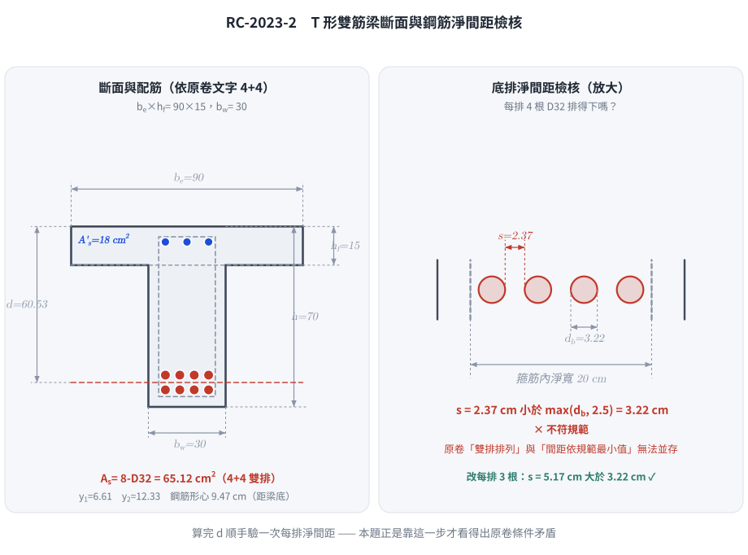
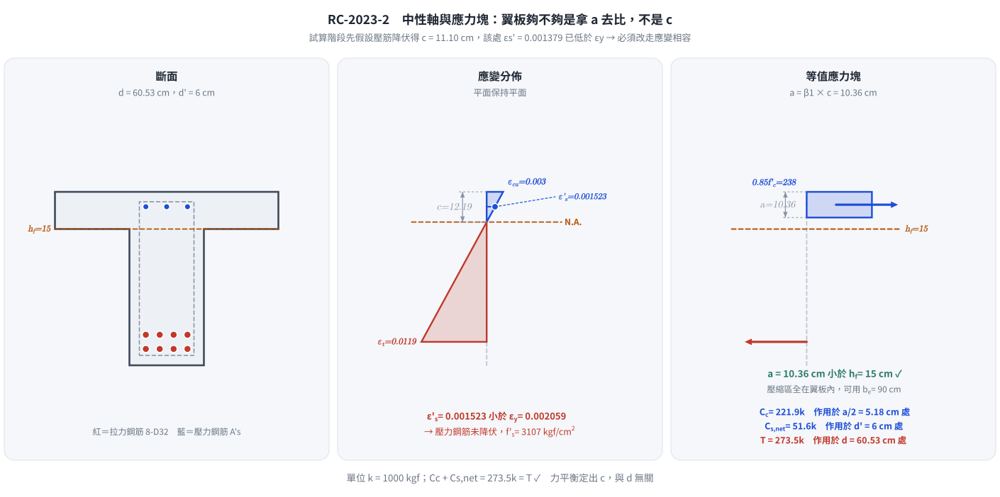
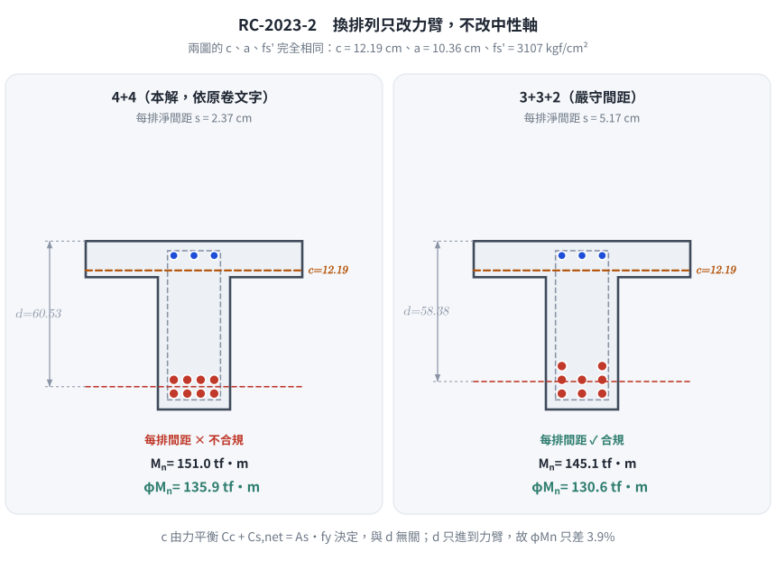

### 考題編號：RC-2023-2

**主分類：** `RC-U1-1` RC 梁彎矩強度分析與設計
**副分類：** 無
**設計法：** USD強度設計法
**標籤：** `T形梁` `雙筋梁` `壓力鋼筋未降伏` `應變相容` `雙排配筋` `有效深度計算` `Whitney應力塊` `翼板內中性軸` `鋼筋間距檢核` `題目條件互相矛盾`

---

## 1. 原始題目重述 (Problem Restatement)

鋼筋混凝土 T 型雙筋梁，斷面條件如下：

| 參數 | 數值 |
|------|------|
| 梁腹寬 $b_w$ | 30 cm |
| 有效翼緣寬 $b_e$ | 90 cm |
| 翼緣厚 $h_f$ | 15 cm |
| 梁深 $h$ | 70 cm |
| 拉力鋼筋 | 8 根 D32，雙排排列（$A_s = 8 \times 8.14 = 65.12 \text{ cm}^2$） |
| 壓力鋼筋 | $A_s' = 18 \text{ cm}^2$（單排） |
| 箍筋 | D10 |
| 混凝土強度 | $f'_c = 280 \text{ kgf/cm}^2$ |
| 鋼筋降伏強度 | $f_y = 4200 \text{ kgf/cm}^2$ |

保護層及上下層間距均依規範最小值。試求設計彎矩強度 $\phi M_n$。（25 分）

> **幾何假設（規範最小值）：**
> - 最小淨保護層（至箍筋外面）= **4 cm**（室內梁，土木401-110）
> - D10 箍筋直徑 = 0.96 cm（取 **1.0 cm** 簡化）
> - 雙排拉力鋼筋層間淨距 = **2.5 cm**（規範下限）
> - 壓力鋼筋假設單排，**$d' = 6 \text{ cm}$**（壓力鋼筋尺寸未給定，依最小覆蓋估算）
>
> ⚠ **原卷的兩個條件互相矛盾：** 「8 根 D32 採雙排排列」（即 4+4）與「間距均依規範最小值」
> 在 $b_w = 30$ cm 下**無法同時成立**（每排 4 根的淨間距只有 2.37 cm < $d_b$ = 3.22 cm）。
> 本解依原卷文字採 4+4；若嚴守間距須改三排，$\phi M_n$ 降為 130.6 tf·m。詳見 §5 ①。

---



*圖 1　斷面配筋與淨間距檢核。原卷「雙排排列」與「間距依規範最小值」在 $b_w = 30$ cm 下無法並存——這張圖攔下「算完 $d$ 就往下走、從不回頭驗每排放不放得下」。*

## 2. 考題核心精神與出題者意圖 (Core Concepts & Examiner's Intent)

**核心觀念：** 雙筋梁的設計強度需同時考慮三個力：混凝土壓力 $C_c$、壓力鋼筋力 $C_s$、拉力鋼筋力 $T$，且壓力鋼筋是否降伏需通過**應變相容**驗算，不能直接假設。

**出題者測驗的能力：**
1. 能否正確算出雙排鋼筋的有效深度 $d$（規範最小覆蓋 + 層間距）
2. 能否識別「壓力鋼筋未降伏」並進行應變相容迭代求解
3. T 形梁壓縮區面積的正確處理（先判斷 $a$ vs. $h_f$，再決定是否需要 T 形面積計算）

**常見陷阱：**
- 直接假設壓力鋼筋降伏，不驗算 $\varepsilon'_s$
- 誤把中性軸深度 $c$ 與應力塊深度 $a$ 拿去跟 $h_f$ 比較（應比較的是 $a$）
- 忘記壓力鋼筋貢獻的混凝土扣除項（淨壓力應為 $A_s'(f'_s - 0.85f'_c)$）

---

## 3. 解題戰略地圖與陷阱分析 (Strategic Roadmap & Trap Analysis)

**作戰計畫：**

```
Step 1：計算 d（雙排鋼筋最小覆蓋 + 層間距）、d'
     ↓
Step 2：假設壓力鋼筋降伏 → 試算 a → 驗算 ε's
     （若 ε's < εy → 不降伏 → 進 Step 3）
     ↓
Step 3：應變相容 + 力平衡 → 建立二次方程 → 求 c
     ↓
Step 4：驗算 a ≤ hf（確認壓縮區在翼板內）
     ↓
Step 5：計算 Mn = Cc(d - a/2) + Cs_net(d - d')
     ↓
Step 6：確認 φ（判斷 εt）→ 輸出 φMn
```

**關鍵陷阱：**

| 陷阱 | 說明 | 應對策略 |
|------|------|---------|
| ⚠ 壓力鋼筋假設降伏不驗算 | 壓力鋼筋可能因中性軸偏深而應變不足 | 必驗 $\varepsilon'_s = \varepsilon_{cu}(c-d')/c$ |
| ⚠ Cs 未扣混凝土 | 壓力鋼筋所在位置已有混凝土壓力 $0.85f'_c$ | 淨力 $C_s = A_s'(f'_s - 0.85f'_c)$ |
| ⚠ 比較 $c$ vs. $h_f$ | 應力塊深度 $a$（非 $c$）才是判斷翼板是否足夠的依據 | 始終比較 $a = \beta_1 c$ 與 $h_f$ |
| ⚠ 雙排鋼筋的 $d$ 計算 | 雙排重心不等於單排位置 | 取兩排形心的加權平均 |
| ⚠ 沒檢查每排放不放得下 | 4 根 D32 在 $b_w = 30$ 的淨間距只有 2.37 cm，**違反 $s \geq d_b$** | $s = \dfrac{b_w - 2c - 2d_s - nd_b}{n-1} \geq \max(d_b,\ 2.5)$，見 §5 ① |

---

## 3.5 變數層次分析（Variable Hierarchy Analysis）

> 複習提示：第一次解題後，在每個卡住的知識點旁標記 `⚠`；第二次複習時只看有 `⚠` 的項目。

### 最終目標

`計算 T 型雙筋梁的設計彎矩強度 φMn（壓力鋼筋應變相容驗算 + 力矩平衡）`

### 本題關鍵公式（依計算順序）

$$\text{Step 1: } d = h - \bar{y}_s;\quad d' \approx c_{\text{cover}} + d_{s} + d_{b,\text{comp}}/2$$

$$\text{Step 2（試驗）: } \varepsilon'_s = \varepsilon_{cu}\frac{c - d'}{\boxed{c}}$$

$$\text{Step 3（不降伏）: } f'_s = E_s \cdot \varepsilon'_s = \frac{6120(c - d')}{c}$$

$$\text{Step 4（平衡）: } 0.85f'_c b_e \beta_1 c + A_s'(f'_s - 0.85f'_c) = A_s f_y \quad\Rightarrow\quad \text{二次方程求 } c$$

$$\text{Step 5: } M_n = C_c\!\left(d - \frac{\boxed{a}}{2}\right) + C_{s,\text{net}}(d - d')$$

$$\text{Step 6: } \phi M_n = \phi \cdot \boxed{M_n},\quad \phi = 0.9 \text{ if } \varepsilon_t \geq 0.005$$

### L1：題目直接給定

| 符號 | 數值 | 說明 |
|------|------|------|
| $b_w$ | 30 cm | 腹板寬 |
| $b_e$ | 90 cm | 有效翼緣寬（題目已給定） |
| $h_f$ | 15 cm | 翼緣厚 |
| $h$ | 70 cm | 梁深 |
| $A_s$ | 65.12 cm² | 8×D32，查表 $8\times8.14$ |
| $A_s'$ | 18 cm² | 壓力鋼筋量 |
| $f'_c$ | 280 kgf/cm² | 混凝土強度 |
| $f_y$ | 4200 kgf/cm² | 鋼筋降伏強度 |
| $\varepsilon_{cu}$ | 0.003 | 規範極限壓應變 |
| $E_s$ | 2,040,000 kgf/cm² | 鋼筋彈性模數 |

### L2：需知識點推導

**Step 1：幾何計算**

| 符號 | 公式／來源 | 卡關? |
|------|-----------|:-----:|
| 底排重心 $y_1$ | $4 + 1.0 + d_{b}/2 = 4 + 1.0 + 1.61 = 6.61$ cm（D32） | |
| 頂排重心 $y_2$ | $y_1 + d_{b}/2 + 2.5 + d_{b}/2 = 6.61 + 5.72 = 12.33$ cm | |
| 拉鋼筋形心 $\bar{y}_s$ | $(4\times y_1 + 4\times y_2)/8$ | |
| 有效深度 $d$ | $h - \bar{y}_s$ | |
| 壓力鋼筋深度 $d'$ | 假設 6 cm（壓力鋼筋尺寸未給定） | |

**Step 2：材料常數**

| 符號 | 公式／來源 | 卡關? |
|------|-----------|:-----:|
| $\beta_1$ | $f'_c = 280 \Rightarrow 0.85$ | |
| $\varepsilon_y$ | $f_y / E_s = 4200/2{,}040{,}000 = 0.002059$ | |

**Step 3：壓力鋼筋應變相容（不降伏路徑）**

| 符號 | 公式／來源 | 卡關? |
|------|-----------|:-----:|
| $f'_s$ | $E_s \cdot \varepsilon_{cu}(c-d')/c = 6120(c-6)/c$ | |
| $C_c$ | $0.85\times280\times90\times0.85c = 18{,}207c$ | |
| $C_{s,\text{net}}$ | $18\times(f'_s - 238)$ | |
| $c$（二次方程）| 聯立 $C_c + C_{s,\text{net}} = T$，整理成 $18{,}207c^2 - 167{,}628c - 660{,}960 = 0$ | |

**Step 4：彎矩計算**

| 符號 | 公式／來源 | 卡關? |
|------|-----------|:-----:|
| $\varepsilon_t$ | $\varepsilon_{cu}(d-c)/c$ | |
| $\phi$ | $\varepsilon_t \geq 0.005 \Rightarrow 0.9$；過渡區線性插值 | |
| $M_n$ | $C_c(d-a/2) + C_{s,\text{net}}(d-d')$ | |

### L3：深層知識（不懂就卡住）

| 知識點 | 說明 | 卡關? |
|--------|------|:-----:|
| 為何比較 $a$ 而非 $c$ 與 $h_f$？ | Whitney 應力塊深度 $a$ 代表混凝土受壓區實際高度；$c$ 是彈性中性軸，不是壓力區範圍 | |
| 壓力鋼筋淨力扣除 $0.85f'_c$ | 壓力鋼筋截面積所在處混凝土已貢獻 $0.85f'_c$，合力計算時鋼筋只補充額外部分 | |
| 二次方程如何建立？ | 將 $f'_s = E_s\varepsilon_{cu}(c-d')/c$ 代入平衡方程，整理後為 $Ac^2 + Bc + C = 0$ | |
| $\varepsilon'_s < \varepsilon_y$ 的物理意義 | 中性軸偏淺 → 壓力鋼筋所在位置壓應變不足以達到降伏應力 | |

---

## 4. 步驟化詳細計算過程 (Step-by-Step Detailed Calculation)

### Step 1：計算有效深度 $d$ 及 $d'$

拉力鋼筋（D32，雙排 4+4 排列）：

$$y_1 = 4.0 + 1.0 + \frac{3.22}{2} = 4.0 + 1.0 + 1.61 = 6.61 \text{ cm（底排重心距底面）}$$

$$y_2 = 6.61 + \frac{3.22}{2} + 2.5 + \frac{3.22}{2} = 6.61 + 1.61 + 2.5 + 1.61 = 12.33 \text{ cm（頂排重心距底面）}$$

$$\bar{y}_s = \frac{4 \times 6.61 + 4 \times 12.33}{8} = \frac{26.44 + 49.32}{8} = \frac{75.76}{8} = 9.47 \text{ cm}$$

$$d = 70 - 9.47 = \mathbf{60.53 \text{ cm}} \quad (\text{取 } 60.5 \text{ cm})$$

$$d' = 6.0 \text{ cm} \quad \text{（壓力鋼筋深度，依最小覆蓋估算，壓力鋼筋尺寸未給）}$$

其他常數：

$$\beta_1 = 0.85 \;(f'_c = 280 \text{ kgf/cm}^2),\quad \varepsilon_y = \frac{4200}{2{,}040{,}000} = 2.059 \times 10^{-3}$$

$$A_s = 8 \times 8.14 = 65.12 \text{ cm}^2,\quad T = A_s f_y = 65.12 \times 4200 = 273{,}504 \text{ kgf}$$

---

### Step 2：先假設壓力鋼筋降伏（$f'_s = f_y = 4200$ kgf/cm²）

$$0.85 f'_c b_e a + A_s'(f_y - 0.85f'_c) = A_s f_y$$

$$0.85 \times 280 \times 90 \times a + 18 \times (4200 - 238) = 273{,}504$$

$$21{,}420\, a + 71{,}316 = 273{,}504 \quad\Rightarrow\quad a = \frac{202{,}188}{21{,}420} = 9.44 \text{ cm}$$

$$c_{\text{trial}} = \frac{a}{\beta_1} = \frac{9.44}{0.85} = 11.11 \text{ cm}$$

**驗算壓力鋼筋應變：**

$$\varepsilon'_s = \varepsilon_{cu} \cdot \frac{c - d'}{c} = 0.003 \times \frac{11.11 - 6}{11.11} = 0.003 \times 0.4599 = 1.380 \times 10^{-3}$$

$$\varepsilon'_s = 0.001380 < \varepsilon_y = 0.002059 \quad \Rightarrow \quad \textbf{壓力鋼筋未降伏！}$$

---

### Step 3：應變相容 + 力平衡（壓力鋼筋不降伏）

$$f'_s = E_s \cdot \varepsilon'_s = E_s \cdot \varepsilon_{cu} \cdot \frac{c - d'}{c} = 2{,}040{,}000 \times 0.003 \times \frac{c - 6}{c} = \frac{6{,}120(c - 6)}{c}$$

$$= 6{,}120 - \frac{36{,}720}{c}$$

力平衡（$C_c + C_{s,\text{net}} = T$）：

$$0.85 \times 280 \times 90 \times (0.85c) + 18\!\left[\left(6{,}120 - \frac{36{,}720}{c}\right) - 238\right] = 273{,}504$$

$$18{,}207c + 18\!\left(5{,}882 - \frac{36{,}720}{c}\right) = 273{,}504$$

$$18{,}207c + 105{,}876 - \frac{660{,}960}{c} = 273{,}504$$

$$18{,}207c - \frac{660{,}960}{c} = 167{,}628$$

兩邊乘以 $c$：

$$18{,}207c^2 - 167{,}628c - 660{,}960 = 0$$

$$c = \frac{167{,}628 + \sqrt{167{,}628^2 + 4 \times 18{,}207 \times 660{,}960}}{2 \times 18{,}207}$$

$$= \frac{167{,}628 + \sqrt{28{,}099 \times 10^6 + 48{,}146 \times 10^6}}{36{,}414} = \frac{167{,}628 + \sqrt{76{,}245 \times 10^6}}{36{,}414}$$

$$= \frac{167{,}628 + 276{,}127}{36{,}414} = \frac{443{,}755}{36{,}414} = \mathbf{12.19 \text{ cm}}$$

$$\boxed{a = 0.85 \times 12.19 = 10.36 \text{ cm} < h_f = 15 \text{ cm} \checkmark \text{（壓縮區在翼板內，可用 } b_e \text{）}}$$

**確認壓力鋼筋應力（不超過 $f_y$）：**

$$f'_s = \frac{6{,}120 \times (12.19 - 6)}{12.19} = \frac{6{,}120 \times 6.19}{12.19} = \frac{37{,}883}{12.19} = 3{,}108 \text{ kgf/cm}^2 < f_y \checkmark$$

---



*圖 2　中性軸與應力塊。垂直尺度三格共用，故 $c = 12.19$ 與 $a = 10.36$ 的相對深度是真的——判斷翼板夠不夠要拿 $a$ 去比 $h_f$，拿 $c$ 去比會誤判；圖上同時標出 $\varepsilon'_s$ 落在 $\varepsilon_y$ 以下，攔下「壓力鋼筋逕自假設降伏」。*

### Step 4：計算各合力

$$C_c = 0.85 \times 280 \times 90 \times 10.36 = 21{,}420 \times 10.36 = 221{,}911 \text{ kgf}$$

$$C_{s,\text{net}} = A_s'(f'_s - 0.85f'_c) = 18 \times (3{,}108 - 238) = 18 \times 2{,}870 = 51{,}660 \text{ kgf}$$

**平衡驗核：**

$$C_c + C_{s,\text{net}} = 221{,}911 + 51{,}660 = 273{,}571 \approx T = 273{,}504 \text{ kgf} \checkmark$$

---

### Step 5：計算 $M_n$ 與 $\phi M_n$

**力臂：**

$$d - \frac{a}{2} = 60.5 - \frac{10.36}{2} = 60.5 - 5.18 = 55.32 \text{ cm}$$

$$d - d' = 60.5 - 6.0 = 54.5 \text{ cm}$$

**標稱彎矩強度：**

$$M_n = C_c \!\left(d - \frac{a}{2}\right) + C_{s,\text{net}}(d - d')$$

$$= 221{,}911 \times 55.32 + 51{,}660 \times 54.5$$

$$= 12{,}276{,}797 + 2{,}815{,}470 = 15{,}092{,}267 \text{ kgf·cm}$$

**強度折減因子 $\phi$（確認 $\varepsilon_t$）：**

$$\varepsilon_t = \varepsilon_{cu} \cdot \frac{d - c}{c} = 0.003 \times \frac{60.5 - 12.19}{12.19} = 0.003 \times \frac{48.31}{12.19} = 0.003 \times 3.963 = 0.01189$$

$$\varepsilon_t = 0.01189 \gg 0.005 \quad \Rightarrow \quad \text{拉力控制斷面} \quad \phi = 0.90$$

**設計彎矩強度：**

$$\boxed{\phi M_n = 0.90 \times 15{,}092{,}267 \text{ kgf·cm} \approx 13{,}583{,}000 \text{ kgf·cm} \approx \mathbf{136 \text{ tf·m}}}$$

---

### 計算彙整表

| 項目 | 數值 |
|------|:---:|
| 有效深度 $d$ | 60.5 cm |
| 壓力鋼筋深度 $d'$ | 6.0 cm（假設） |
| 中性軸深度 $c$ | 12.19 cm |
| 應力塊深度 $a$ | 10.36 cm（< $h_f$ = 15 cm ✓） |
| 壓力鋼筋應力 $f'_s$ | 3,108 kgf/cm²（< $f_y$ ✓） |
| $C_c$ | 221,911 kgf |
| $C_{s,\text{net}}$ | 51,660 kgf |
| $\varepsilon_t$ | 0.0119（>> 0.005） |
| $\phi$ | 0.90 |
| $\phi M_n$ | **≈ 136 tf·m** |

---

## 5. 關鍵爭議點與進階探討 (Critical Issues & Advanced Discussion)

**1. ⚠ 原卷「雙排排列」與「間距取規範最小值」互相矛盾**

原卷（112 年第二題）寫「縱向拉鋼筋 8 根 D32 **採雙排排列**……鋼筋保護層及上下層間距**均依規範最小值**之規定」。
但每排 4 根 D32 在 $b_w = 30$ cm 內的淨間距為：

$$s_{\text{clear}} = \frac{b_w - 2c_{\text{cover}} - 2d_{\text{stirrup}} - 4d_b}{3}
= \frac{30 - 2(4) - 2(1.0) - 4(3.22)}{3} = \frac{7.12}{3} = 2.37 \text{ cm}$$

$$2.37 \text{ cm} < \max(d_b,\ 2.5 \text{ cm}) = 3.22 \text{ cm} \quad ✗\ \textbf{不符規範}$$

改為每排 3 根則 $s = \dfrac{20 - 3(3.22)}{2} = 5.17$ cm ✓ 通過。也就是說：
**「雙排」與「間距合規」在本斷面二選一，不可能同時成立。**

**兩種處理的完整對照：**

| | 4+4（本解，依原卷文字） | 3+3+2（三排，嚴守間距） |
|---|---:|---:|
| 底排／次排／第三排形心 | 6.61 ／ 12.33 cm | 6.61 ／ 12.33 ／ 18.05 cm |
| $\bar y_s$ | 9.47 cm | 11.62 cm |
| $d$ | 60.53 cm | 58.38 cm |
| $c$ | 12.19 cm | 12.19 cm（**不變**） |
| $a$ | 10.36 cm | 10.36 cm（**不變**） |
| $f'_s$ | 3,107 kgf/cm² | 3,107（**不變**） |
| $M_n$ | 151.0 tf·m | 145.1 tf·m |
| $\phi M_n$ | **136 tf·m** | **130.6 tf·m（−3.9%）** |

> **為什麼 $c$、$a$、$f'_s$ 完全不變？** 它們只由**力平衡**（$C_c + C_{s,\text{net}} = A_sf_y$）決定，
> 與 $d$ 無關；$d$ 只進到**力臂**。所以換排列只改彎矩、不改中性軸——這個結構值得記住。



*圖 3　換排列只改力臂。兩格畫的是同一條中性軸——$c$ 由力平衡定出，與 $d$ 無關；這張圖攔下「以為改排列會連中性軸一起變」而把整題重算一遍的錯。*

**考場建議：** 依原卷文字寫 4+4（坊間解答通行），但**在卷面加一句**
「註：4 根 D32 於 $b_w=30$ 之淨間距 2.37 cm 未達 $d_b$，本解依題意仍採雙排」，
把矛盾點出來反而顯示有做間距檢核。

**2. 壓力鋼筋尺寸未給定的處理**

本題未明示壓力鋼筋尺寸，故 $d'$ 需假設。若改用 $d' = 6.5$ cm（如 D29 bars），則 $c$ 略有變化但 $\phi M_n$ 差異在 1% 以內，不影響最終有效位數。考場上應明確寫出假設值。

**3. 中性軸在翼板以外的情境（本題不需，但需能判斷）**

若無壓力鋼筋時：$a = 12.77$ cm，仍 $< h_f = 15$ cm，翼板完全足夠。本題有壓力鋼筋後 $a$ 更小。因此本題全程用 $b_e = 90$ cm 是正確的。若 $a > h_f$，才需要分離 $A_{sf}$（翼板部分）與 $A_{sw}$（腹板部分）分別計算。

**4. 為何 $C_{s,\text{net}} = A_s'(f'_s - 0.85f'_c)$？**

壓力鋼筋面積所在位置，Whitney 應力塊原本就有 $0.85f'_c$ 的混凝土壓力貢獻。若計算 $C_c$ 時已包含整個寬度（包括鋼筋所在位置），則壓力鋼筋只能提供「額外的」壓力，即 $A_s'(f'_s - 0.85f'_c)$。

**5. 考場最安全作法**

1. 先假設壓力鋼筋降伏 → 快速試算 $c$ → 驗算 $\varepsilon'_s$
2. 若 $\varepsilon'_s < \varepsilon_y$，才建立二次方程求 $c$（不要跳過這個試驗步驟）
3. 翼板判斷：永遠比較 $a$ 與 $h_f$，而非 $c$ 與 $h_f$
4. 算完 $d$ **順手驗一次每排的淨間距**——本題正是靠這一步才看得出原卷條件矛盾

---

*圖解補繪：2026-08-31（向量圖 3 張，腳本 `figs/gen_RC-2023-2.py`，可重跑；腳本檔尾對 §4／§5 公佈值做 assert）*
