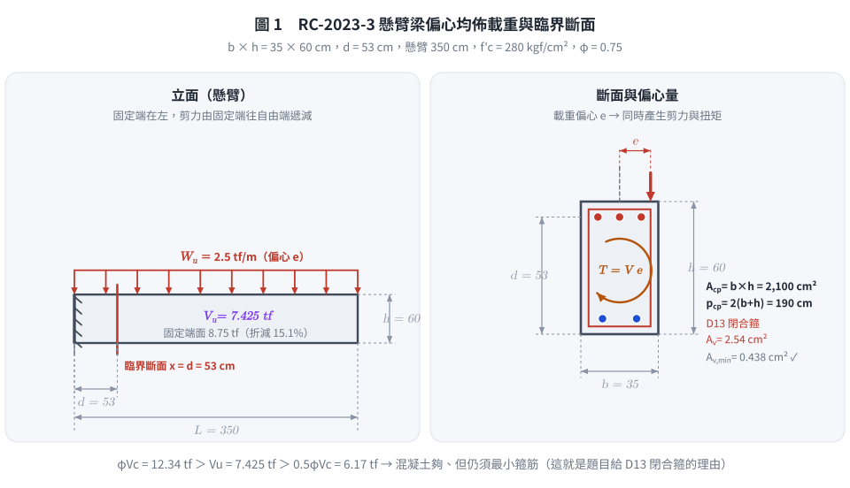
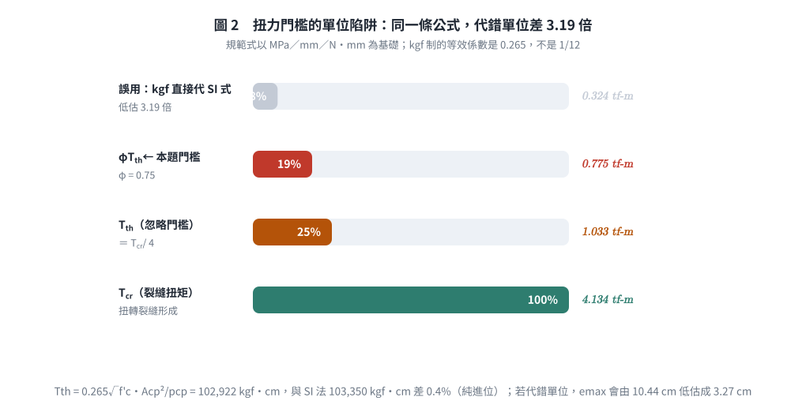
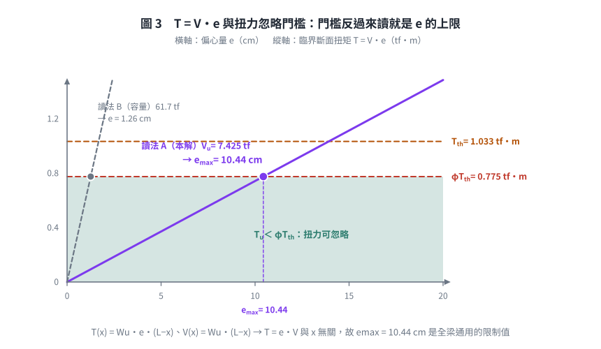

### 考題編號：RC-2023-3

**主分類：** `RC-U2-1` RC 剪力強度分析與設計
**副分類：** `RC-U2-2` RC 扭力強度設計
**設計法：** USD強度設計法
**標籤：** `懸臂梁` `臨界斷面` `扭力忽略門檻` `偏心載重` `Acp` `pcp` `φTth` `剪力需求` `題意歧義` `單位換算`

---

## 1. 原始題目重述 (Problem Restatement)

**依據與作答規範（原卷明訂）：** 中國土木水利工程學會「混凝土工程設計規範與解說」（土木 401-110），未依上述規範作答，不予計分。

**原卷原文（112 年第三題）：**

> 鋼筋混凝土懸臂矩形梁，跨度 3.5 m，梁斷面寬度 $b = 35$ cm、深度 $h = 60$ cm，有效深度 $d = 53$ cm，閉合箍筋及縱向鋼筋均採用 D13，承受偏心垂直均佈載重 $W_u = 2.5$ tf/m。若此梁設計時不考慮扭力，則此梁斷面所能承受之**最大設計剪力 $V_u$** 及**臨界斷面最大偏心量 $e$** 值為何？強度折減因子採 0.75，材料使用 $f'_c = 280$ kgf/cm²，$f_y = 4200$ kgf/cm²。（25 分）

| 參數 | 數值 |
|------|------|
| 跨度 $L$ | 3.5 m = 350 cm（懸臂） |
| 梁寬 $b$ | 35 cm |
| 梁深 $h$ | 60 cm |
| 有效深度 $d$ | 53 cm（題目已給定） |
| 箍筋／縱向鋼筋 | 閉合箍筋 D13、縱向 D13（$d_b = 1.27$、$A_b = 1.27$ cm²） |
| 偏心垂直均佈載重 | $W_u = 2.5$ tf/m，偏心量 $e$（待求） |
| $f'_c$ | 280 kgf/cm² |
| $f_y$ | 4200 kgf/cm² |
| $\phi$ | 0.75（題目指定） |

**試求：**
1. 此梁斷面的最大設計剪力 $V_u$（臨界斷面）
2. 臨界斷面的最大偏心量 $e$（使扭力仍可忽略）

---



*圖 1　懸臂梁的臨界斷面與偏心量。$d$ 偏移三條件逐條成立才取距固定端 $d$ 處（判準是條件，不是構件名稱）；圖右下的 $\phi V_c > V_u > 0.5\phi V_c$ 說明 D13 閉合箍是**最小鋼筋量**要求，不是為了承受扭力。*

## 2. 考題核心精神與出題者意圖 (Core Concepts & Examiner's Intent)

**核心觀念：** 偏心垂直載重同時產生**剪力 $V$** 與**扭矩 $T = V\cdot e$**。若 $T_u < \phi T_{th}$（規範的扭力忽略門檻，約為裂縫扭矩的 1/4），則扭力效應可在設計中忽略，只需設計剪力。反過來讀，就能由門檻反推「最大容許偏心量」。

**出題者測驗：**
1. 懸臂梁臨界斷面位置（距**固定端** $d$ 處）與剪力計算——並且要能說出憑什麼可以 $d$ 偏移
2. 土木 401-110 扭力忽略條件 $T_u < \phi T_{th}$ 的應用
3. $T_{th}$ 的計算（需用 $A_{cp}$、$p_{cp}$）——**以及公式的單位制**，這是本題最容易整體錯掉的一步
4. $T_u = V_u \cdot e$ 對偏心均佈載重在**任意**斷面都成立的推導

**設計哲學：** 偏心載重本質上是「剪力 ＋ 扭力」的組合。當 $e$ 足夠小、扭矩低於裂縫扭矩的 $\phi$ 倍時，規範允許忽略扭力——因為此時扭轉裂縫尚未形成，扭轉勁度尚未退化，斷面的既有配筋足以吸收。

---

## 3. 解題戰略地圖與陷阱分析 (Strategic Roadmap & Trap Analysis)

**作戰計畫：**

```
Step 1：確認臨界斷面位置（逐條驗 d 偏移三條件）→ 距固定端 d
     ↓
Step 2：計算臨界斷面的剪力 Vu = Wu × (L − d)
     ↓
Step 3：計算斷面幾何參數 Acp、pcp
     ↓
Step 4：計算扭力門檻 Tth（注意單位制！）
     ↓
Step 5：由 Tu = Vu × e ≤ φTth → 求 e_max
```

**關鍵陷阱：**

| 陷阱 | 說明 | 應對策略 |
|------|------|---------|
| ⚠ **懸臂梁的臨界斷面** | 依土木 401-110／ACI 318 §9.4.3.2 **三條件逐一驗**：(a) 固定端反力向上、端區受壓 ✓ (b) 載重自頂面施加 ✓ (c) 區間內無集中載重 ✓ → 三條件均成立，臨界斷面取距**固定端** $d$ 處（非自由端） | 剪力由固定端向自由端遞減；**判準是三條件而非構件名稱** |
| ⚠ **扭矩門檻公式的單位** | 規範式 $T_{th} = \frac{\sqrt{f'_c}}{12}\frac{A_{cp}^2}{p_{cp}}$ 是 SI（MPa, mm, N·mm）。直接把 kgf/cm² 與 cm 代進去會**低估 3.19 倍** | 換算至 SI 計算，或改用 kgf 制等效係數 **0.265** |
| ⚠ **kgf·cm 與 tf·m 換算差 10⁵** | $77{,}515\ \text{kgf·cm} = \mathbf{0.775}\ \text{tf·m}$，不是 7.75 tf·m | $1\ \text{tf·m} = 10^5\ \text{kgf·cm}$ |
| ⚠ **混淆 $A_{cp}$ 與 $A_{oh}$** | $A_{cp}$：斷面外輪廓全面積（用於忽略條件）；$A_{oh}$：箍筋中心線圍成面積（用於扭力設計） | 忽略條件用 $A_{cp} = b\times h$、$p_{cp} = 2(b+h)$ |
| ⚠ **偏心距的力學關係** | 均佈偏心載重在任意截面的扭矩 = 該截面剪力 × 偏心距 | $T_u = V_u\cdot e$ 對所有截面成立 |
| ⚠ **「所能承受」的讀法** | 中文語意可讀成「容量」也可讀成「所受」 | 見 §5-1；本解取「臨界斷面所受之設計剪力」，並留檔容量讀法 |

---

## 3.5 變數層次分析（Variable Hierarchy Analysis）

> 複習提示：第一次解題後，在每個卡住的知識點旁標記 `⚠`；第二次複習時只看有 `⚠` 的項目。

### 最終目標

`求懸臂梁臨界斷面的最大設計剪力 Vu，及在不考慮扭力條件下的最大偏心量 e_max`

### 本題關鍵公式（依計算順序）

$$\text{Step 1: } V_u = W_u \times (L - d)$$

$$\text{Step 2: } T_{th} = \frac{\sqrt{f'_c}}{12}\cdot\frac{A_{cp}^2}{p_{cp}} \quad \text{(SI: MPa, mm, N·mm)}$$

$$\text{等效 kgf 制: } T_{th} = 0.265\sqrt{f'_c}\cdot\frac{A_{cp}^2}{p_{cp}} \quad \text{(kgf·cm, kgf/cm}^2\text{, cm)}$$

$$\text{Step 3: } T_u = V_u\,e \le \phi T_{th} \quad \Rightarrow \quad e_{\max} = \frac{\phi \boxed{T_{th}}}{\boxed{V_u}}$$

### L1：題目直接給定

| 符號 | 數值 | 說明 |
|------|------|------|
| $L$ | 3.5 m = 350 cm | 懸臂跨度 |
| $b$ | 35 cm | 梁寬 |
| $h$ | 60 cm | 梁深 |
| $d$ | 53 cm | 有效深度（已給） |
| $W_u$ | 2.5 tf/m | 因數化偏心均佈載重 |
| $f'_c$ | 280 kgf/cm² = 27.46 MPa | 混凝土強度 |
| $\phi$ | 0.75 | 剪力／扭力強度折減因子 |

### L2：需知識點推導

**Step 1：臨界斷面剪力**

| 符號 | 公式／來源 | 卡關? |
|------|-----------|:-----:|
| 臨界斷面位置 | $x_c = d = 53$ cm 距固定端（§9.4.3.2） | |
| $V_u$ | $W_u(L-d) = 2.5\times(3.5-0.53) = 7.425$ tf | |

**Step 2：斷面幾何**

| 符號 | 公式／來源 | 卡關? |
|------|-----------|:-----:|
| $A_{cp}$ | $b\times h = 35\times60 = 2{,}100$ cm² | |
| $p_{cp}$ | $2(b+h) = 2(35+60) = 190$ cm | |

**Step 3：扭力忽略門檻**

| 符號 | 公式／來源 | 卡關? |
|------|-----------|:-----:|
| $T_{th}$ [N·mm] | $\frac{\sqrt{27.46}}{12}\cdot\frac{(210{,}000)^2}{1{,}900} = 1.014\times10^7$ | |
| $T_{th}$ [kgf·cm] | $1.014\times10^7/98.07 = 103{,}354$ | |
| $\phi T_{th}$ | $0.75\times103{,}354 = 77{,}515$ kgf·cm $= 0.775$ tf·m | |

**Step 4：最大偏心量**

| 符號 | 公式／來源 | 卡關? |
|------|-----------|:-----:|
| $T_u$ | $V_u\times e = 7{,}425\,e$ [kgf·cm] | |
| $e_{\max}$ | $77{,}515/7{,}425 = 10.44$ cm | |

### L3：深層知識（不懂就卡住）

| 知識點 | 說明 | 卡關? |
|--------|------|:-----:|
| 懸臂梁臨界剪力斷面 | §9.4.3.2 三條件：(a) 反力在端區產生壓力 (b) 載重在頂面 (c) 區間無集中載重。本題三條件均成立 → 取距支承面 $d$ 處。**判準是條件不是構件名稱**；若載重自拉力側進入（懸吊式），應取端面（見 [RC-2020-2](../RC-2020-2/RC-2020-2.md)）；若支承細節未明示，保守取端面（見 [RC-2006-1](../RC-2006-1/RC-2006-1.md)） | |
| $T_{th}$ 的物理意義 | $T_{cr} = \frac{\sqrt{f'_c}}{3}\frac{A_{cp}^2}{p_{cp}}$（SI），$T_{th} = T_{cr}/4$；當 $T_u < \phi T_{th}$，扭轉裂縫尚未形成，扭力對設計的影響可忽略 | |
| $A_{cp}$ vs. $A_{oh}$ | $A_{cp}$：斷面外輪廓全面積（忽略條件用）；$A_{oh}$：箍筋中心線圍面積（實際扭力設計用，須扣保護層與箍筋） | |
| **單位換算係數 0.265 的來歷** | ACI 英制式為 $1.0\sqrt{f'_c}\frac{A_{cp}^2}{p_{cp}}$（psi, in）。$\sqrt{f'_c[\text{psi}]} = \sqrt{14.223}\sqrt{f'_c[\text{kgf/cm}^2]} = 3.771\sqrt{f'_c}$，再乘 $1\,\text{psi} = 0.0703\,\text{kgf/cm}^2$ → $3.771\times0.0703 = \mathbf{0.265}$ | |
| 為何 $T_u = V_u\times e$？ | 偏心 UDL：$T(x) = W_u e(L-x)$、$V(x) = W_u(L-x)$，故 $T = V\cdot e$ 對所有截面成立（與 $x$ 無關） | |
| 最小箍筋量門檻 | $V_u > 0.5\phi V_c$ 即需最小剪力筋；本題 $7.425 > 6.17$ → 需要，這正是題目給 D13 閉合箍筋的原因 | |

---

## 4. 步驟化詳細計算過程 (Step-by-Step Detailed Calculation)

### Step 1：臨界斷面位置與最大設計剪力 $V_u$

懸臂梁，固定端在左（$x = 0$），自由端在右（$x = L = 350$ cm）。

**土木 401-110 §9.4.3.2 三條件檢核：**

| 條件 | 內容 | 本題 |
|------|------|:----:|
| (a) | 支承反力在端區產生壓力 | ✓ 固定端支承反力向上頂住梁 |
| (b) | 載重施加於構材頂部或其附近 | ✓ 垂直均佈載重自頂面施加 |
| (c) | 支承面與臨界斷面間無集中載重 | ✓ 純均佈載重 |

→ **三條件均成立，可採 $d$ 偏移。**

**臨界斷面位置：** $x_c = d = 53$ cm（距固定端）

**臨界斷面剪力：**

$$V(x) = W_u(L - x) \quad \Rightarrow \quad V_u = W_u(L - d) = 2.5 \times (3.5 - 0.53) = 2.5\times2.97$$

$$\boxed{V_u = 7.425 \text{ tf} = 7{,}425 \text{ kgf}}$$

（對照：固定端面 $V = 2.5\times3.5 = 8.75$ tf；$d$ 偏移折減 15.1%。）

> **驗核混凝土剪力容量（確認 D13 箍筋的用途）：**
>
> $$V_c = 0.53\sqrt{280}\times35\times53 = 8.8686\times1{,}855 = 16{,}451\ \text{kgf} = 16.45\ \text{tf}$$
>
> $$\phi V_c = 0.75\times16{,}451 = 12{,}338\ \text{kgf} = 12.34\ \text{tf},\qquad 0.5\phi V_c = 6.17\ \text{tf}$$
>
> $V_u = 7.425\ \text{tf} < \phi V_c = 12.34\ \text{tf}$ → 混凝土本身即足以抵抗剪力；
> 但 $V_u = 7.425 > 0.5\phi V_c = 6.17\ \text{tf}$ → 仍須配置**最小剪力筋**。
> 這就是題目給「閉合箍筋 D13」的理由——它是最小鋼筋量要求，不是為了承受扭力。

---

### Step 2：斷面幾何參數

$$A_{cp} = b \times h = 35 \times 60 = 2{,}100 \text{ cm}^2$$

$$p_{cp} = 2(b + h) = 2(35 + 60) = 190 \text{ cm}$$

---

### Step 3：計算扭力忽略門檻 $T_{th}$（土木 401-110 §22.7）

**方法一：以 SI 單位計算（規範原始單位）**

$$f'_c = \frac{280}{10.197} = 27.46 \text{ MPa},\qquad A_{cp} = 210{,}000\ \text{mm}^2,\qquad p_{cp} = 1{,}900\ \text{mm}$$

$$T_{th} = \frac{\sqrt{f'_c}}{12}\cdot\frac{A_{cp}^2}{p_{cp}} = \frac{\sqrt{27.46}}{12}\times\frac{(2.10\times10^5)^2}{1.90\times10^3}$$

$$= \frac{5.240}{12}\times\frac{4.410\times10^{10}}{1.900\times10^3} = 0.4367\times2.3211\times10^7 = 1.0136\times10^7 \text{ N·mm}$$

**換算至 kgf·cm：**（$1\ \text{N·mm} = \dfrac{1}{9.807\times10} \text{ kgf·cm}$）

$$T_{th} = \frac{1.0136\times10^7}{98.07} = \boxed{103{,}354 \text{ kgf·cm}}$$

**方法二：直接用 kgf 制等效係數（考場更快，可互相驗算）**

$$T_{th} = 0.265\sqrt{f'_c}\,\frac{A_{cp}^2}{p_{cp}} = 0.265\times16.733\times\frac{2{,}100^2}{190} = 4.434\times23{,}211 = 102{,}920 \text{ kgf·cm}$$

兩法相差 0.4%（純屬換算進位），取 $T_{th} \approx 1.03\times10^5$ kgf·cm。

$$\phi T_{th} = 0.75 \times 103{,}354 = \boxed{77{,}515 \text{ kgf·cm} = 0.775 \text{ tf·m}}$$

> ⚠ **兩個單位陷阱一次踩到就整題錯：**
> ① 若把 kgf/cm² 與 cm 直接代進 SI 式 $\frac{\sqrt{f'_c}}{12}\frac{A_{cp}^2}{p_{cp}}$，得
> $\frac{16.733}{12}\times23{,}211 = 32{,}363$ kgf·cm，**低估 3.19 倍**（$e_{\max}$ 也跟著低估成 3.3 cm）。
> ② $77{,}515$ kgf·cm $= \mathbf{0.775}$ tf·m。$1\ \text{tf·m} = 10^5\ \text{kgf·cm}$，不是 $10^4$。

---

### Step 4：最大偏心量 $e_{\max}$

對均佈偏心載重，任意斷面的扭矩：

$$T(x) = W_u\,e\,(L-x),\qquad V(x) = W_u(L-x)\qquad\Rightarrow\qquad T(x) = e\cdot V(x)$$

故臨界斷面：

$$T_u = V_u \times e = 7{,}425\,e \quad [\text{kgf·cm}，e\text{ 單位 cm}]$$

扭力忽略條件：$T_u \le \phi T_{th}$

$$7{,}425\,e \le 77{,}515$$

$$\boxed{e_{\max} = \frac{77{,}515}{7{,}425} = 10.44 \text{ cm}}$$

（取 $e_{\max} \approx 10.4$ cm。注意 $T = e\cdot V$ 的比例關係與 $x$ 無關，故**任一斷面**檢核的結果都相同——臨界斷面只是剪力最大處，$e$ 的限制值全梁一致。）

---

### 計算結果彙整

| 項目 | 結果 |
|------|:---:|
| 臨界斷面位置 | 距固定端 $d = 53$ cm |
| **最大設計剪力 $V_u$** | **7.425 tf（7,425 kgf）** |
| 固定端面剪力（對照） | 8.75 tf |
| 混凝土剪力容量 $\phi V_c$ | 12.34 tf > $V_u$ ✓（$0.5\phi V_c = 6.17 < V_u$ → 需最小箍筋） |
| 斷面積 $A_{cp}$ | 2,100 cm² |
| 外周長 $p_{cp}$ | 190 cm |
| 扭力門檻 $T_{th}$ | 103,354 kgf·cm |
| $\phi T_{th}$ | 77,515 kgf·cm = 0.775 tf·m |
| **最大偏心量 $e_{\max}$** | **≈ 10.4 cm** |

---



*圖 2　扭力門檻的單位陷阱。同一條 $T_{th}$ 公式，kgf 制的等效係數是 $0.265$ 而不是 $1/12$，代錯就低估 3.19 倍、$e_{\max}$ 跟著從 10.44 cm 掉到 3.27 cm。圖上同時標出 $T_{th} = T_{cr}/4$ 的關係，避免把忽略門檻與裂縫扭矩混為一談。*



*圖 3　把門檻反過來讀就是偏心量的上限。$T = e \cdot V$ 的比例與斷面位置 $x$ 無關，所以 $e_{\max} = 10.44$ cm 是**全梁通用**的限制值；圖上另畫出「所能承受」讀成容量時的那條陡線（$e = 1.26$ cm），一眼看出兩種讀法差了八倍。*

## 5. 關鍵爭議點與進階探討 (Critical Issues & Advanced Discussion)

**1. 題意歧義：「此梁斷面所能承受之最大設計剪力」該怎麼讀？（留檔）**

中文「所能承受」字面上偏向**容量**，但本題的資料配置指向**需求**：

| 讀法 | $V_u$ | 用到的題給條件 | $e_{\max}$ | 評述 |
|------|:---:|---|:---:|------|
| **A：臨界斷面所受設計剪力（本解主線）** | $W_u(L-d) = \mathbf{7.425}$ tf | 用到 $W_u$、$L$、$d$ | **10.4 cm** | 兩小題自然銜接（第二小題的 $T_u = V_u e$ 直接用第一小題的答案）；所有題給條件都用到 |
| B：斷面剪力容量 | $5\phi V_c = \phi(V_c{+}4V_c) = \mathbf{61.7}$ tf | 用到 $f'_c$、$b$、$d$、$\phi$；**$W_u = 2.5$ tf/m 完全用不到** | 1.26 cm | 「容量」語意較貼；但把題目給的載重擺著不用，且 $e = 1.26$ cm 的偏心在工程上無意義 |

判定採讀法 A 的理由：(i) 第二小題明寫「**臨界斷面**最大偏心量」，需要臨界斷面的剪力值，正是第一小題的答案；(ii) 若採讀法 B，$W_u = 2.5$ tf/m 這個條件會完全落空——考題不會給一個完全用不到的數字；(iii) 同一年（112 年）第一、二題都是「給定斷面求強度」，本題若也只是求容量，就不需要給載重。

**讀法 B 的完整數字（供對照）：** $V_c = 16.45$ tf、$V_{s,\max} = 4V_c = 65.8$ tf、$V_{n,\max} = 5V_c = 82.3$ tf、$V_{u,\max} = 5\phi V_c = 61.7$ tf；此時 $e_{\max} = 77{,}515/61{,}692 = 1.26$ cm。
（可比對 [RC-2020-2](../RC-2020-2/RC-2020-2.md) 小題(三)「計算此梁斷面**所能抵抗**之最大設計剪力」——那題確實是容量題，句型幾乎相同，這也是本題語意會分歧的根源。作答時**兩個都寫、註明理由**最安全。）

**2. 扭力門檻公式的單位問題（最容易整題錯的一步）**

土木 401-110（＝ ACI 318-19 SI 版）的 $T_{th}$ 公式以 MPa、mm、N·mm 為基礎：

$$T_{th} = 0.083\lambda\sqrt{f'_c}\,\frac{A_{cp}^2}{p_{cp}}\quad\left(0.083 \approx \frac{1}{12}\right)$$

直接將 kgf/cm² 與 cm 代入會缺少單位換算的組合因子
$1000/(\sqrt{10.197}\times 98.07) = 3.19$（＝ kgf 制係數 $0.265$ 除以 SI 係數 $1/12$），
導致 $T_{th}$ 低估約 **3.19 倍**（$103{,}354 / 32{,}363 = 3.19$）。
（注意 $\sqrt{14.223}=3.771$ 是「英制 psi ↔ kgf 制」的換算因子，用於推導下方的 $0.265$，
不是「SI 式誤代 kgf」所缺的因子；兩者不可混用。）正確的 kgf 制等效式：

$$\boxed{T_{th} = 0.265\sqrt{f'_c}\,\frac{A_{cp}^2}{p_{cp}}}\quad[\text{kgf·cm};\ f'_c:\text{kgf/cm}^2;\ A_{cp}:\text{cm}^2;\ p_{cp}:\text{cm}]$$

同理裂縫扭矩 $T_{cr} = 4\times T_{th} = 1.06\sqrt{f'_c}A_{cp}^2/p_{cp}$（kgf 制）。**這兩個係數（0.265／1.06）建議背下來。**

**3. 為何 $T_u = V_u \times e$ 在每個截面都成立？**

$$T(x) = W_u \cdot e \cdot (L - x), \quad V(x) = W_u(L - x) \quad\Rightarrow\quad T(x) = e \cdot V(x)$$

比例關係與 $x$ 無關，所以在臨界斷面直接代入 $V_u$ 即可，也代表 $e_{\max}$ 是**全梁通用**的限制值，不是只在臨界斷面才成立。

**4. D13 箍筋的設計目的**

本題 $V_u = 7.425 < \phi V_c = 12.34$ tf → 混凝土單獨就夠；但 $V_u > 0.5\phi V_c = 6.17$ tf → 仍需最小箍筋量：

$$A_{v,\min} = \max\!\left(0.2\sqrt{f'_c}\frac{b_ws}{f_{yt}},\ 3.5\frac{b_ws}{f_{yt}}\right)$$

以 $s = 15$ cm 計：$\max(0.418,\ 0.438) = 0.438\ \text{cm}^2 \ll A_v = 2\times1.27 = 2.54\ \text{cm}^2$ ✓，餘裕極大。
閉合箍筋的形式也符合扭力配筋的構造要求（即使此處扭力被忽略）——扭力一旦不可忽略，開口箍筋是完全無效的。

**5. 若 $e$ 超過 10.4 cm 會怎樣**

$T_u > \phi T_{th}$ 後必須做完整扭力設計：改用 $A_{oh}$（箍筋中心線圍成面積）、$A_o \approx 0.85A_{oh}$，計算扭力箍筋 $A_t/s$ 與扭力縱向筋 $A_l$，並與剪力箍筋**相加**（$A_v/s + 2A_t/s$）；同時檢核組合應力上限
$\sqrt{(V_u/b_wd)^2 + (T_up_h/1.7A_{oh}^2)^2} \le \phi(V_c/b_wd + 2.12\sqrt{f'_c})$。
這也解釋了為何規範要設一個門檻：門檻以下省下大量計算，門檻以上則是完全不同量級的工作。

**6. 依最新規範（土木 401-112／ACI 318-19）重算對照**

原卷指定的土木 401-110 本身即以 ACI 318-19 為藍本，故本題**兩版完全一致**：

| 項目 | 土木 401-110（原卷指定，本解主線） | 土木 401-112／ACI 318-19 | 差異 |
|------|:---:|:---:|:---:|
| $d$ 偏移條件 | §9.4.3.2 三條件 | 相同 | 無 |
| $V_c$（$A_v \ge A_{v,\min}$、$N_u = 0$） | $0.53\lambda\sqrt{f'_c}b_wd = 16.45$ tf | $\left[0.53\lambda\sqrt{f'_c}+\dfrac{N_u}{6A_g}\right]b_wd$，$N_u{=}0$ → 同 | 無 |
| $T_{th}$ | $0.083\lambda\sqrt{f'_c}A_{cp}^2/p_{cp}$ | Table 22.7.4.1(a) 相同 | 無 |
| $A_{v,\min}$ | $\max(0.2\sqrt{f'_c},\,3.5)b_ws/f_{yt}$ | §9.6.3.4 相同 | 無 |
| $V_{s,\max}$ | $4V_c = 2.12\sqrt{f'_c}b_wd$ | §22.5.1.2 相同 | 無 |
| **答案** | **7.425 tf／10.4 cm** | **7.425 tf／10.4 cm** | 無 |

> **唯一需留意的 318-19 新規定：** 若本斷面**未**配置最小剪力筋（$A_v < A_{v,\min}$），
> $V_c$ 必須改用 $2.12\lambda_s\lambda\,\rho_w^{1/3}\sqrt{f'_c}b_wd$ 並乘上尺寸效應係數 $\lambda_s \le 1$。
> 本題有 D13 閉合箍筋且遠超 $A_{v,\min}$，故不觸發。

**7. 考場最安全作法**

- 扭力門檻先換算成 SI（MPa, mm）求 $T_{th}$，再換回 kgf·cm；或直接記 kgf 制係數 **0.265** 並用另一法互驗
- 記住 $A_{cp}$ ＝ 斷面全面積、$p_{cp}$ ＝ 外周長（不是箍筋中心線的 $A_{oh}$／$p_h$）
- $e_{\max}$ 的單位要一致（kgf·cm ÷ kgf = cm）
- 「所能承受之最大設計剪力」若時間允許，**需求（7.425 tf）與容量（61.7 tf）都寫**，並各附一句理由

*圖解補繪：2026-09-02（向量圖 3 張，腳本 `figs/gen_RC-2023-3.py`，可重跑；腳本檔尾對 §4 公佈值做 assert）*
