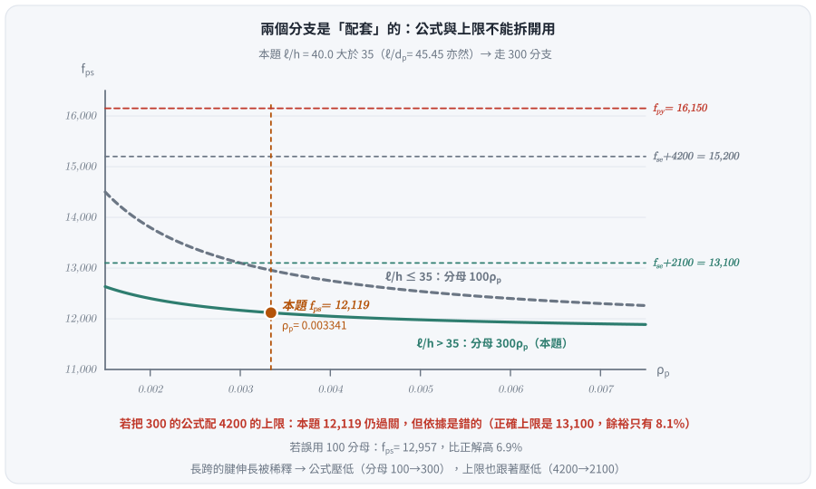
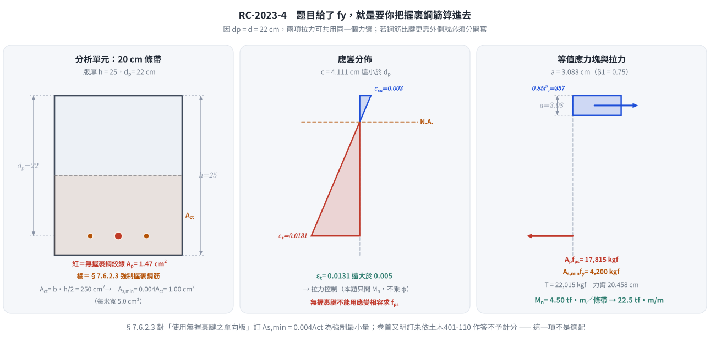
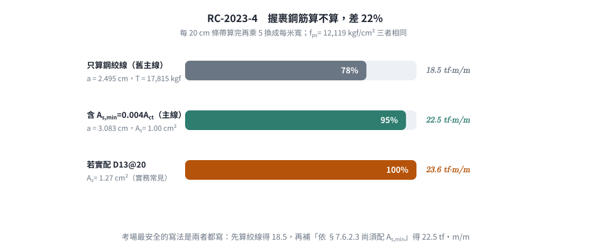

### 考題編號：RC-2023-4

**主分類：** `RC-U4-1` 預力梁斷面應力分析
**副分類：** 無
**設計法：** USD強度設計法
**標籤：** `後拉法` `無握裹鋼絞線` `fps公式` `跨深比分支` `fps上限2100` `最小握裹鋼筋` `單向版` `有效預力` `撓曲強度` `β₁折減`

---

## 1. 原始題目重述 (Problem Restatement)

簡支後拉預力混凝土單向版，條件如下：

| 參數 | 數值 |
|------|------|
| 短向跨度 $L$ | 10 m |
| 斷面深度 $h$ | 25 cm |
| 有效深度 $d_p$ | 22 cm（鋼絞線中心至壓力面距離） |
| 無握裹鋼絞線 | $A_p = 1.47 \text{ cm}^2$/根，間距 20 cm |
| 普通具握裹鋼筋 | 間距 20 cm；面積未直接給定，依 §7.6.2.3 取 $A_{s,\min}=0.004A_{ct}=1.00$ cm²／條帶 |
| 鋼絞線極限強度 | $f_{pu} = 19{,}000 \text{ kgf/cm}^2$ |
| 有效預力 | $f_{se} = 11{,}000 \text{ kgf/cm}^2$ |
| 降伏強度 | $f_{py} = 0.85 f_{pu} = 16{,}150 \text{ kgf/cm}^2$ |
| 混凝土強度 | $f'_c = 420 \text{ kgf/cm}^2$ |
| 普通鋼筋降伏強度 | $f_y = 4200 \text{ kgf/cm}^2$ |

試求此單向版的計算撓曲強度 $M_n$。（25 分）

> **主線答案（2026-08-22 改判）：** $M_n = \mathbf{22.5}$ tf·m/m（含規範強制之最小握裹鋼筋）；
> 若只計鋼絞線則為 18.5 tf·m/m。兩者取捨的完整論證見 §5-2。

**考題提供的參考式：**


*圖說：原卷「參考式」欄位印出的無握裹後拉腱應力計算式，即 $f_{ps} = f_{se} + 700 + \dfrac{f'_c}{300\rho_p}$。原卷**只印這一式**（分母含 $300\rho_p$），對應規範中 $\ell/h > 35$ 的分支；$\ell/h \le 35$ 的分支（分母 $100\rho_p$）與兩式各自的上限值原卷均未印，須自行背出。*

$$f_{ps} = f_{se} + 700 + \frac{f'_c}{300\rho_p}$$

> ⚠ **2026-08-22 勘誤：** 舊版圖說把判準寫成「簡支梁 vs. 懸臂梁」，**是錯的**——
> 規範的判準是**跨深比 $\ell/h$**（構材型式無關），且句尾「$300\rho_p$ 分母改為 300」文義破碎。已全部改寫。

> **原卷原文（112 年第四題）核對：** 「一簡支後拉預力混凝土單向版，短向跨度為 10 m，斷面深度 $h$=25 cm，
> 有效深度 $d$=22 cm，配置**無握裹鋼絞線（$A_b$ = 1.47 cm²）及普通具握裹鋼筋，兩者間距均為 20 cm**。
> 試求此單向版之計算撓曲強度 $M_n$。已知鋼絞線 $f_{pu}$=19000、$f_{se}$=11000、$f_{py}=0.85f_{pu}$、
> $f'_c$=420 kgf/cm²、$f_y$＝4200 kgf/cm²。（25 分）」
> **卷首並明訂：「依據與作答規範：中國土木水利工程學會《混凝土工程設計規範與解說》（土木 401-110），未依上述規範作答，不予計分。」**
>
> 這兩個紅字是本題的關鍵：題目**明講有普通具握裹鋼筋**、**給了 $f_y$**、又**強制依規範作答**，
> 而規範對「無握裹腱單向版」有強制的最小握裹鋼筋量 $A_{s,\min} = 0.004A_{ct}$——
> 鋼筋量因此是**可以算出來的**，不是「未給定」。詳見 §4 Step 6 與 §5-2。

---

## 2. 考題核心精神與出題者意圖 (Core Concepts & Examiner's Intent)

**核心觀念：** 後拉無握裹腱與有握裹腱的根本差異在於**應力傳遞機制**：
- 有握裹腱：透過握裹力，在極限狀態下用應變相容求 $f_{ps}$
- 無握裹腱：全長自由滑動，無法用應變相容；必須用 **ACI 經驗公式** 求 $f_{ps}$，且 $f_{ps}$ 與**跨深比 $\ell/h$** 相關

**出題者測驗：**
1. 能否正確識別跨深比並選用**成套**的 $f_{ps}$ 公式與上限（$100\rho_p$／$f_{se}+4200$ vs. $300\rho_p$／$f_{se}+2100$）
2. $f_{ps}$ 的兩個上限值檢核
3. 高強度混凝土的 $\beta_1$ 折減計算（$f'_c = 420 > 280$ kgf/cm²）
4. 單向版撓曲強度的計算（以每根絞線的條帶寬為分析單元），並依 §7.6.2.3 補上強制的最小握裹鋼筋

---

## 3. 解題戰略地圖與陷阱分析 (Strategic Roadmap & Trap Analysis)

**作戰計畫：**

```
Step 1：計算跨深比 ℓ/h → 判斷 fps 公式分支（100 or 300）與對應上限
     ↓
Step 2：計算 ρp（以 20 cm 條帶為單元）
     ↓
Step 3：代入 fps 公式 → 驗核兩個上限
     ↓
Step 4：計算 β₁（f'c = 420 > 280，需折減）
     ↓
Step 5：Whitney 應力塊求 a
     ↓
Step 6：依 §7.6.2.3 算 As,min = 0.004Act
     ↓
Step 7：Mn = (Ap·fps + As·fy)(d - a/2)，乘以條帶倍數換算每米寬
```

**關鍵陷阱：**

| 陷阱 | 說明 | 應對策略 |
|------|------|---------|
| ⚠ 混用 100 和 300 係數 | $\ell/h \leq 35$ 用 100；$\ell/h > 35$ 用 300（細長構件延伸量小） | 先算 $\ell/h = 1000/25 = 40 > 35$ → 用 300 |
| ⚠ 上限值配錯分支 | $\ell/h>35$ 的上限是 $f_{se}+\mathbf{2100}$；$f_{se}+4200$ 只配 $\ell/h\le35$ | 公式與上限必須同分支，兩個上限都要驗算 |
| ⚠ 漏算最小握裹鋼筋 | 單向版用無握裹腱時 §7.6.2.3 強制 $A_{s,\min}=0.004A_{ct}$，會使 $M_n$ 增加 22% | 題目給了 $f_y$ 就是要你算 |
| ⚠ β₁ 未折減 | $f'_c = 420 > 280$ kgf/cm²，每增加 70 kgf/cm² 折減 0.05 | $\beta_1 = 0.85 - 0.05 \times (420-280)/70 = 0.75$ |
| ⚠ 無握裹腱不能用應變相容求 fps | 無握裹腱全長自由滑動，不存在局部應變；必須用 ACI 經驗公式 | fps 公式是唯一合法方法 |
| ⚠ 分析寬度 b | 題目給的是每根絞線的條帶（20 cm），$\rho_p$ 和 $M_n$ 的計算基準要一致 | 用 $b = 20$ cm 算 $\rho_p$，算出的 $M_n$ 再乘 5 換成每米寬 |

---

## 3.5 變數層次分析（Variable Hierarchy Analysis）

> 複習提示：第一次解題後，在每個卡住的知識點旁標記 `⚠`；第二次複習時只看有 `⚠` 的項目。

### 最終目標

`計算無握裹後拉預力單向版的計算撓曲強度 Mn（每米寬），含規範強制的最小握裹鋼筋貢獻`

### 本題關鍵公式（依計算順序）

$$\text{Step 1: 判斷} \frac{\ell}{h} > 35 \Rightarrow f_{ps} = f_{se} + 700 + \frac{f'_c}{300\rho_p}$$

$$\text{Step 2: } \rho_p = \frac{A_p}{b \cdot d_p}$$

$$\text{Step 3: 驗核 } f_{ps} \leq \min\!\left(f_{py},\ f_{se} + 2100\right)\quad(\ell/h>35\ \text{分支})$$

$$\text{Step 3b: } A_{s,\min} = 0.004\,A_{ct},\quad A_{ct} = b\,h/2$$

$$\text{Step 4: } a = \frac{A_p \boxed{f_{ps}} + A_{s,\min} f_y}{0.85 f'_c \cdot b}$$

$$\text{Step 5: } M_n = \left(A_p f_{ps} + A_{s,\min} f_y\right)\!\left(d - \frac{\boxed{a}}{2}\right)$$

### L1：題目直接給定

| 符號 | 數值 | 說明 |
|------|------|------|
| $L$ | 1000 cm | 跨度 |
| $d_p$ | 22 cm | 鋼絞線有效深度 |
| $A_p$ | 1.47 cm² | 每根鋼絞線面積 |
| 間距 | 20 cm | 鋼絞線（及握裹鋼筋）間距 |
| $f_{pu}$ | 19,000 kgf/cm² | 鋼絞線極限強度 |
| $f_{se}$ | 11,000 kgf/cm² | 有效預力（長期損失後） |
| $f_{py}$ | 0.85 × 19,000 = 16,150 kgf/cm² | 鋼絞線降伏強度 |
| $f'_c$ | 420 kgf/cm² | 混凝土強度 |
| $\varepsilon_{cu}$ | 0.003 | 規範極限壓應變 |

### L2：需知識點推導

**Step 1：fps 公式係數判斷**

| 符號 | 公式／來源 | 卡關? |
|------|-----------|:-----:|
| $\ell/h$；$\ell/d_p$ | $1000/25 = 40.0$；$1000/22 = 45.45$；皆 $> 35$ → 係數 **300** | |
| $\rho_p$ | $A_p/(b \cdot d_p) = 1.47/(20 \times 22)$ | |
| $f_{ps}$ | $f_{se} + 700 + f'_c/(300\rho_p)$ | |
| $f_{ps}$ 上限 1 | $f_{py} = 0.85 f_{pu} = 16{,}150$ kgf/cm² | |
| $f_{ps}$ 上限 2 | $f_{se} + 2{,}100 = 13{,}100$ kgf/cm²（$\ell/h>35$ 分支）| |
| $A_{s,\min}$ | $0.004\,A_{ct} = 0.004\times(20\times12.5) = 1.00$ cm²／條帶 | |

**Step 2：應力塊計算**

| 符號 | 公式／來源 | 卡關? |
|------|-----------|:-----:|
| $\beta_1$ | $0.85 - 0.05(f'_c - 280)/70$，下限 0.65 | |
| $a$ | $A_p f_{ps}/(0.85 f'_c b)$ | |
| $c$ | $a/\beta_1$（供驗核用） | |

**Step 3：標稱彎矩**

| 符號 | 公式／來源 | 卡關? |
|------|-----------|:-----:|
| $M_n$（20 cm 條帶） | $(A_p f_{ps} + A_s f_y)(d - a/2)$ | |
| $M_n$（每米寬） | $M_n \times (100/20)$ | |

### L3：深層知識（不懂就卡住）

| 知識點 | 說明 | 卡關? |
|--------|------|:-----:|
| 無握裹腱為何用經驗公式？ | 無握裹腱全長自由滑動，不存在「截面應變相容」，極限狀態的 $\Delta f_p$ 由跨度整體伸長量決定，因此 ACI 以跨深比為參數的經驗式代替應變計算 | |
| 跨深比的物理意義 | 跨度越長（$\ell/h$ 大），絞線伸長量被「稀釋」到更長的自由長度，所以 $f_{ps}$ 提升量越小 → 用更大分母（300 vs 100） | |
| $\beta_1$ 折減規則 | CNS 1480：$f'_c = 280 \Rightarrow \beta_1 = 0.85$；每增加 70 kgf/cm²，$\beta_1$ 減 0.05，下限 0.65；$f'_c = 420$：$\beta_1 = 0.75$ | |
| $f_{ps}$ 的兩個上限意義 | $f_{ps} \leq f_{py}$：腱不得超過降伏；應力增量上限**隨分支不同**：$\ell/h\le35$ 為 $f_{se}+4200$（$\Delta f_p \le 420$ MPa）、$\ell/h>35$ 為 $f_{se}+2100$（$\Delta f_p \le 210$ MPa） | |
| 無握裹腱為何一定要配握裹鋼筋 | 腱不與混凝土握裹 ⇒ 開裂後裂縫會集中成少數幾條大裂縫；握裹鋼筋負責把裂縫分散、並在腱失效時提供剩餘強度，故 §7.6.2.3 訂為**強制最小量** | |

---

## 4. 步驟化詳細計算過程 (Step-by-Step Detailed Calculation)

> **分析單元：** 取單根鋼絞線對應的 20 cm 條帶（$b = 20$ cm）進行計算。

### Step 1：判斷 $f_{ps}$ 公式係數

規範的判準是**跨深比**。嚴格依條文文字，深度取**構材全深 $h$**；坊間常直接用 $d_p$。
**本題兩種取法同結論**，寫哪一個都安全：

$$\frac{\ell}{h} = \frac{1000}{25} = 40.0 > 35 \qquad\text{（條文定義）}$$
$$\frac{\ell}{d_p} = \frac{1000}{22} = 45.45 > 35 \qquad\text{（坊間慣用）}$$

$$\Rightarrow \text{使用 } \mathbf{300\rho_p} \text{ 分支：} f_{ps} = f_{se} + 700 + \frac{f'_c}{300\rho_p}$$

> 原卷「參考式」欄只印了這一式，等於已經替考生決定了分支——但**上限值原卷沒印**，
> 而上限正是本題最容易踩的地方（見 Step 3）。

---

### Step 2：計算 $\rho_p$

$$\rho_p = \frac{A_p}{b \cdot d_p} = \frac{1.47}{20 \times 22} = \frac{1.47}{440} = 3.341 \times 10^{-3}$$

---

### Step 3：計算 $f_{ps}$ 並驗核上限

$$\frac{f'_c}{300\rho_p} = \frac{420}{300 \times 3.341 \times 10^{-3}} = \frac{420}{1.0023} = 419.0 \text{ kgf/cm}^2$$

$$f_{ps} = 11{,}000 + 700 + 419.0 = \mathbf{12{,}119 \text{ kgf/cm}^2}$$

**驗核兩個上限：**

| 上限條件 | 限制值 | 是否滿足 |
|---------|-------|:-------:|
| $f_{ps} \leq f_{py}$ | $0.85 \times 19{,}000 = 16{,}150$ kgf/cm² | ✓ |
| $f_{ps} \leq f_{se} + 2100$（**本題適用**，$\ell/h>35$） | $11{,}000 + 2{,}100 = 13{,}100$ kgf/cm² | ✓（餘裕 7.5%）|
| ~~$f_{ps} \leq f_{se} + 4200$~~ | ~~15,200~~ | 這條**只適用 $\ell/h \le 35$**，本題不可引用 |

> ⚠ **2026-08-22 改正：$\ell/h > 35$ 的上限是 $f_{se}+2100$，不是 $f_{se}+4200$。**
> 兩個分支是「配套」的，不能拆開用（土木 401-110 §20.3.2.4.1／ACI 318-19 §20.3.2.4.1）：
>
> | 跨深比 | $f_{ps}$ 公式 | 應力增量上限 |
> |---|---|---|
> | $\ell/h \le 35$ | $f_{se} + 700 + \dfrac{f'_c}{100\rho_p}$ | $f_{se} + 4200$（＝ 420 MPa）|
> | $\ell/h > 35$ | $f_{se} + 700 + \dfrac{f'_c}{300\rho_p}$ | $f_{se} + \mathbf{2100}$（＝ 210 MPa）|
>
> 邏輯很直觀：長跨的腱伸長被稀釋、應力增量本來就小，所以**公式壓低、上限也跟著壓低**。
> 舊版本頁用 300 的公式配 4200 的上限，是把兩個分支混著用。本題 $f_{ps}=12{,}119$ 兩種上限都通過，
> **答案不受影響，但驗算依據原本是錯的**。

$f_{ps} = 12{,}119 \text{ kgf/cm}^2$ 控制。



*圖 1　公式與上限是成對的，不能拆開用。長跨的腱伸長被稀釋，所以分母從 $100\rho_p$ 加嚴為 $300\rho_p$、上限也同步從 $f_{se}+4200$ 壓到 $f_{se}+2100$——這張圖攔的是「用 $300\rho_p$ 的公式去配 $4200$ 的上限」：本題答案雖不受影響，但驗算依據整個錯位。*


---

### Step 4：材料常數 $\beta_1$

$$\beta_1 = 0.85 - 0.05 \times \frac{f'_c - 280}{70} = 0.85 - 0.05 \times \frac{420 - 280}{70} = 0.85 - 0.05 \times 2 = \mathbf{0.75}$$

---

### Step 5：Whitney 應力塊深度 $a$

$$a = \frac{A_p \cdot f_{ps}}{0.85 \cdot f'_c \cdot b} = \frac{1.47 \times 12{,}119}{0.85 \times 420 \times 20} = \frac{17{,}815}{7{,}140} = \mathbf{2.495 \text{ cm}}$$

**驗核中性軸深度：**

$$c = \frac{a}{\beta_1} = \frac{2.495}{0.75} = 3.327 \text{ cm} \ll d_p = 22 \text{ cm} \checkmark \text{（壓力區遠小於有效深度）}$$

---

### Step 6：規範強制的最小握裹鋼筋 $A_{s,\min}$

> **這一步是 2026-08-22 補上的主線步驟。** 舊版本頁以「$A_s$ 未給定」為由整段略過，
> 但題目明講「配置……**及普通具握裹鋼筋，兩者間距均為 20 cm**」並給了 $f_y = 4200$，
> 卷首又強制「依土木 401-110 作答，未依規範作答不予計分」——鋼筋量是**規範算得出來的**。

無握裹腱之**單向版**必須配置最小握裹變形鋼筋（土木 401-110 §7.6.2.3／ACI 318-19 §7.6.2.3）：

$$A_{s,\min} = 0.004\,A_{ct}$$

$A_{ct}$ ＝ 斷面**受拉面到全斷面形心之間**那一塊的面積。全斷面形心在 $h/2 = 12.5$ cm：

$$A_{ct} = b \times \frac{h}{2} = 20 \times 12.5 = 250\ \text{cm}^2
\;\Rightarrow\; A_{s,\min} = 0.004 \times 250 = \mathbf{1.00\ \text{cm}^2}\ \text{／20 cm 條帶}$$

即每米寬 5.0 cm²（實務上 D13@20 給 1.27 cm²/條帶即可滿足）。
握裹鋼筋與鋼絞線同在受拉側，題目已給「有效深度 $d$ = 22 cm」（原卷用的是 $d$ 不是 $d_p$），
故取 $d = d_p = 22$ cm。



*圖 2　$A_{ct}$ 是「受拉面到全斷面形心」那一塊，不是整個斷面。$A_{s,\min} = 0.004A_{ct} = 1.00$ cm²／條帶是規範強制值——這張圖攔的是「題目沒給 $A_s$ 就當作沒有」：無握裹腱的單向版依 §7.6.2.3 一定要配握裹鋼筋，漏掉就少算 21.8% 的強度。*


---

### Step 7：計算 $M_n$

**（主線）含最小握裹鋼筋，每 20 cm 條帶：**

$$T = A_p f_{ps} + A_{s,\min} f_y = 1.47\times12{,}119 + 1.00\times4{,}200 = 17{,}815 + 4{,}200 = 22{,}015\ \text{kgf}$$

$$a = \frac{T}{0.85f'_c b} = \frac{22{,}015}{0.85\times420\times20} = \frac{22{,}015}{7{,}140} = 3.083\ \text{cm}
\qquad c = \frac{a}{\beta_1} = \frac{3.083}{0.75} = 4.111\ \text{cm}$$

驗核拉力控制：$\varepsilon_t = 0.003\dfrac{d-c}{c} = 0.003\times\dfrac{22-4.111}{4.111} = 0.0131 \gg 0.005$ ✓

$$M_n = T\left(d - \frac{a}{2}\right) = 22{,}015 \times (22 - 1.542) = 22{,}015 \times 20.458 = 450{,}390\ \text{kgf·cm}$$

**換算每米寬（×5 倍）：**

$$\boxed{M_n = 450{,}390 \times 5 = 2{,}251{,}950\ \text{kgf·cm/m} \approx \mathbf{22.5\ \text{tf·m/m}}\quad(\text{每 20 cm 條帶 } 4.50\ \text{tf·m})}$$

**（對照）只算鋼絞線，不計握裹鋼筋：**

$$a = \frac{17{,}815}{7{,}140} = 2.495\ \text{cm},\quad c = 3.327\ \text{cm}$$

$$M_n = 17{,}815 \times (22 - 1.248) = 369{,}705\ \text{kgf·cm}\ \times 5 = \mathbf{18.5\ \text{tf·m/m}}$$

兩者差 **21.8%**。詳見 §5-2 的取捨說明。



*圖 3　握裹鋼筋算不算，答案差 21.8%。主線取規範最小值 $A_{s,\min}$ 而非實配的 D13@20——這張圖攔的是兩個方向的錯：略過握裹鋼筋（低估到 18.5），或直接拿實配鋼筋充當規範需求（高報到 23.6）。*


---

### 計算彙整表

| 項目 | 數值 |
|------|:---:|
| $\ell/h$（條文定義）／$\ell/d_p$（慣用） | 40.0／45.45（皆 > 35 → 分母 $300\rho_p$） |
| $\rho_p$ | $3.341 \times 10^{-3}$ |
| $f_{ps}$ | 12,119 kgf/cm²（$< f_{py}=16{,}150$、$< f_{se}+2100 = 13{,}100$ ✓） |
| $\beta_1$ | 0.75（$f'_c = 420 > 280$） |
| $A_{s,\min} = 0.004A_{ct}$ | 1.00 cm²／20 cm 條帶（5.0 cm²/m） |
| $a$／$c$／$\varepsilon_t$（主線，含 $A_s$） | 3.083 cm／4.111 cm／0.0131（拉力控制） |
| **$M_n$（每 20 cm 帶）** | **4.50 tf·m** |
| **$M_n$（每 1 m 寬）主線** | **22.5 tf·m/m** |
| $M_n$（每 1 m 寬）僅絞線對照 | 18.5 tf·m/m |

---

## 5. 關鍵爭議點與進階探討 (Critical Issues & Advanced Discussion)

**1. 為何用 300 而非 100？**

ACI 318（CNS 1480 土木401-110 §20.3.2.4）對無握裹腱區分兩種係數：
$$\frac{\ell}{h} \leq 35 \Rightarrow f_{ps} = f_{se} + 700 + \frac{f'_c}{100\rho_p} \leq \min(f_{py},\, f_{se}+4200)$$
$$\frac{\ell}{h} > 35 \Rightarrow f_{ps} = f_{se} + 700 + \frac{f'_c}{300\rho_p} \leq \min(f_{py},\, f_{se}+\mathbf{2100})$$

本題 $\ell/h = 40.0$（或 $\ell/d_p = 45.45$）$> 35$，用 300。直覺理解：跨度越長，同樣的絕對伸長量 $\Delta L$ 被分配到更長的自由長度，單位伸長應變 $\Delta L/L$ 越小，$\Delta f_{ps}$ 越小。

**2. 普通具握裹鋼筋要不要算進去？——本題最大的取捨（2026-08-22 改判）**

| 讀法 | 依據 | $a$ | $M_n$（每米寬） |
|---|---|:---:|:---:|
| **B（現行主線）** 含 $A_{s,\min}=0.004A_{ct}=1.00$ cm²/條帶 | 題目明列握裹鋼筋且給 $f_y$；卷首強制依土木 401-110；§7.6.2.3 是**強制條文** | 3.083 cm | **22.5 tf·m/m** |
| A（對照，舊主線） 只算鋼絞線 | 「$A_s$ 未給定，不宜臆測」 | 2.495 cm | 18.5 tf·m/m |
| （參考）若實配 D13@20（$A_s=1.27$） | 實務常見配置 | 3.242 cm | 23.6 tf·m/m |

**改採 B 為主線的三個理由：**

1. **$f_y = 4200$ 在讀法 A 下完全用不到。** 出題者不會白給一個參數；同理「兩者間距**均為** 20 cm」
   這句話若不打算算鋼筋，根本不必寫。
2. **卷首明訂「未依土木 401-110 作答不予計分」。** §7.6.2.3 對「使用無握裹腱之單向版」
   規定 $A_{s,\min} = 0.004A_{ct}$ 是**強制最小值**，不是選配；閱卷委員要看的正是考生知不知道這條。
3. **題目問 $M_n$（不乘 $\phi$）＝斷面的完整標稱撓曲強度**，斷面裡既然依規範一定有握裹鋼筋，
   它的貢獻就是斷面強度的一部分。

**風險與作答建議：** 讀法 A 也有其道理（$A_s$ 確實沒有直接給數字），
故**考場最安全的寫法是兩者都寫**：先算絞線得 18.5，再寫「依 §7.6.2.3 尚須配 $A_{s,\min}=0.004A_{ct}$，
一併計入得 22.5 tf·m/m」。本解析保留兩組數字即為此。

$$a = \frac{A_p f_{ps} + A_s f_y}{0.85 f'_c b},\qquad
M_n = \left(A_p f_{ps} + A_s f_y\right)\!\left(d - \frac{a}{2}\right)\ \ (d_p = d = 22)$$

**注意：** 因 $d_p = d$，兩項可以合併同一個力臂；若題目給的 $d_p \ne d$（鋼筋比腱更靠外側），
必須分開寫成 $A_pf_{ps}(d_p - a/2) + A_sf_y(d - a/2)$，不可合併。

**3. $\beta_1 = 0.75$ 的影響**

$f'_c = 420$ kgf/cm² 對應 $\beta_1 = 0.75$（非常規的 0.85）。本題 $a = 2.5$ cm 非常小，此影響有限；但若 $f'_c$ 更高或鋼筋量更多，$\beta_1$ 的折減會顯著影響 $c$ 值及應變計算。

**4. 考場最安全作法**

1. **先算跨深比** → 決定分支後再代公式（常見錯誤：不計算就直接用 100）
2. **兩個上限都要寫出**，且要用**對應分支的**上限（$\ell/h>35$ → $f_{se}+2100$；$\le 35$ → $f_{se}+4200$）
3. **$\beta_1$ 折減**：$f'_c > 280$ 時必須折減，本題 $f'_c = 420$（高強度），$\beta_1 = 0.75$
4. **握裹鋼筋兩種讀法都寫**（18.5 與 22.5），並註明依 §7.6.2.3 的 $A_{s,\min}=0.004A_{ct}$
5. $M_n$ 的單位：單向版通常以「每米寬」表示，記得說明換算過程

---

## 6. 依最新規範對照（土木 401-112／ACI 318-19）

原卷指定土木 401-110，其本身即以 ACI 318-19 為藍本，**與 401-112 之間本題相關條文完全未動**，
故「依最新規範計算」的答案與依原卷指定規範**相同**。真正要修正的是舊版本頁**引錯的條文內容**：

| 項目 | 舊版本頁 | 土木 401-110／112＝ACI 318-19 | 影響 |
|---|---|---|---|
| $f_{ps}$ 分支判準 | 「簡支 vs. 懸臂」 | **跨深比 $\ell/h$**（構材型式無關），§20.3.2.4.1 | 判準敘述錯，本題分支恰好選對 |
| $\ell/h>35$ 之上限 | $f_{se}+4200$ | $f_{se} + \mathbf{2100}$ | **依據錯**；本題 12,119 < 13,100 故答案不變 |
| $\ell/h\le35$ 之上限 | （未區分） | $f_{se}+4200$ | 兩分支須配套引用 |
| $f_{ps} \le f_{py}$ | ✓ | ✓ 兩分支共用 | 無 |
| 單向版最小握裹鋼筋 | 「未給定，略過」 | **§7.6.2.3 強制** $A_{s,\min}=0.004A_{ct}$ | **主線由 18.5 改為 22.5 tf·m/m** |
| $\beta_1$（$f'_c=420$） | 0.75 | kgf 制同式；SI 制 $0.85-0.05(41.2-28)/7=0.756$ | 差 0.8%，答案不變 |
| $\phi$／$\varepsilon_t$ | 未算（題目只要 $M_n$） | 若追問 $\phi M_n$：$\varepsilon_t = 0.0131 > 0.005$ → $\phi=0.9$ → $\phi M_n = 20.3$ tf·m/m | 延伸 |
| 混凝土極限應變 | 0.003 | 0.003（§22.2.2.1） | 無 |
| $f'_c = 420$ kgf/cm² 是否需特別處理 | — | $= 41.2$ MPa，未超過 $\beta_1$ 下限 0.65 的門檻，也未進入高強度混凝土的額外規定 | 無 |

**延伸提醒（本題未觸發但同單元常考）：** 高強度鋼筋（$f_y > 4200$）時，
318-19 的拉力控制界限已改為 $\varepsilon_{ty}+0.003$ 而非固定 0.005；
但**預力鋼腱**的界限仍固定為 0.005（Table 21.2.2 對預力構材另有規定），不要混用。

---

*圖解補繪：2026-08-31（向量圖 3 張，腳本 `figs/gen_RC-2023-4.py`，可重跑；腳本檔尾對 §4／§5 公佈值做 assert）*
