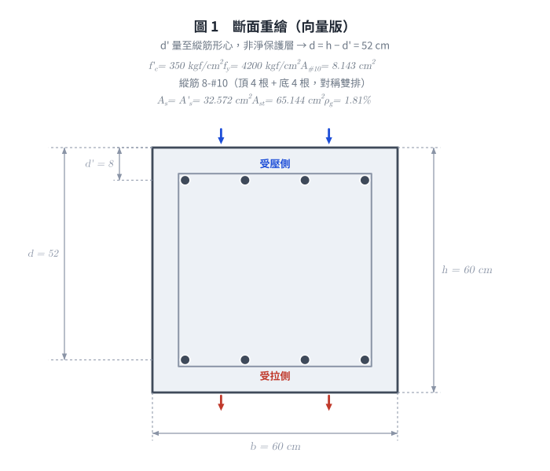
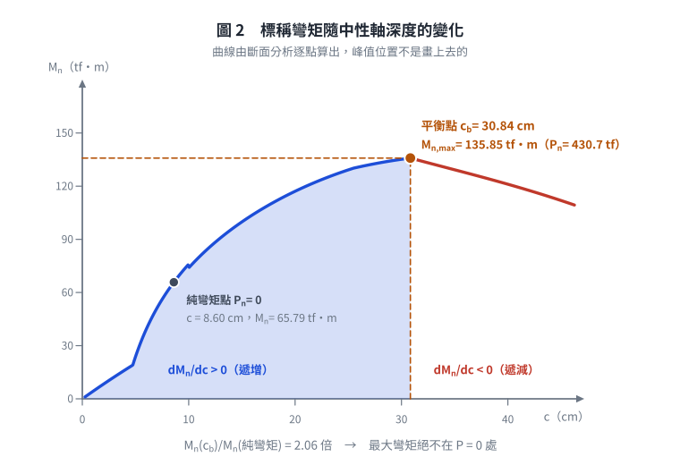
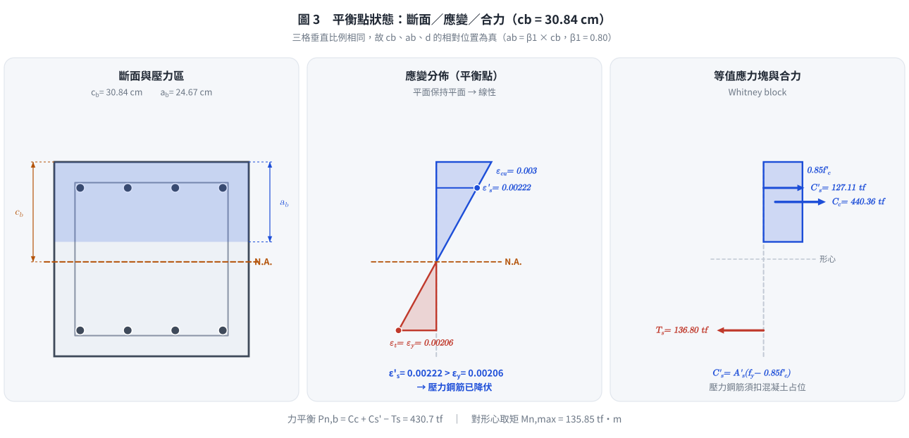
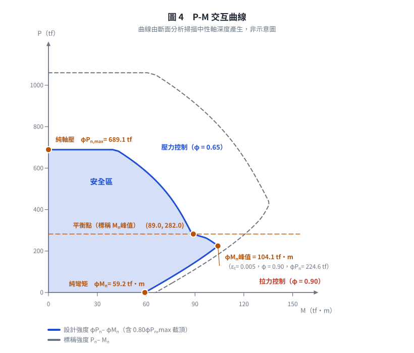

# RC-2015-1 — 對稱雙排鋼筋方形柱最大極限彎矩載重：拉力控制界限 (φMn)max = 104.1 tf·m

**來源：** 結構工程技師高考 · 鋼筋混凝土設計與預力 · 第1題
**考年：** 2015（民國104年）
**主分類：** [[RC-U1-2]] RC 柱強度分析與設計
**設計法：** USD強度設計法
**標籤：** `方形柱` `P-M互制` `平衡點` `最大彎矩` `對稱配筋` `雙排鋼筋` `壓力控制過渡區` `拉力控制界限` `設計強度峰值` `β₁折減`
**驗證狀態：** ⏳ unverified（2026-08-21 補算主線答案，待人工複核）

---

## 題幹摘要

RC 方形柱 $b=h=60$ cm，$d'=8$ cm，$d=52$ cm；縱筋 8-\#10（頂 4 + 底 4，$A_s=A'_s=32.572$ cm²，$A_{st}=65.144$ cm²）；$f'_c=350$ kgf/cm²，$f_y=4{,}200$ kgf/cm²。在適當調整軸壓後，求此柱斷面可承受之最大極限彎矩載重。

## 核心考點

- **兩條曲線、兩個峰值**：標稱 $M_n$ 峰值在平衡點（135.85 tf·m）；設計 $\varphi M_n$ 峰值在拉力控制界限（**104.1 tf·m**）
- 題目問「最大**極限**彎矩載重」（$M_u\leq\varphi M_n$）→ 答案取設計曲線峰值 $(\varphi M_n)_{\max}=104.1$ tf·m，$\varphi P_n=224.6$ tf
- 峰值為何右移：$\varphi$ 在過渡區必走完 0.65→0.90（+38%），$M_n$ 同區間只退 15%，乘積在 $\varepsilon_t=0.005$ 觸頂處形成折點極大值
- $\beta_1=0.80$（$f'_c=350>280$）；平衡點 $c_b=30.84$ cm、$a_b=24.67$ cm；拉力控制界限 $c=19.50$ cm、$a=15.60$ cm
- 壓力鋼筋在平衡點降伏（$\varepsilon'_s=0.00222$），在拉力控制界限**未降伏**（$\varepsilon'_s=0.001769$ → $f'_s=3{,}609$ kgf/cm²）
- 對照：平衡點 $P_{n,b}=430.7$ tf、$M_{n,\max}=135.85$ tf·m、$\varphi=0.650$ → $\varphi M_n=88.3$ tf·m（**小於** 104.1）
- 進階：純彎矩點 $M_n=65.79$ tf·m（$\varphi M_n=59.21$），僅為標稱峰值的 48%

## 解題關鍵步驟

1. $\beta_1=0.85-0.05\times(350-280)/70=0.80$；$\varepsilon_y=4200/2{,}040{,}000=0.00206$
2. 平衡中性軸：$c_b=6120/10{,}320\times52=30.84$ cm；$a_b=0.80\times30.84=24.67$ cm
3. 壓力鋼筋應變：$\varepsilon'_s=0.003\times22.84/30.84=0.00222>\varepsilon_y$ → $f'_s=4{,}200$ kgf/cm²（降伏）
4. 三力：$C_c=0.85\times350\times24.67\times60=440{,}362$ kgf；$C'_s=32.572\times(4200-297.5)=127{,}112$ kgf；$T_s=32.572\times4200=136{,}802$ kgf
5. $P_{n,b}=440{,}362+127{,}112-136{,}802=430{,}672$ kgf $=430.7$ tf
6. 力矩（對斷面形心 30 cm）：$M_{n,\max}=440{,}362\times17.665+127{,}112\times22+136{,}802\times22=13{,}585{,}103$ kgf·cm $=135.85$ tf·m
7. 平衡點 $\varepsilon_t=\varepsilon_{ty}$ 恰在壓力控制界限 → $\varphi=0.650$；$\varphi M_n(c_b)=0.650\times135.85=88.3$ tf·m —— **這還不是答案**
8. 判斷 $\varphi M_n$ 峰值位置：$\varphi$ 升幅（+38%）> $M_n$ 降幅（−15%）→ 峰值在 $\varepsilon_t=0.005$ 的折點
9. 拉力控制界限：$c=\dfrac{0.003}{0.008}\times52=19.50$ cm；$a=0.80\times19.50=15.60$ cm（$>d'=8$，仍扣占位）
10. $\varepsilon'_s=0.003\times11.50/19.50=0.001769<\varepsilon_y$ → $f'_s=2{,}040{,}000\times0.001769=3{,}609$ kgf/cm²（**未降伏**）
11. 三力：$C_c=0.85\times350\times15.60\times60=278{,}460$ kgf；$C'_s=32.572\times(3{,}609-297.5)=107{,}870$ kgf；$T_s=136{,}802$ kgf
12. $P_n=278{,}460+107{,}870-136{,}802=249{,}528$ kgf $=249.53$ tf
13. $M_n=278{,}460\times22.20+107{,}870\times22+136{,}802\times22=11{,}564{,}596$ kgf·cm $=115.65$ tf·m
14. $\varepsilon_t=0.005$ → $\varphi=0.90$；$(\varphi M_n)_{\max}=0.90\times115.65=\mathbf{104.1}$ tf·m，$\varphi P_n=\mathbf{224.6}$ tf
15. 掃描 $c$ 驗證單峰：$c$ 由 15→19.50→30.84 時 $\varphi M_n$ 為 89.85→**104.08**→88.30，峰值確在 19.50 cm

## 用到的公式

- 平衡中性軸：$c_b=\dfrac{6120}{6120+f_y}\cdot d$
- 拉力控制界限中性軸：$c_{tc}=\dfrac{0.003}{0.003+0.005}\cdot d=0.375d$
- 壓力鋼筋應力（未降伏時）：$f'_s=E_s\varepsilon'_s=E_s\cdot0.003\dfrac{c-d'}{c}$
- 壓力鋼筋淨力：$C'_s=A'_s(f'_s-0.85f'_c)$（僅當 $a>d'$ 才扣混凝土占位）
- 力矩平衡（對形心）：$M_n=C_c(h/2-a/2)+C'_s(h/2-d')+T_s(d-h/2)$
- 過渡區 $\varphi$：$0.65+0.25(\varepsilon_t-\varepsilon_{ty})/(0.005-\varepsilon_{ty})$，$\varepsilon_{ty}=f_y/E_s$
- 極限彎矩載重：$M_{u,\max}=\max_c[\varphi(\varepsilon_t)\cdot M_n(c)]$（極大化**乘積**，非 $M_n$ 單項）

## 涉及陷阱

- **把「$\varphi\times$ 標稱峰值」當成最大極限彎矩**：$\max(\varphi M_n)=104.1\neq\varphi\cdot\max(M_n)=88.3$——本題最大失分點
- 最大彎矩不在純彎矩（$P=0$）點——對稱配筋柱的常見誤解
- $\beta_1=0.80$（$f'_c=350>280$），不可用 0.85
- 壓力鋼筋力需扣除混凝土占位：$C'_s=A'_s(f'_s-0.85f'_c)$（$a<d'$ 時則不扣）
- 拉力控制界限的壓力鋼筋**未降伏**，不可沿用平衡點的 $f'_s=f_y$
- 平衡點 $\varepsilon_t=\varepsilon_{ty}=0.00206$ **恰在壓力控制界限上**，$\varphi=0.65$ 不必內插（依 [[ACI-318]] §21.2.2 以 $\varepsilon_{ty}$ 而非 0.002 為界）

## 圖形

互動圖：[RC-2015-1-pm-viz.html](../../raw/solutions/RC-2015-1/RC-2015-1-pm-viz.html)

向量圖解由 `raw/solutions/RC-2015-1/figs/gen_RC-2015-1.py` 產生，可重跑。

## 手寫補充

無

## 相關題目

- [[RC-2013-2]] — 特殊矩形框架柱塑鉸區圍束設計
- [[RC-2019-2]] — 矩形柱壓力控制斷面 P-M 分析
- [[RC-2012-3]] — 特殊矩形框架柱箍筋設計
- [[RC-2017-1]] — 加大柱雙折線應力應變
- [[RC-2014-1]] — 過筋梁應變相容（β₁折減同類考點）
